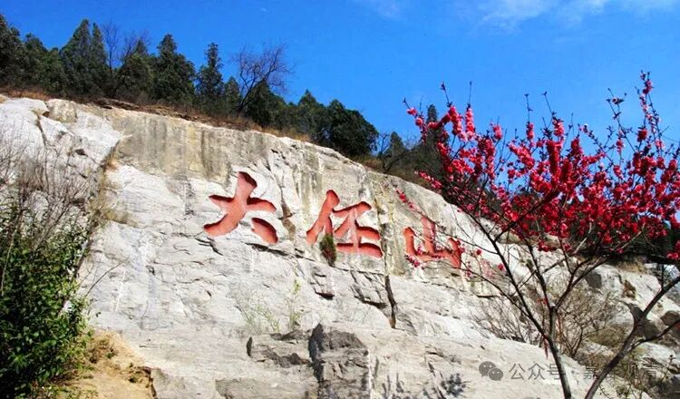
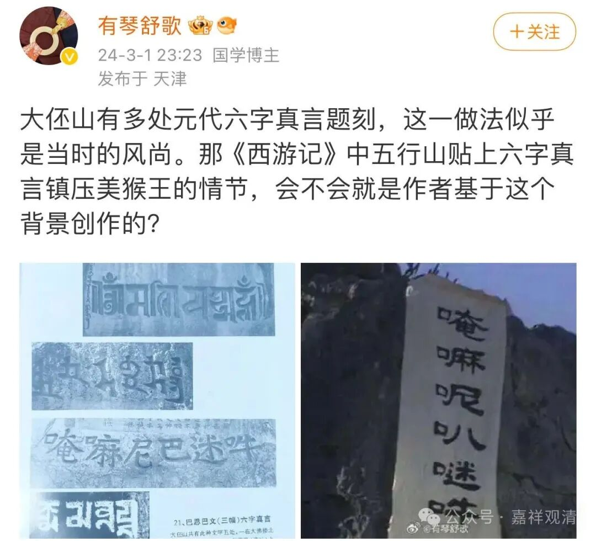
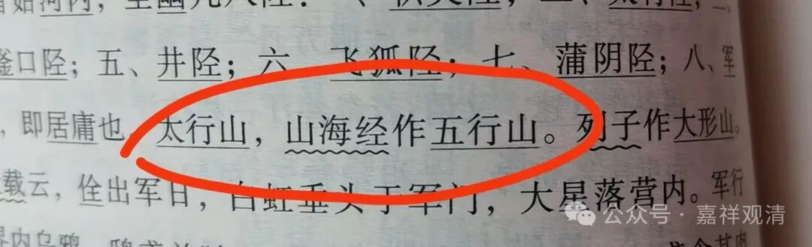
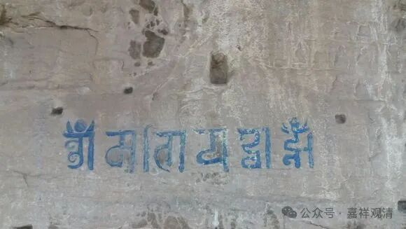
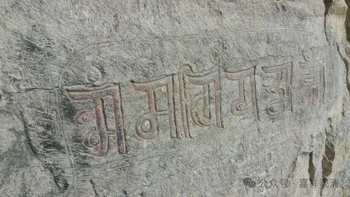
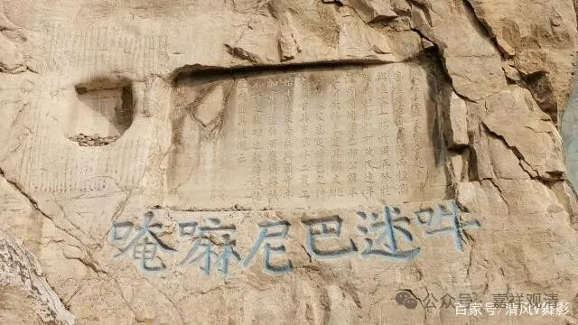
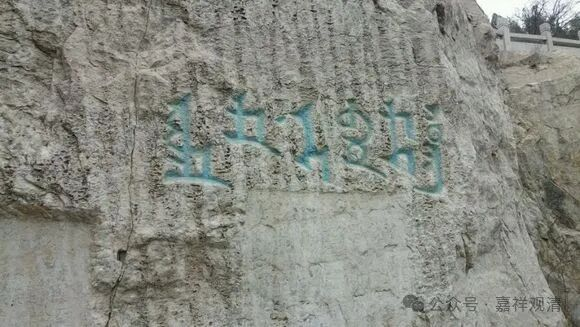
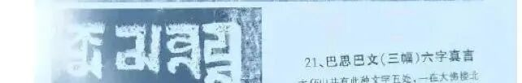

**大伾山的六字真言石刻和**

** 《西游记》里压着孙猴子的五行山**

今天群里有个法师转发了一段这个文字图片。

这个微博博主说，大伾山有很多梵、汉、藏、蒙、回文六字真言的摩崖石刻，联系到《西游记》中五行山贴上六字真言镇压美猴王的情节，他怀疑《西游记》这一段的创作灵感和这些大伾山上的摩崖石刻有关。

一开始我只是看了一眼，还没太当回事儿。

不过正好我下午随便翻翻手边的（中华书局版）《辽史纪事本末》，第32页上赫然写着——

“……** 太行山，《山海经》作五行山**……”

咦（这不要睡觉送来枕头了吗），太行山原来又叫五行山，这不就和压着孙悟空（哦，不对，这个时候他还没叫“悟空”呢，只能叫孙猴子）的那个“五行山”对上了嘛？！（我一直以为是海南的五指山。）

马上打开百度一查，原来大伾山还真是太行山的余脉……那就是说，确实“五行山上有六字真言”咯！那就和《西游记》的对上了。

网上一查——

这都是大伾山梵文的六字大明咒

这是大伾山汉文的六字大明咒

这不认识，传说中的回文？

大伾山八思巴文（藏文）六字大明咒

有趣。

大伾山不高，就一百多米，有空大家可以去看看哦。

