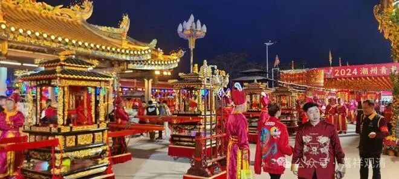

**海外有备份的传统文化**

今天是2024龙年正月二十四，一早，某法师就发来“潮州青龙庙会非遗巡游活动”的直播平台入口，一打开就是一阵锣鼓声（直到结束没有中断过。）

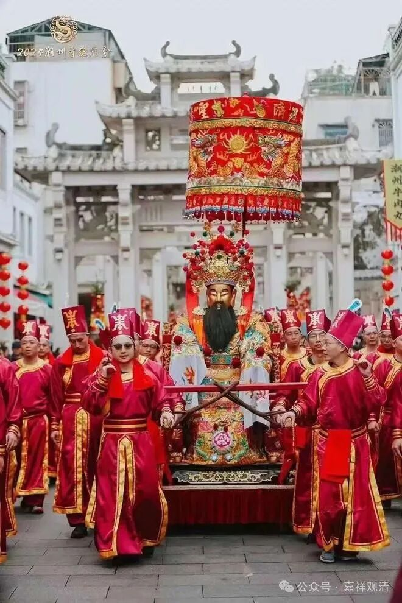

除了疫情三年，青龙庙会一直是潮州人民每年的大场面。看过一个视屏，说在疫情前一年，老爷就“说”了，接下来三年要“停一停”，这有点牛啊！

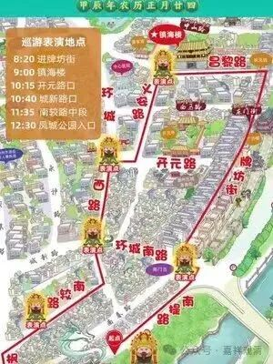

这是巡游的路线图，沿线一多半都是我非常熟的地方，都在开元寺附近，是我经常散步、跑步的地方。（不过青龙古庙我还真没去过，去年年底开会我也忘了去了，那时候太冷，本来还想跑步的，我跑鞋都带上了。）

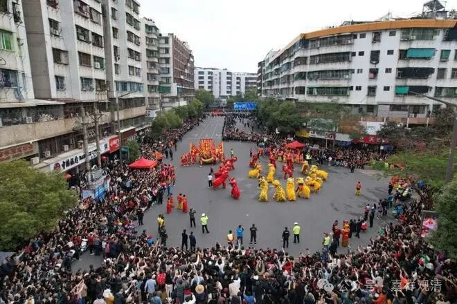

青龙古庙的庙会，原先是民间宗教成分重一点的，现在呢，主要包装为“非遗巡游展示”的窗口，更多地展示民俗、节日、文化的内核了，我们这种人看来，组织、热闹劲有了、更好了，更有秩序了，但内核已经被移风易俗了，这种借瓶换酒的事儿，历史上的佛教可是一把好手，哈哈。

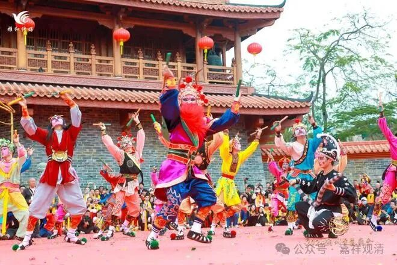

巡游内容，最有名的有（梁山好汉）英歌舞（这次有两个英歌队），舞龙、舞狮（无数），大锣鼓（不懂，也有好几个队），布马舞（这个很多人爱看，直播给的镜头少，被人在直播平台骂了，哈哈），花车就不说了。

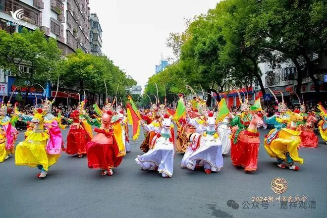

北方人一直在感叹闽粤等地这些巡游、巡城、游神、巡境活动保存得很好，北方鲜有保存下来的，其实今天我想到了部分的原因——因为福建、潮汕、两广都有很多海外移民，这里的民间文化传统在外还有“备份”，比如东南亚、比如港澳台，因为有备份，所以即使原件有损，恢复起来还是比较容易的，没有备份的就困难了。特别可以当作实例的就是去年今年都看到的“二十四节气鼓”，这个大鼓的名号一听起来就很“中国”，但实际是马来华侨团体编练传播的，并非是本土的原产，但又绝对“中华文化”。

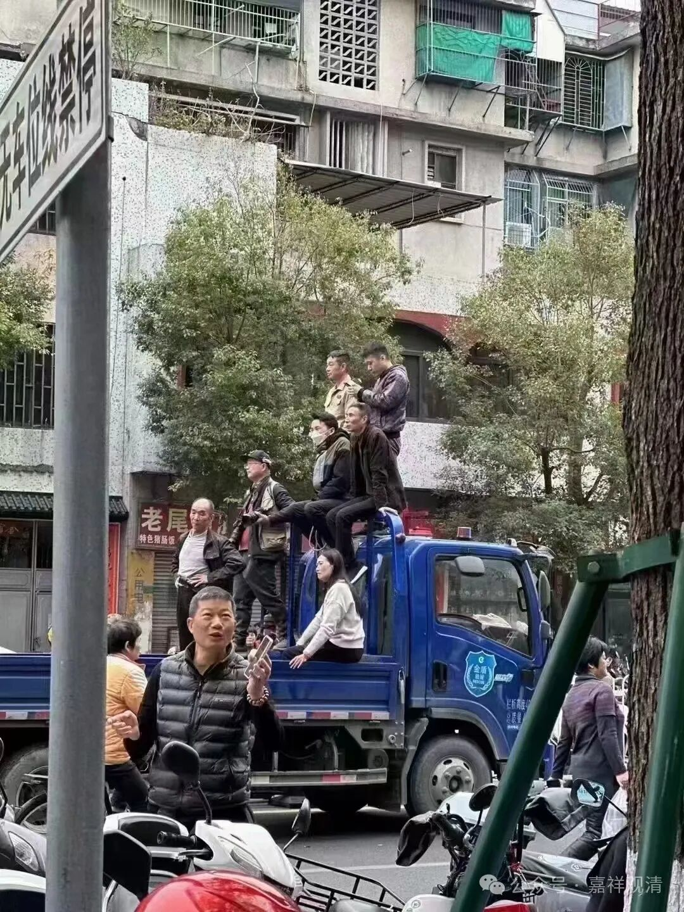

看看人家看得多认真

衣服穿多正式

这是逃课来的吗？

多整齐，还有技术含量

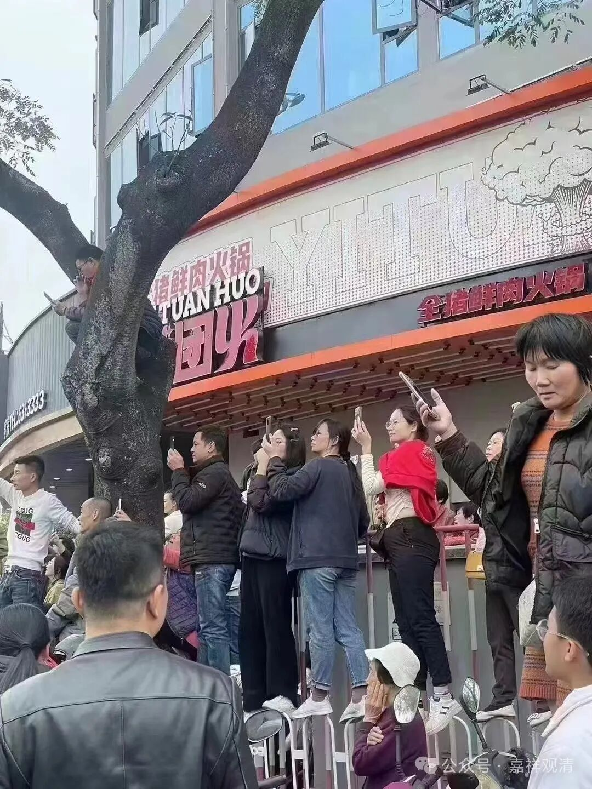

巾帼不让，难度更高！

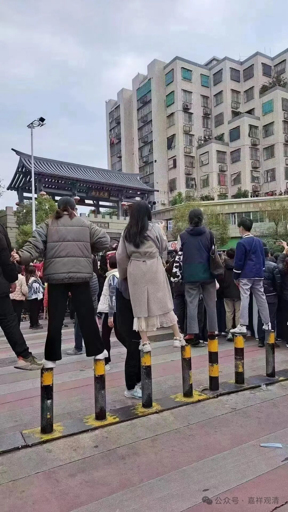

这都是练过梅花桩的

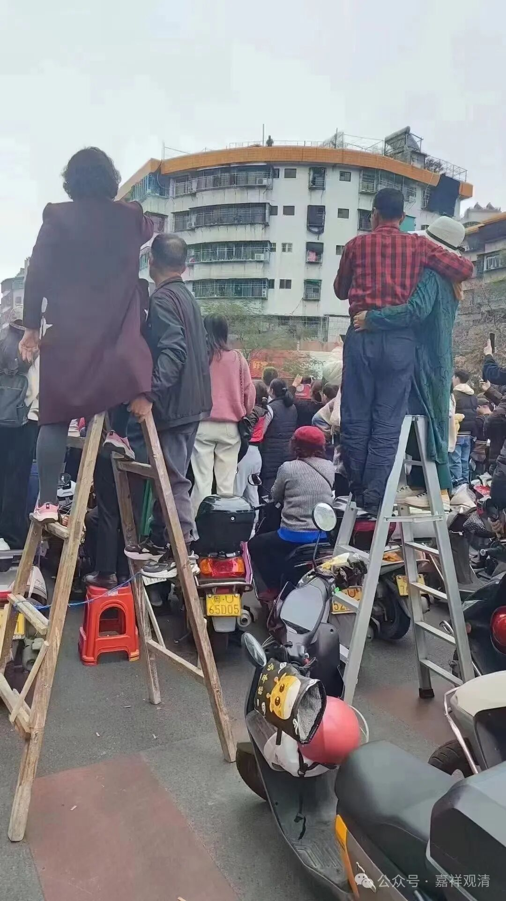

明年我也带俩去，感觉能挣钱！

应该放个桌子，高低整点儿……

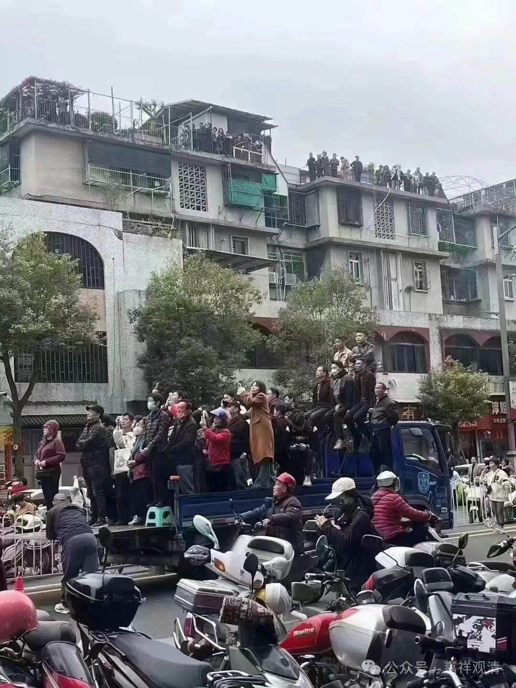

哈哈，这个挣得多

下课！

