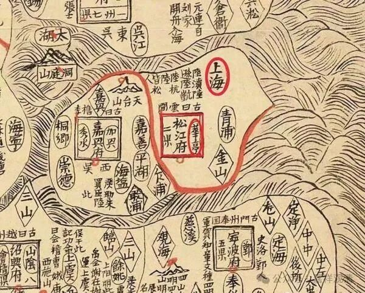

**“赤乌年建寺”有话说**

最近因为关注上海的佛教史，读一些上海的地方志。

上海的地方志中，最早的志书大约是书成于南宋的《云间志》。书成于南宋绍熙四年（1193），由彼时华亭县知县杨潜主修（我差点以为知县名字叫杨潜修，后来发现有个序，署名是杨潜。）

《云间志》卷中《寺观》，记录了四十六座佛寺，有静安寺、法忍院（后为朱泾西林寺，今不存）、七宝寺等，龙华寺彼时叫“空相寺”。此时的静安寺也不在今天的寺址。

《云间志》对静安寺之建于赤乌有异议（这个我们之前讨论过，江南今天知道至少有七八个寺院说建于吴赤乌年间，简直要算“疯狂”），说：

“赤乌十年，康僧会入境，孙仲谋始为立寺建业，曰‘建初’，‘建初’者，言江东初有佛法也……”

说吴大帝孙权于赤乌十年为康僧会在建邺城兴建“建初寺”，即“建”邺之最“初”佛“寺”之意……按这个说法，那些说自己建于“赤乌二三四五年”的吴地各寺都要算是抢皇帝的头功了，呵呵……

上次我们说过，此后所谓吴地各寺院的建造年代，可能是另一个吴王——五代十国时期的吴越王钱镠等所建，讹而变为三国东吴所建……彼时东吴之佛教不至于有如此之特胜也。

南宋之华亭县，已包括后来松江府之全境，差不多已经大致有今天上海市的范围了，收录寺院四十六座，似乎有点少哦……

