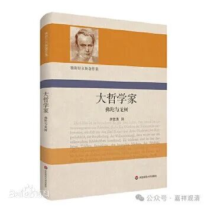

**谈几句《大哲学家——佛陀与龙树》的注释**

作为龙树迷，一看到这本《大哲学家——佛陀与龙树》就下单买了，德国哲学家卡尔·雅斯贝尔斯的作品。

全书注释非常之多，几近全书之半，全是译者做的注释，部分来源于日译本。不过以我们这种专业的视角看来，这些注释中的错误之处极多。随便摘录几处吧……

P108注159：

** “……到了公元三世纪，龙树完成了《方便心论》……”**

清案：

《方便心论》现在可以明确不是龙树的作品。

P110注164：

** “刹那亦即瞬间……佛教认为一切现象都是刹那生灭，故而谓之空。”**

清案：

1、据《摩诃僧祇律》，一瞬间有二十刹那。佛教说的“刹那”从来都不等于“瞬间”。

2、有为法刹那生灭是“无常”，无常不就是空。这恰好就是龙树在《大智度论》里面明确说的。（又，注解158给的《大智度论》的梵文拼写也不对。）

P110注165：

** “金刚（vajra）谓金中最刚之意……常常将般若比喻成金刚。《金刚经》全称是《能断金刚般若波罗蜜多经》，又称《金刚般若波罗蜜经》……”**

清案：

1、“金刚”的后面都打上梵文拼写“（vajra）”了，那本来应该知道此“金刚”即钻石，而非“金中最刚”。

2、《金刚般若波罗蜜经》的“金刚”固然比喻般若智慧，但《能断金刚般若波罗蜜多经》的“金刚”则指的是坚固的烦恼，“能断”金刚的才是般若智慧。

P111注166：

** “中观学派认为世间和出世间、烦恼和涅槃应该是同一的……名之中观”**

清案：

谁许“世间和出世间、烦恼和涅槃是同一的”，当名之为蠢货，和中观毫无关系。中观师的说法是“世间和出世间、烦恼和涅槃都是没有终极存在的！”

P111注166：

** “龙树的《中论颂》……其卷四‘四谛品’第十八偈……”**

清案：

龙树《中论颂》没有“卷四”，有卷四的是鸠摩罗什译的《中论·青目释》！

……

我还能说什么？（我的学生看到这篇大概要笑了……）

