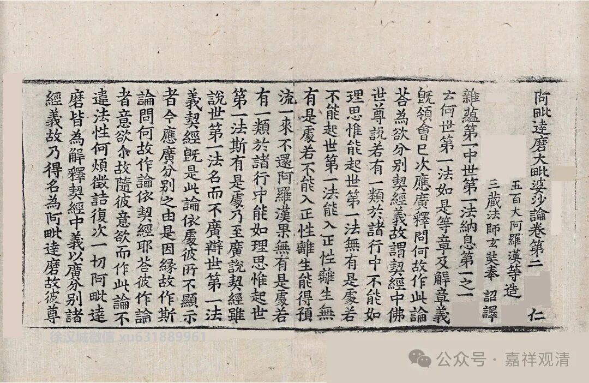

**《大毗婆沙论》所见的几种“二谛说”

一般对说一切有部的“二谛说”常用世亲《俱舍论》的“** 彼觉破便无，慧析余亦尔，如瓶水世俗，异此名胜义**”作为有部的正义。其实检《大毗婆沙论》，有部对二谛的许法也是各说各的。

《大毗婆沙论》卷七十七：

** 问：世俗、胜义，亦可施设各是一物不相杂耶？**

** 答：亦可施设。**

** （问：）其事云何？**

** （答：）尊者世友作如是说：能显名是世俗，所显法是胜义。**

** 复作是说：随顺世间所说名是世俗，随顺贤圣所说名是胜义。**

** 大德（法救）说曰：宣说有情、瓶、衣等事，不虚妄心所起言说是世俗谛；宣说缘性、缘起等理，不虚妄心所起言说是胜义谛。**

** 尊者达罗达多说曰：名自性是世俗——此是苦、集谛少分；义自性是胜义——此是苦、集谛少分，及余二谛、二无为。

这里，《大毗婆沙论》算是顺带提及了有部的几种“二谛说”。

首先。“也可以说”二谛是不同的事物。（这里的“亦可施设”就很值得玩味了。）在这个背景下，有四种说法：

1、世友第一说：能显名是世俗，所显法是胜义——这类似说遍计所执性是世俗谛，依他起性是胜义谛；

2、世友第二说：随顺世间所说是世俗谛，随顺贤圣所说是胜义谛。

世友的第二说，“谛”被解释为“言说”，罗什和今天南传上座部也都有这个以“言说”释“谛”的意思。

3、法救说：宣说瓶衣等的不虚妄言说是世俗谛，宣说缘起缘性等的是胜义谛。这一说略同世友第二说，但他比世友对“谛”多了一种解释——1、言说，2、真实。

4、达罗达多说：名自性是世俗谛，义自性是胜义谛，前者为苦集二谛少分，后者为所剩的四谛之余。达罗达多说略近于第一说，而加上了无为法，大概可以类比做：遍计所执性是世俗谛，依他起性和圆成实性是胜义谛。

这就是《大毗婆沙论》所见的有部四种二谛说。和后期《俱舍论》的说法并不是一个思路。

