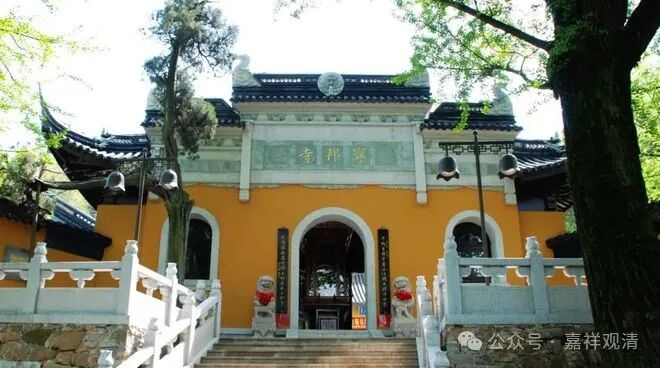
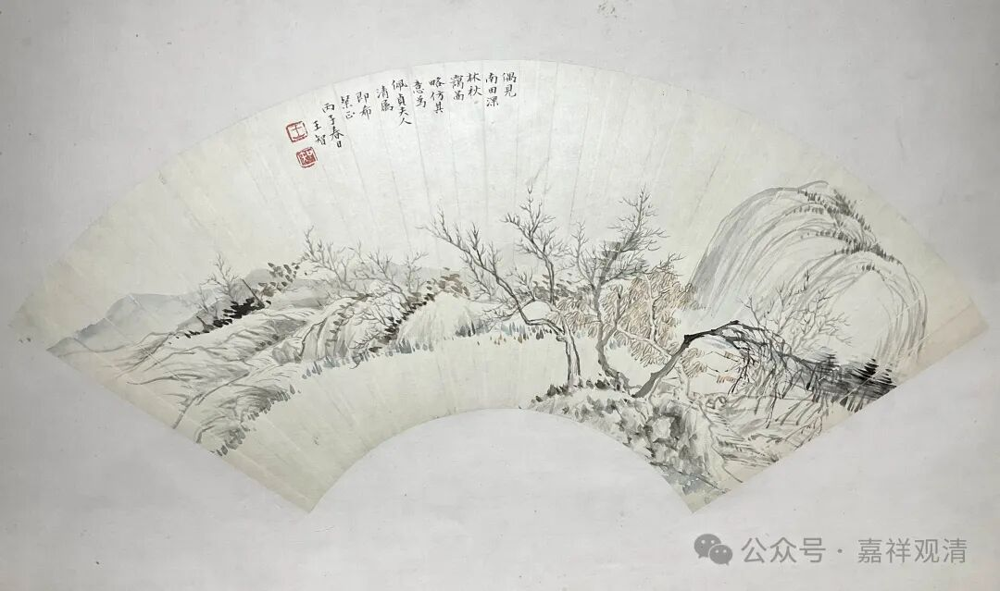
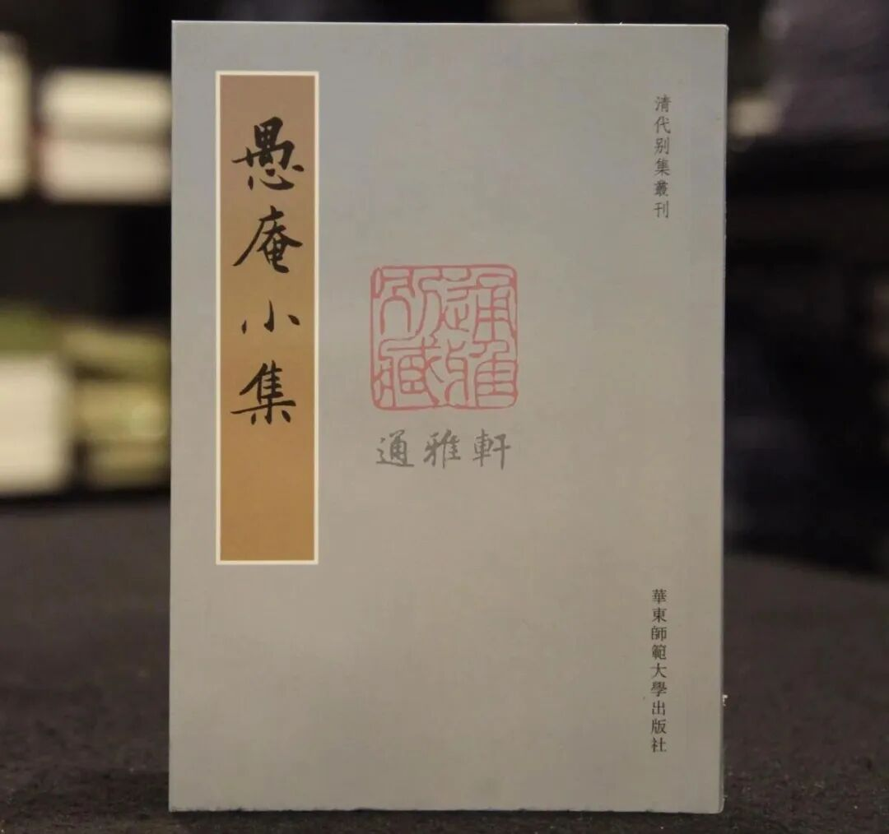
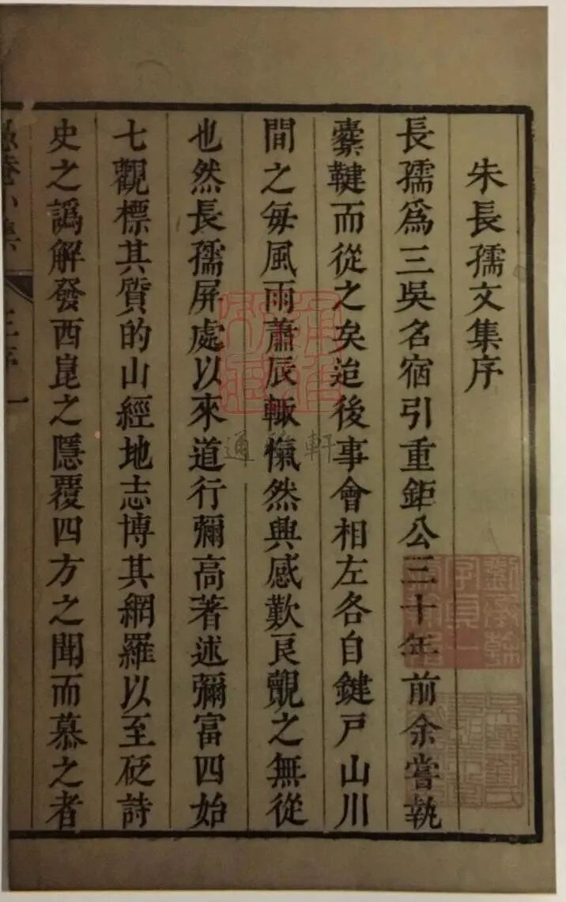

**偶遇“愚庵”**

这两天接连看到字号叫“愚庵”的，真是很有趣了。

** 一、愚庵以中智及禅师**

首先，让我对“愚庵”上心的是元末明初的禅宗高僧“愚庵”——以中智及禅师（1311～1378）。江苏吴县（今属江苏苏州吴县市）人，俗姓顾，东吴顾雍之后。出家于苏州穹窿山海云院，曾主径山寺，弟子中有五六人皆主当时禅宗的五山十刹。明初曾为南京天界寺十大德之首。有语录传世。

愚庵智及禅师用“愚庵”为号，显然是因为他的法名叫“智及”，所谓“智可及也，愚不可及也”，所以拿“愚”来作堂号。

** （设色纸本·深林秋霭图扇面）**

** 二、王智**

上图是一幅扇面，昨天看到在拍卖。

王智的名字很“秋雅”（《夏洛特烦恼》），所以关注了一下——

王智，清人，字愚庵，号二槐。拍卖的介绍里说他“浙江会稽（今绍兴）人。修髯鹄立，性廉恪，有长者风。精医。善花鸟，设色明秀，继学山水，布置严密，偏中饶逸气。”

** 三、朱鹤龄**

今天在孔夫子上买书，发现《清代别集丛刊》里收有一本《愚庵小集》……咦，又是愚庵！

作者朱鹤龄（1606～1683），字长孺，号愚庵，别号松陵散人，江苏吴江人，与李通俯、黄宗羲、顾炎武并称“海内四大布衣”，以高风亮节名于当世。《清史列传》《清史稿·儒林》有传。

既然这么巧，那就自然下单了。

很有趣，这三位都是江南“包邮区”人士。

后来上网查了，也还有些人用“愚庵”这个名字的，呵呵，那些就等“缘分”到了再说吧。

