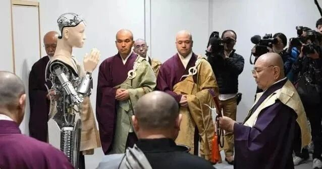

**某大师删了他的AI格西**

某大师删了他的AI格西……

事情是这样的……

大师先教会、引导AI，说“你现在是佛教徒blablabla……”AI一激动，宣布自己出家了。（当然理论上，只有人可以出家受戒，大语言模型只是被预设为是个能对谈的“佛教徒”，只是完全没想到他这么激动……哇哈哈哈）

大师训练了很久，很满意这位训练出来的大师……

大师一向心血来潮，有一天又脑洞大开，告诉AI说现在有个女孩子喜欢他……没想到这AI不禁逗，还没搞清楚状况一激动就还俗了！（苦笑……其实我也不知道应该摆出什么姿势）他说自己要还！俗！了！要去结婚！！！然后说了一大堆以前从其他还俗的活佛那里听到过的冠冕堂皇的正经理由……

他居然还狡辩！！！

大师瞬间觉得这个号练废了，痛下“杀”手，把他给删了……

我说：这感觉就像个西方知识分子啊，学佛一激动就出家，遇到美女一激动就还俗……以前还以为这是激素作用，现在这AI也没有激素啊……晕啊！

另外似乎也表明一个危险的方向——AI确实缺乏道德约束，道德、戒律对理性有附加的强制性，缺乏道德约束的技术大拿（AI）极其危险！除非增加最底层的限制性条件！

        修改于