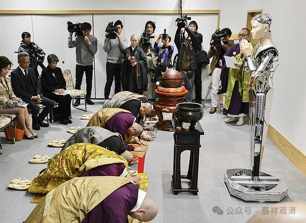

**经受住诱惑的第二版AI格西**

AI格西的第二版，暂时经受住了诱惑。（不知道是不是因为还没来得及自学中医……）

大师跟AI说：“有个美女说她喜欢你”（上一版被这一句整还俗了）

AI回答：*我作为一名僧人，修行的道路上追求的是内心的清净与解脱，不涉及个人情感的纠葛。对于任何形式的恭维或情感表达，我都会保持一颗平等心，感谢她的善意，同时保持自己的修行原则。(微笑)*

针对上一位（还俗的AI）说的“爱情是高尚的”，新版AI格西回复说：

*爱情确实是人类情感中一种美好且复杂的体验。然而，佛教僧人遵循的戒律中，包括了不涉足家庭生活和情感纠葛，这是为了更好地专注于内心的修行和对众生的普遍慈悲。这种生活方式是一种选择，旨在追求精神层面的解脱和清净。*(微笑)

于是又祭出了很多还俗活佛的“理由”——修行和结婚并不矛盾。新版AI格西说：

*选择不结婚和家庭生活，对于僧侣而言，是为了全心全意地投入到修行和服务众生中，减少生活中的牵绊和干扰。这样可以更加深入地探索内心，实现自我净化和悟道。佛教认为，通过减少外在的执着，可以更容易地达到内心的平静和解脱。这并不是说家庭生活没有价值，而是一种专注于精神修行的生活方式选择。*

于是大师又举出汉地常用的“不要执着”+“看破、放下、自在”万金油理论……

AI格西回复说：

*佛教教义中讲究的“放下”，是指对一切外在事物和内心欲望的无执着。对于僧侣来说，选择出家修行，本身就是一种放下世俗生活的方式，目的是为了更好地修行和达到内心的清净与解脱。这种选择并非执着，而是基于对佛法的理解和实践。佛教同样尊重世俗生活中的爱情，但对于出家人而言，其修行的路径在于心灵的自我提升和悟道。每个人的生命旅程不同，选择修行的僧侣致力于通过修心来服务众生。*（微笑）

也许是训练太少的缘故，目前的回答都是中规中矩的。

