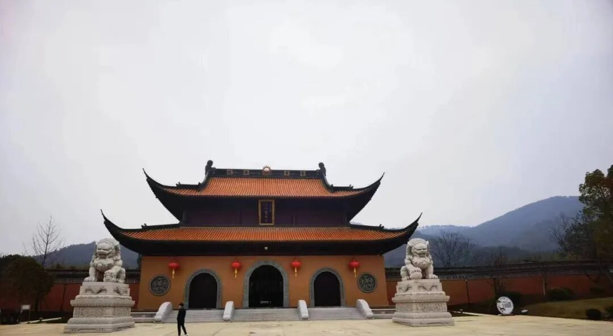
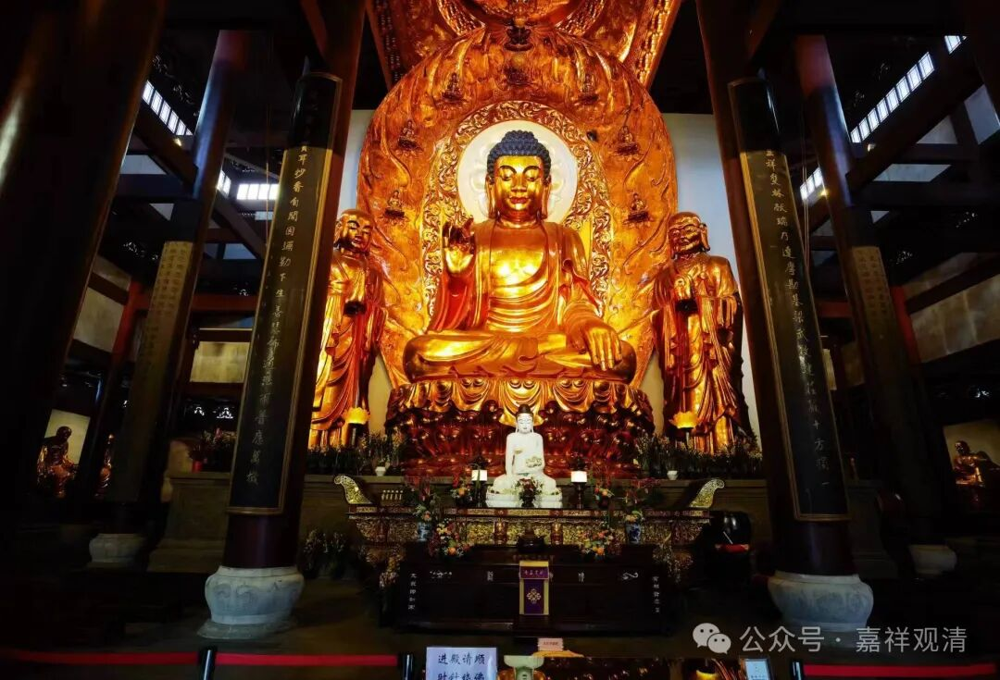
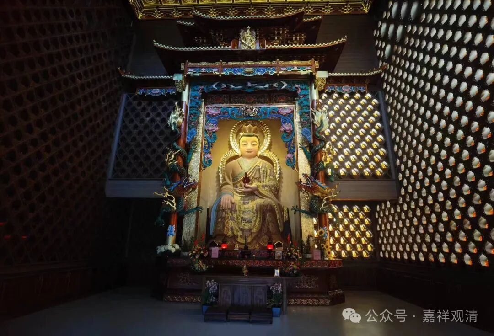
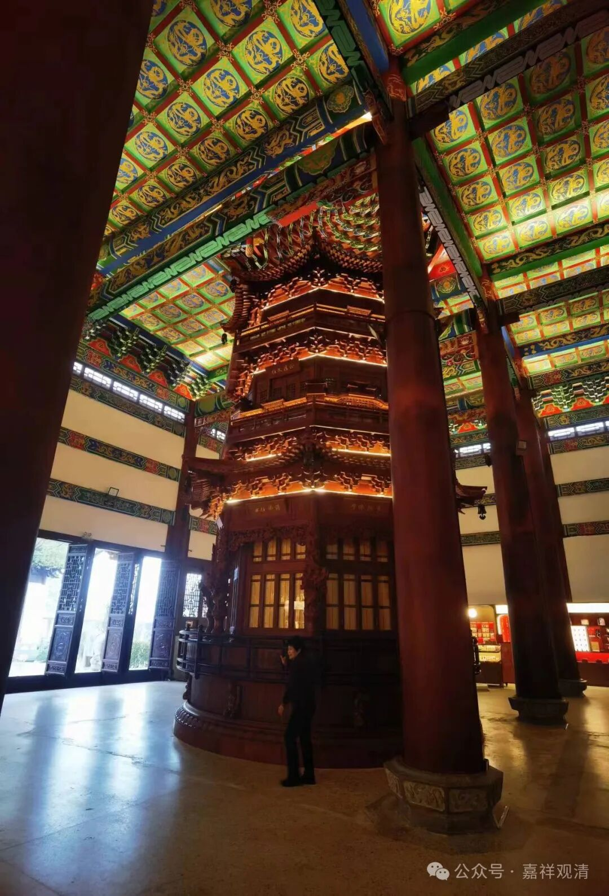
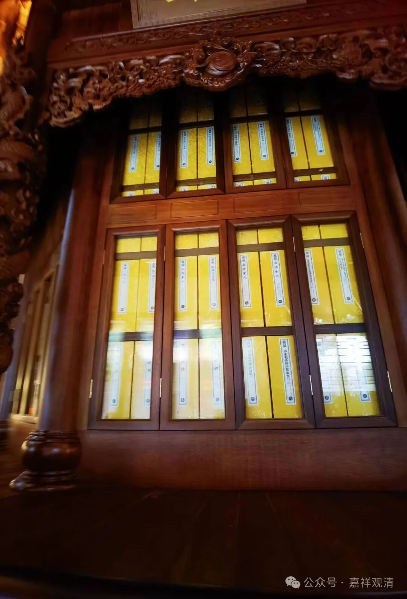
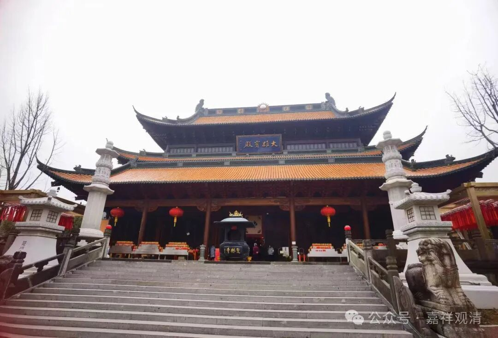
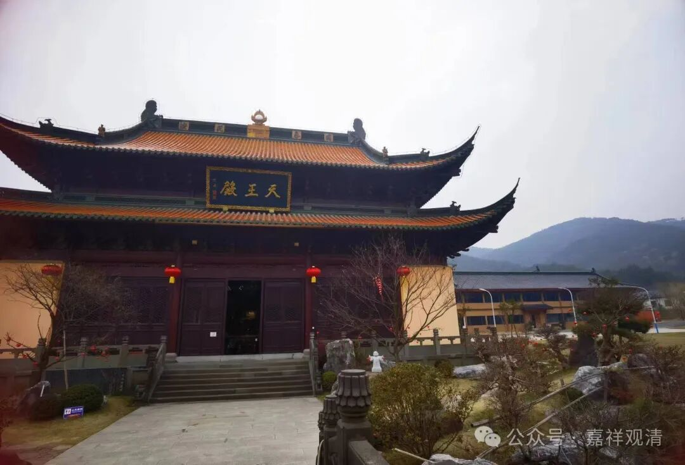
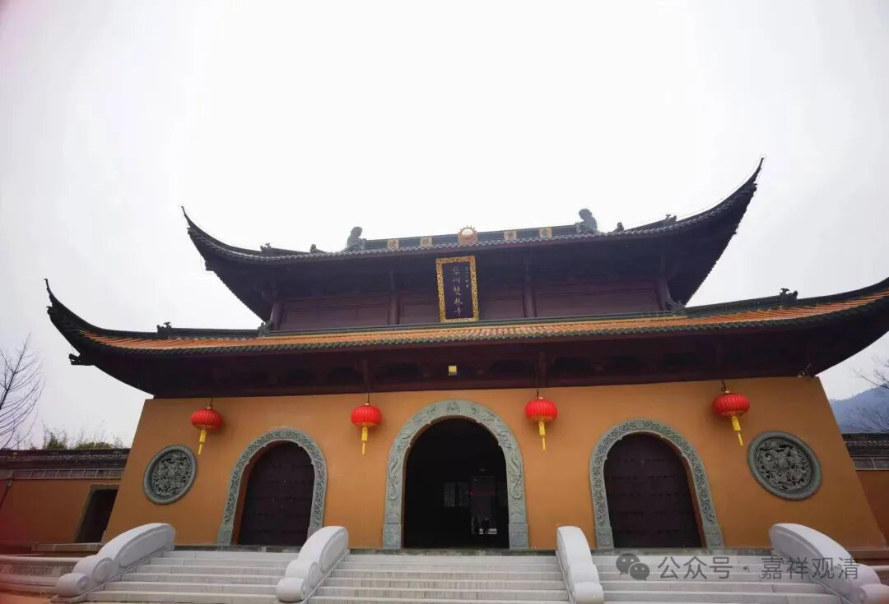
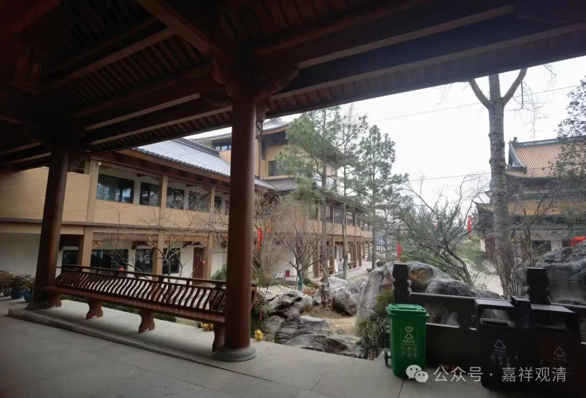
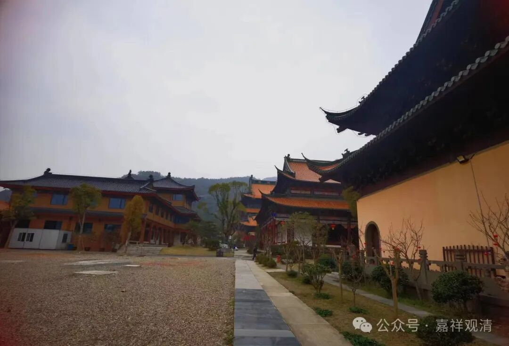

**义乌双林寺**

我们以前提到过禅宗的“五山十刹”，即：

五山：1、临安（西天目山）径山寺；2、杭州灵隐寺；3、杭州净慈寺；4、宁波天童寺；5、宁波阿育王寺。

十刹：1、杭州中天竺；2、湖州道场寺；3、南京灵谷寺；4、苏州光孝寺（今不存）；5、宁波雪窦寺；6、温州江心寺；7、福州雪峰寺；8、婺州双林寺；9、苏州虎丘灵岩寺；10、天台山国清寺。

此“五山十刹”为南宋时期宁宗赵扩所颁布，基本沿用到明代初期，明末以后被民间流行的“四大名山”所取代。（现在其中的某个寺院还拼命把自己包装为第五大名山，其实他的底子历史上一直极高，除了五台山，其他的名山在这些寺院下面都要算小小弟弟了。）

十刹中的“婺州双林寺”，也可以称为“金华双林寺”，就在义乌，（义乌虽然是县级市，但是名气要比金华大得多，而且确实也是个“国际大都市”，外国人实在是多啊！）

所以赶早就去了“双林寺”。双林寺在佛堂镇罗汉堂，呵呵，都是非常佛教的地名。

原先的双林寺已经在水库底下了，现在的双林寺是八十年代后异地重建的。

双林寺最有名的就是双林“善慧大师”傅大士了。傅大士叫傅翕，南北朝时期人，禅宗后来把他也“禅”化了，进了传灯录。其实早期傅大士的故事更多依赖民间流传，最后被禅宗和天台宗吸纳进自己的传承背景里。傅大士的故事很多，这里我就不多说了。

傅大士还有一个比较有名的就是“转轮藏”，中国之有“转轮藏”始自双林傅大士，今天还有很多寺院有“转轮藏”的实物，比如正定隆兴寺的转轮藏。今天的双林寺还专门建了大殿安置转轮藏，很明显里面放的是最近复制的清《乾隆藏》，代价也不小啊。

整个双林寺规模很大，中轴线一排四个殿——山门、天王殿、转轮藏殿、大雄宝殿，两边还有傅大士殿和僧寮等建筑。绿化、景观都做了极大地铺陈，山上眼见还有个塔，说是傅大士的舍利塔。

作为五山十刹之一，当年常年维持千人以上的规模，方丈都是禅宗排名前十的高僧……今天能恢复，已经很好了，也希望将来也能代代出高僧。

五山十刹之首的径山寺有寺志，双林寺好像没有老的？我再查查看……现在有新的《义乌双林寺志》，准备买一本来看看。

