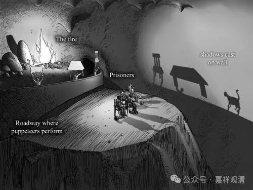

**《宗义略讲》003·009**

** “凡是有漏，定是所断，有漏由所断周遍，资粮与加行二种即是所断故。”

有漏的都是需要断除的。资粮道和加行道由于都还是有漏，都是所断。

**“见道唯是无漏。”

它这个“见道”是指当时见道的这个心唯是无漏，而且也只有通过无漏的方法可以达到。

** “见道唯无漏，修道及无学道二种各各有有漏、无漏之二种道。若是圣道则全是无漏道故，虽皆周遍，但圣者相续之道无漏而非周遍。修道之相续中之寂灭，为粗行相之道，即有漏故。”**无漏，简单来说漏是烦恼的意思，但不简单是这样。

这里比较复杂的是有部认为见道和无学道是只有出世间道能证的，此二中间是可以有世间道有出世间道的。这个观点其他部派也有，但这就引发了很多问题……这里就不多讨论了。

下面是“所示余义”，其实这个“所示余义”是有部正宗想要讲的背景，“三世实有”，这个三时就是三世，过去、现在未来，然后主张“蕴界处实有”，这个是实际存在的说一切有部师真正想讲的。

那么现在呢，我们用另外一种方法，来谈一谈有部所讲的一切法，我现在发到群里面去。

“摄类学”中二谛讲的不一样，“摄类学”在西臧的传统当中是把它算在经部当中，它的二谛跟有部的二谛正好相反，所以有些人就看晕了，说是“怎么这里世俗谛，那里变胜义谛了？”它是完全相反的，经部的世俗谛接近于有部的胜义谛，有部的世俗谛大概就相当于经部的胜义谛，这两个正好相反。我们简单讲一讲……

经部和有部对胜义谛世俗谛的理解有点不一样，当然最后的想法就是就是真实的存在。

我发挥一下试试看，前面有部的我们说了，最后不可分的叫胜义谛……经部的意思和柏拉图有点接近，类似经部师对有部师说：你这“现实的杯子”都是背后“抽象的杯子”的呈现，你把具体的当作“实在”，我们不然，我们说“抽象的杯子”才是“胜义”、是殊胜的境，类似于柏拉图说“圆满的、彼岸的杯子”是一切现实杯子的模范，“现实的杯子”是“彼岸的杯子”的具象、模拟……所以，经部师说，抽象的才是胜义，具体的那是世俗。

呵呵，相当于一对唯名论和唯实论咯。当然实际不完全对应，但这样大概可以帮助大家理解和梳理。其实汉传从南北朝末期基本都一直认为，真正的有部和经部就是小乘里的一对唯名论和唯实论，而唯识和中观就是大乘里的一对唯名论和唯实论。

“唯实论”大概可以理解为共相是更真实、更原初、第一义的存在，“唯名论”则认为共相是第二义的存在。具体地讲，佛教的这几个部派和这两个概念并不对应，但是这里试着互相参考解释一下。

（这里有点脱稿讲了，不直接对应《宗义书》里的经部。）

