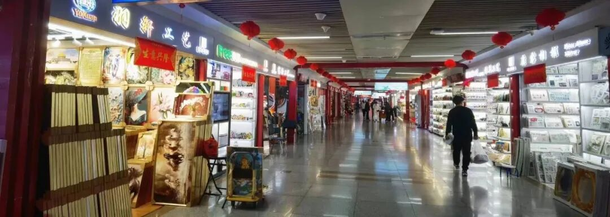
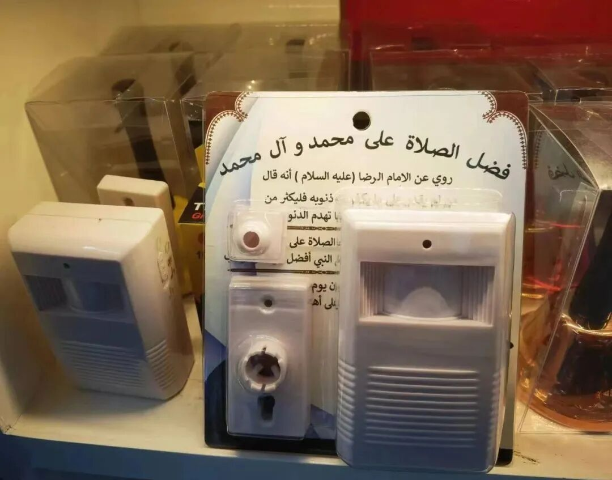
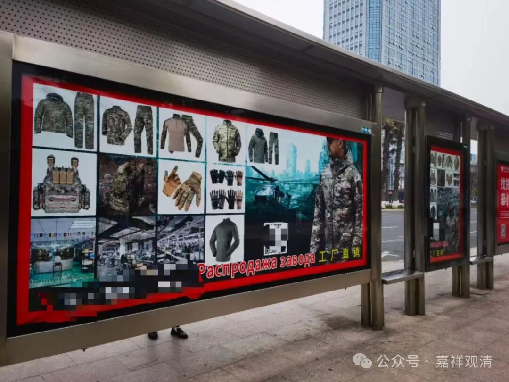
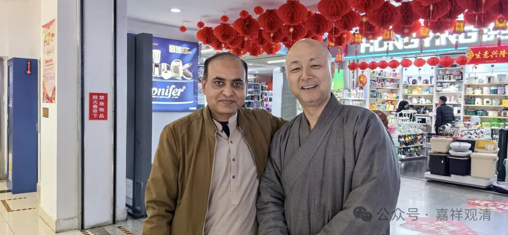
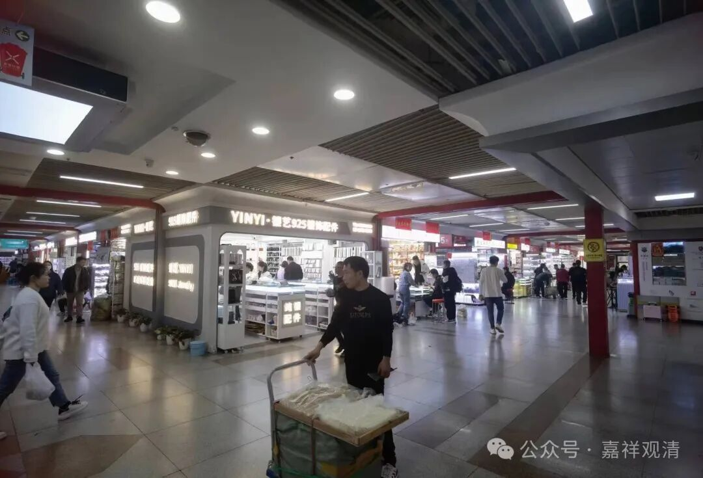

继续逛义乌国际商贸城……

发现这里中东人、俄罗斯人、印度人真的很多，很多商标广告都加了阿拉伯文或者俄文，比如——

这是卖防弹衣的吗？好想搞一套。结果被怼了“一大堆平民中就你穿这个，你会首先被击毙！”额～我穿迷彩不是更能保护自己吗？不过，好像确实也有道理～那我到底应该更专业还是更不专业？金庸先生写了一辈子武侠，最后也发现了这个问题，拥有武力值究竟是更容易保护自己还是更容易被伤害？于是有了韦小宝……

（我觉得还是会了不显摆比较好……可是会了谁不显摆呢……刚看到一则消息，一个女警在男友面前装羔羊，隐瞒自己的实力，最后面对欺负二人的歹徒一招制敌……当场被分手了。女警怒气值爆表，歹徒受到二次伤害……“有了不用”真的很难啊！）

路上碰到一个印度人（闻着味道像），看到我惊讶而友好地打招呼（捂着胸口身体略略前倾），用中文问我是不是武术教练……看来他对我这种“穿制服的人”有刻板印象，认为都是少林寺的武僧。我说我不是武术教练，但也会一点点功夫。印度人说他也会一点点，让我摸他腹肌，我有点没搞懂腹肌和功夫的逻辑关系……很担心他会不会让我当场打一套拳或者过两招，还好我们只是握握手，拍了张照。

剃须刀没带，没发挥好

珠宝区中东人特别多，甚至很多商贩都是穆斯林的打扮，可能他们的装饰都喜欢bingbling的亮片……后来果然发现是这样的。

义乌确实是国际大都市，全方位的。

