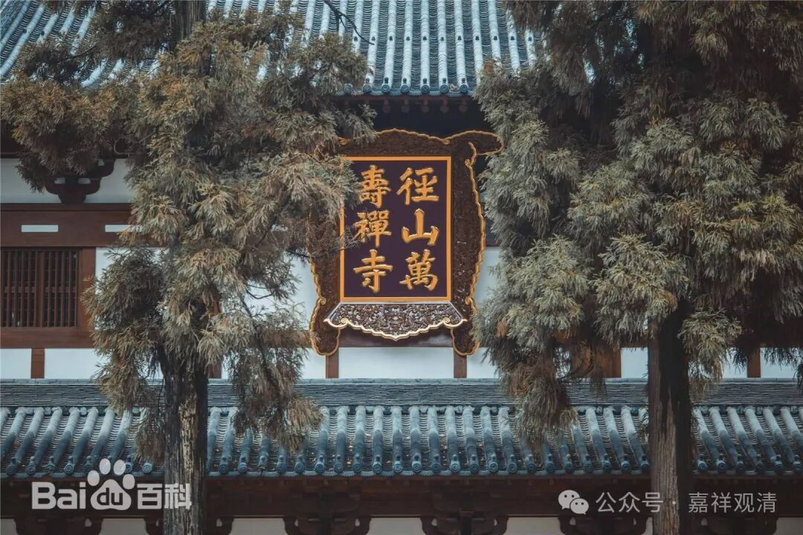
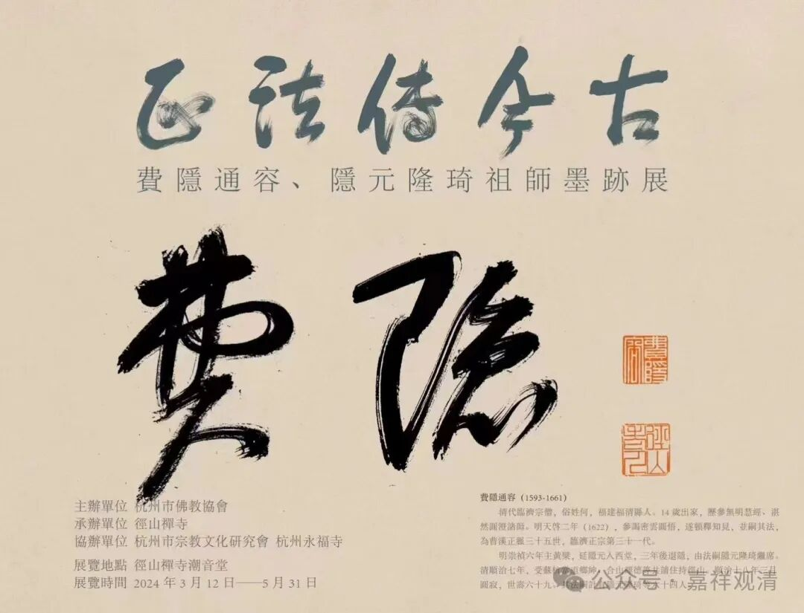
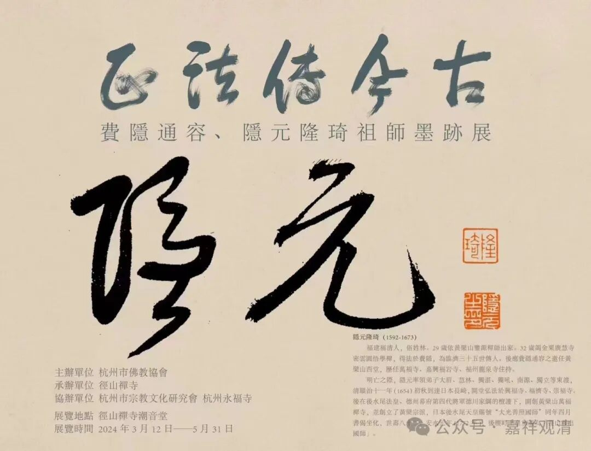

**径山寺有“祖师墨迹展”**

前两天提到“五山十刹”。“五山十刹”中（元以前）排名最高的就是“径山寺”（元代在此上又增天界寺）。其实最早的径山寺是出自三论——牛头系的寺院，后来在大形势下转而为达摩禅系，这在“五山十刹”中的“天台山国清寺”上表现得就更明显了——国清寺可以算得上是天台宗的祖庭了，但在达摩禅的大背景下也成为禅宗“五山十刹”中的一刹。

径山寺近年来重修扩建颇具规模，前几年又在江湖上大肆收购《径山藏》，搞得《径山藏》价格狂飙十倍……最近，径山寺又有“正法传千古——费隐通容、隐元隆琦祖师墨迹展”的展览。大家有兴趣的话可以去看看的。

费隐通容，明清之际的禅宗大师，曾主黄檗山和径山寺，为径山第九十代住持。费隐通容写过灯录，不止在一件事情上引发过明清之际禅宗的极大争论（经诸山长老裁定将此书毁版，但其实还是流传下来了）。我个人并不看好此老的史才、史学、史识、史见，整体上算不得一流高手，但放在明末整个人才凋零的背景下，也算是有点学问、有点想法的老先生了。

隱元隆琦，是费隐通容门下大弟子，上面海报说隐元隆琦是“临济第三十五代”，错！费隐通容禅师是临济第三十一代，隐元隆琦禅师为临济第三十二代。隐元隆琦最重要的是东渡日本，开创了日本禅宗里黄檗宗一脉，此派今天仍旧为日本佛教禅宗里独立于临济、曹洞的一宗。

日本佛教今天有十三宗（三论宗事实上已不存在）：

奈良六宗剩华严宗、法相宗、律宗；（3）

始于平安初期之天台宗、真言宗；（2）

镰仓时期之后，禅宗系有临济宗、曹洞宗、黄檗宗；（3）

净土系统有净土宗、真宗、融通念佛宗、时宗等四宗；（4）

日莲宗；（1）

综上，为日本佛教十三宗，隐元隆琦禅师开创的黄檗宗为其中之一。单纯就隐元隆琦禅师本身来说，明确是传临济正宗的。不过他和费隐通容禅师在曹洞门下也参学过，费隐通容禅师就曾挑起了清初的曹洞、临济之争……暂且不表。

时间还很充裕，大家有机会可以去参访参访……

