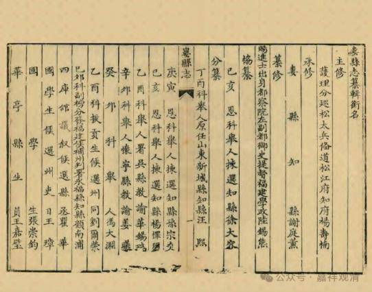
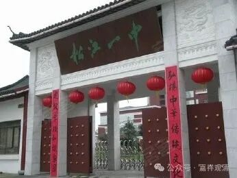

**费隐通容禅师、华亭超果寺与松江一中**

昨天提到明末清初的临济宗第三十一代费隐通容禅师……

说起来，费隐通容禅师和上海还有点关系——他在几次往返于松江，曾住在松江超果寺（又称云间超果寺、华亭超果寺）。费隐通容禅师也在超果寺开堂主法，他最初动议编纂《五灯严统》也在此地。

按理说费隐通容禅师在华亭超果寺呆过，同为华亭县（松江府）治下的朱泾西林禅寺与超果寺相隔也不过三十几里路，但他在《五灯严统》坚称船子徳诚跳河自杀传法，真的就像没在上海呆过一样……上海的小河也是能随便淹死船家的？！（而且朱泾、华亭还流行船子徳诚的垂钓诗集）

松江（华亭、云间）超果寺在上海地区以前算是超等级的大庙了，首先它是上海（华亭）历史上最早出现于《高僧传》的唐代藏奂禅师（赐号心鉴禅师）所建（至少传说中是他建的），初名长寿寺，宋代英宗治平二年（县志说在元年）获赐额“超果寺”，《新续高僧传》中宋代有天台系的灵照法师，明末清初有费隐通容禅师入住，近现代太虚法师也留下过诗句，并派弟子任住持。历史上它曾经是天台宗的寺院，后来又曾是禅宗的寺院……

可惜超果寺终于缘起缘灭，列布瑞特以后殿堂文物尽毁……寺址即今天的松江一中。嗯，上海的寺院成就了好几个名校、医院这种公众设施，也算是为了众生涅槃的了。

        修改于