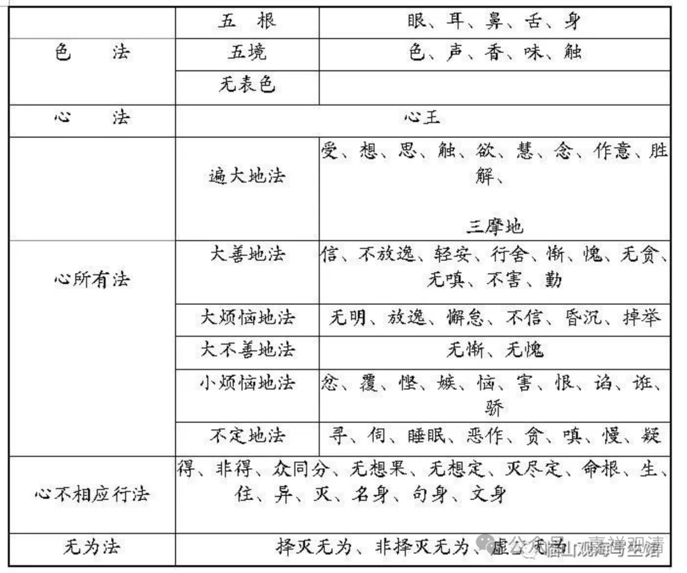
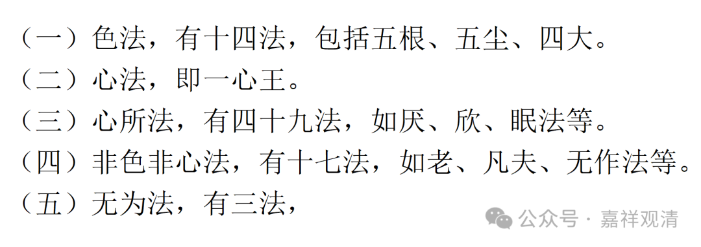
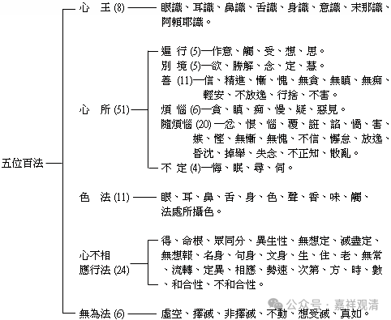
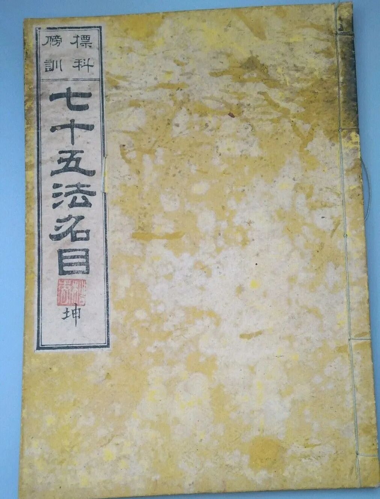

**《宗义建立》003·012**

现在我们看一下各宗对一切法的分类。

我现在发出来的是有部的或者说是有人总结的这个《俱舍论》的“七十五法”，我发上去了。

上面这一小节是成实宗《成实论》的八十四法。

这一篇就是唯识宗的《百法》的树形图，我也发上去了。

那么，实际上，传统上讲的《俱舍》的七十五法，是后人的一种总结（好像是日本人总结的）。

其实说一切有部认为要比这里多，不是仅仅这“七十五法”，标准的俱舍师们其实也认为要补充几个，这里的“七十五法”是先把这个大的框架拿出来……《俱舍论》出来以后，有部很“认”的原因是什么呢？因为它帮有部总结了一个略本，此前有部自己没有这么完美的总结，至少在以前没有总结出《俱舍论》这个篇幅适中的教科书。

关于这“七十五法”，我们基本可以说，这是研究俱舍的大师们在《百法名门论》背景下作的总结。

那么接下来再说《成实论》——经部师的八十四法。和上面《俱舍》的“七十五法”一样，“八十四法”也不是《成实论》自带的，也是后人总结的，很明显，这“八十四法”又是在《俱舍》的“七十五法”的背景下总结的：“八十四法”的四十九心所，是在《俱舍》四十六心所外，加欣、厌二心所（其实这两个善心所是《俱舍》本来就应该加的），又将睡眠，分为睡与眠二心所。十七个不相应行，是在《俱舍》十四个不相应行法，将命根与同分合并，更加老、死、凡夫法、无表色四法。

唯识系统里，世亲论师依《显扬圣教论·本事分》（有人说是《瑜伽师地论·本地分》，其实不然）节录了一个《大乘百法明门论》。有了这么一个总结，后面就容易多了。

总结出来呢，容易被别人当靶子，“不对！你哪几个没有写进去！”所以总结也有好处，也有坏处。不过能够老是被别人当靶子，论文总是被别人引用，不论正面负面，也是说你的论文写得好啊……我们这个世亲论师就是论文写的好的，大家都要引用它。

