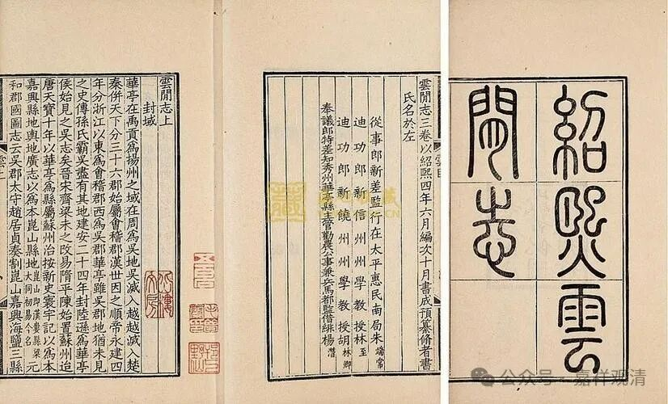

**华亭超果寺与心鉴禅师释藏奂**

《云间志》卷中《仙梵》：

** “心鉴禅师。《高僧传》：藏奂，姓朱氏，苏州华亭人也……”**

《云间志》卷中《寺观》：

** “超果寺……又《高僧传》载，心鉴禅师藏奂，苏州华亭人……”**

清案：

此两处《云间志》引书有误。唐·藏奂（赐号心鉴禅师）事在《宋高僧传》而不在《高僧传》。《高僧传》（又称《梁高僧传》）作者梁·慧皎，《续高僧传》（又称《唐高僧传》）作者唐·道宣，《宋高僧传》作者宋·赞宁，其中，“梁”、“唐”、“宋”《高僧传》是指其编纂年代，而不是收录高僧的年代。

据《宋高僧传》记载，华亭（今上海市）人藏奂禅师为五泄（五洩）灵默禅师（毗陵人，今常州）弟子，而为石头希迁禅师法孙，是禅宗初创期名僧。

又，《娄县志》卷十“寺观”：

** “超果讲寺……唐华亭释藏奂，号心鉴禅师者……咸通中归老乡里建寺……”**

清案：

据《宋高僧传》《景德传灯录》等，并无藏奂禅师在松江建长寿寺的记载，咸通中，藏奂禅师主要在明州（今宁波）栖心寺，栖心寺即今宁波七塔寺。《云间志》就曾婉转地怀疑藏奂禅师建长寿寺（超果寺）的传说，因为史无明文。

也就是说，超果寺和藏奂禅师可能一点关系也没有。

