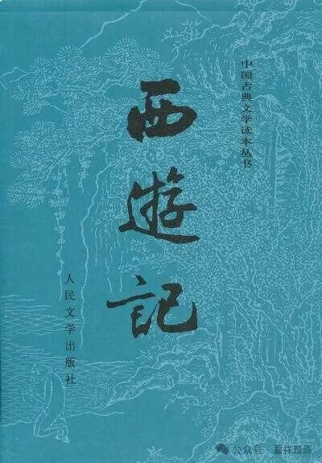

**鸟窠禅师和《多心经》**

说起来，我最早背《心经》还是看的《西游记》。

《西游记》里边，唐僧一路被妖怪囚禁的时候，都是念《多心经》来消除魔障的……

《多心经》是乌巢禅师教给唐僧的。乌巢禅师主动见了唐僧，唐僧询问取经路途，感叹路途遥远，此时乌巢禅师便传唐僧以《多心经》：

** “路途虽远，终须有到之日，却只是魔瘴难消。我有《多心经》一卷，凡五十四句，共计二百七十字。若遇魔瘴之处，但念此经，自无伤害。”**

其实，这里的《多心经》就是《般若波罗蜜多心经》，正确的句读是“般若”（智慧）“波罗蜜多”（到彼岸）“心”（心要）“经”，现在我们常说的《心经》算是正确的“缩写”了，“《多心经》”是一个错误的缩写。

很长一段时间以来，一直以为是因为《西游记》的作者（其实未必是吴承恩）对佛教不怎么了解才搞出《多心经》这么一个讹误来，而且很长一段时间里面，民间也还是叫“《多心经》”的人多（现在很少了）。后来看到上海古籍出版社出版的影印本的《般若心经译注集成》当中，赫然发现，早在唐代就有人在注解的时候称“《多心经》”了——原来不单纯是《西游记》的锅啊。

敦煌文献BD14855号背面也有让僧人妙缘“先通《观音经》《多心经》”，也是句读成“《多心经》”的一个例子。呵呵，看来，这个称“《多心经》”的传统还挺悠久、广布的呢。

又，《西游记》里的“乌巢禅师”实际应该指向历史上的“鸟窠禅师”，鸟窠禅师是三论——牛头——径山系的僧人，不过鸟窠禅师实际年代要晚于玄奘大师。

