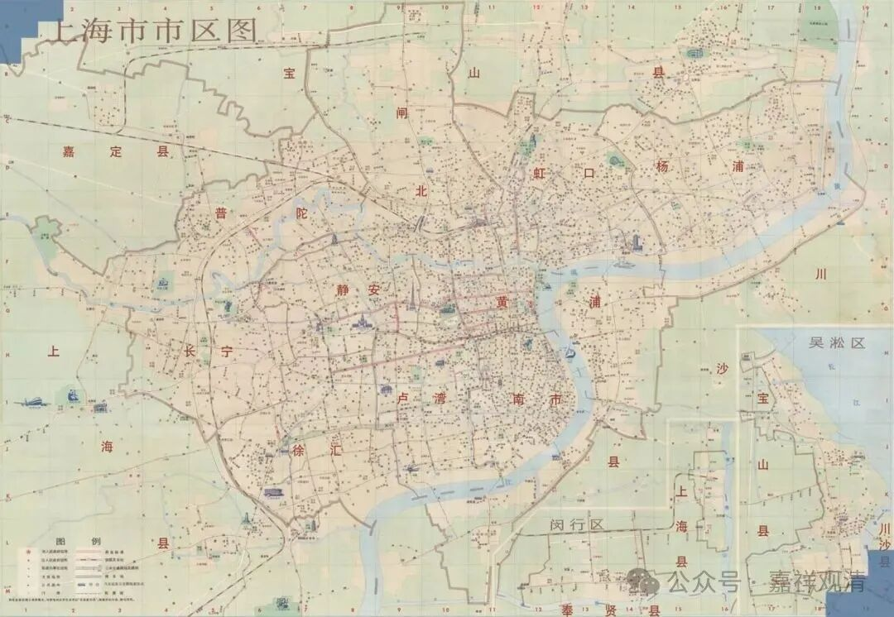

**太虚法师门人与上海寺院**

太虚法师是近现代中国最著名的僧人，他的弟子也遍及上海各大寺院，特别在二战以后，太虚系的僧人迅速成为上海各大寺院的住持、方丈。

1、松江超果寺：

前两天提到的松江第一大寺超果寺，太虚法师有一首诗为超果寺作：

***和夏惟喆題超果寺一覽樓（丙寅）***

***極目雲間不見山，危樓徙眺幾憑欄，撩人野景饒生趣，拂耳春風怯曉寒；***

***三泖清漪空結想，九峰晴翠遠翻瀾。遐思不覺低徊久，五里茸城日已殘。***

丙寅，就是1926年。“云间”，指上海，现存上海第一本地方志叫《云间录》。此前，1925年，太虚大师弟子，原《海潮音》编辑克全法师任松江超果寺住持。超果讲寺历史上主要算天台系统的寺院。

2、玉佛禅寺

二战后，1947年，太虚弟子苇一法师任玉佛寺住持，此前（光复后）已任玉佛寺都监，另有太虚弟子福善法师任监院（此年圆寂）。1949年3月，太虚法师弟子苇舫法师接任玉佛寺住持。玉佛寺后来算禅宗寺院。（1947年，太虚法师圆寂于上海玉佛寺。）

3、静安寺

二战后静安寺纠纷不断……1947年，上海佛教界共推持松法师接任静安寺方丈。持松法师也是太虚大师门下弟子。持松法师似乎有意把静安寺宗东密，后来在静安寺有密坛。今天的静安寺也许要算净土宗。

4、法藏讲寺

法藏讲寺明确是天台宗寺院，由兴慈法师所建。1950年农历四月十七，苇舫法师接手管理法藏讲寺。

这些是把之前讲到过的上海近代佛教历史里相关部分做个总结，也许还有其他的，等以后再添加进来吧。

