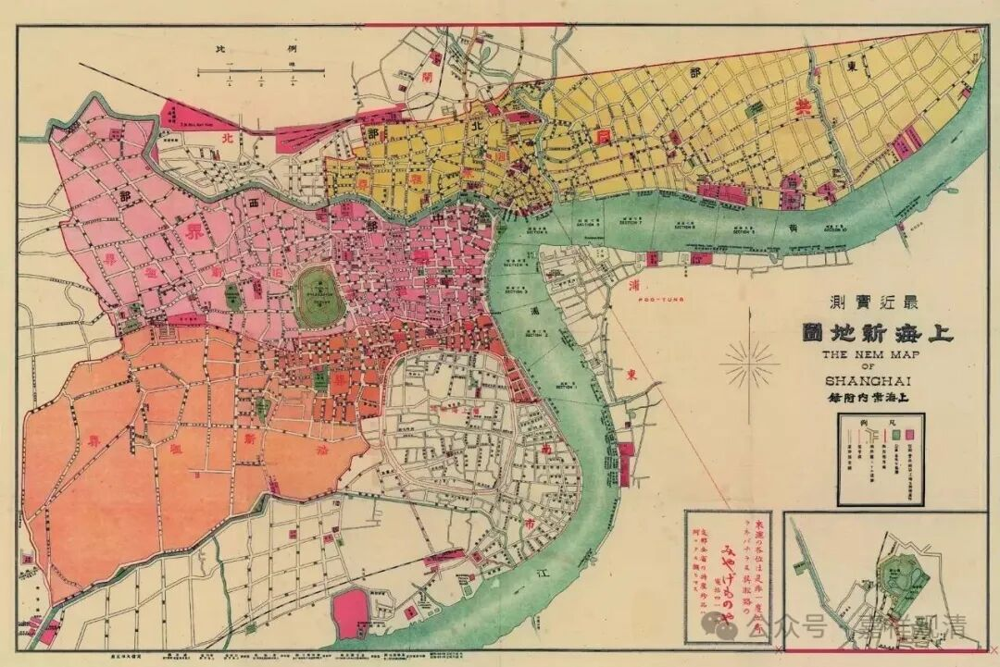

**宛平路有过一个福慧寺**

上海的宛平路上历史上曾经有一个福慧寺。

民国时期的上海，在今天宋庆龄故居以东，宛平路（1943年以前叫汶林路Route J. Winling）淮海中路（霞飞路）附近，宛平路62号（今宛平路六弄小区）还有一个寺院，叫福慧寺。

福慧寺建于日据时期，当时（一九三九年）房主以半价（伪币十二万元）将房屋出售给道根法师，后改造为福寿寺，道根法师为第一任住持。其实当时这样以民房改的寺院很多，比如之前提到过的海慧寺。中国历史上寺院的主流都是以这样的民房改建的寺院为主，只有少数官方寺院才是按照中轴线规规矩矩标标准准摆开的宫殿院落型的大寺院，早期的寺院则是印度式的宝塔+周围僧寮型的寺院……今天又多了一种寺院，旅游观光型的寺院，完全没有宗教功能，也没有僧寮，这种“寺院”今天日本也有。

福慧寺说起来属于净土宗，实际应该就是个普通的经忏道场，僧人多时住有二三十人。寺院三进，第一进是供奉弥勒菩萨和韦驮菩萨，第二进供奉西方三圣，是念佛堂，二楼供奉的是药师如来。第三进则是僧寮。

二战结束、日本投降、上海光复以后，福慧寺继续维持宗教活动……解放后仍继续有僧人活动。一九六三年，道根法师圆寂，由福严法师接任住持。也就在这一年，福慧寺停止宗教活动。

