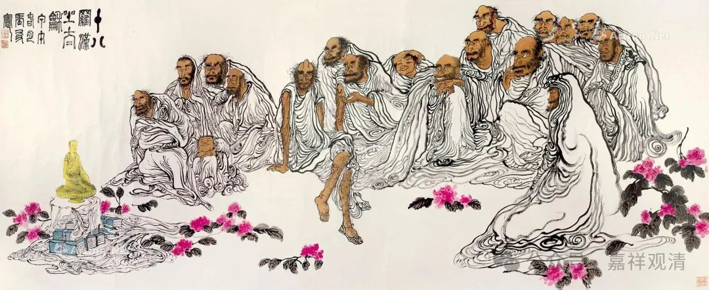
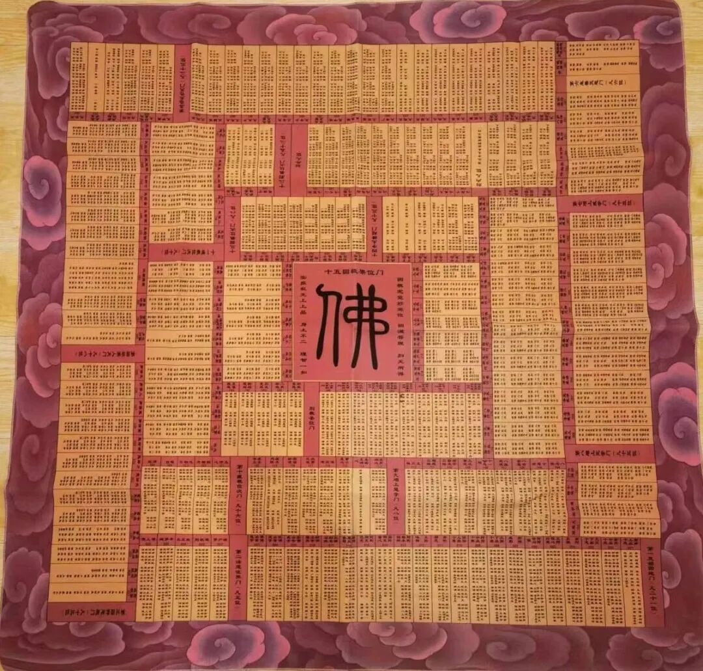
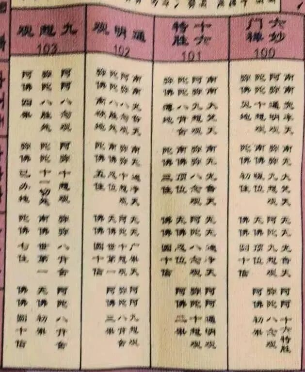
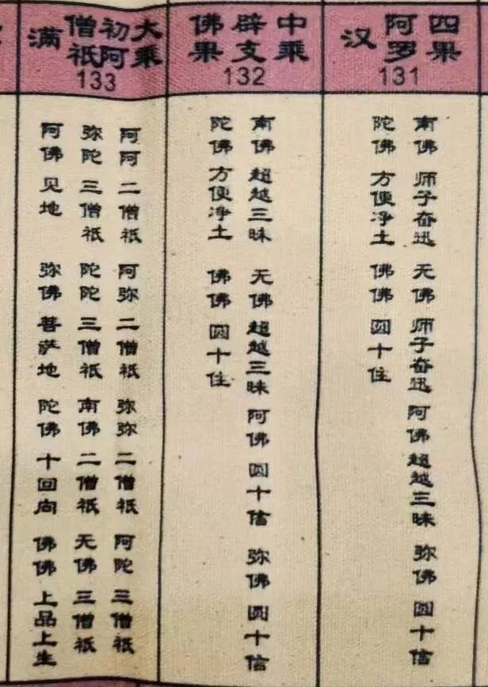
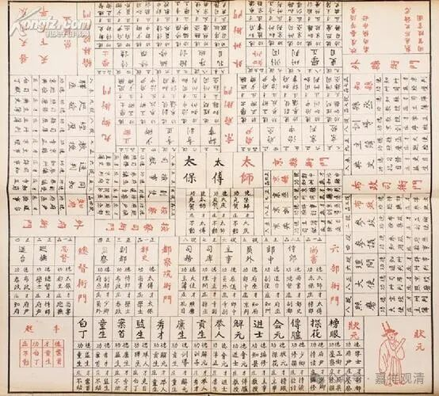
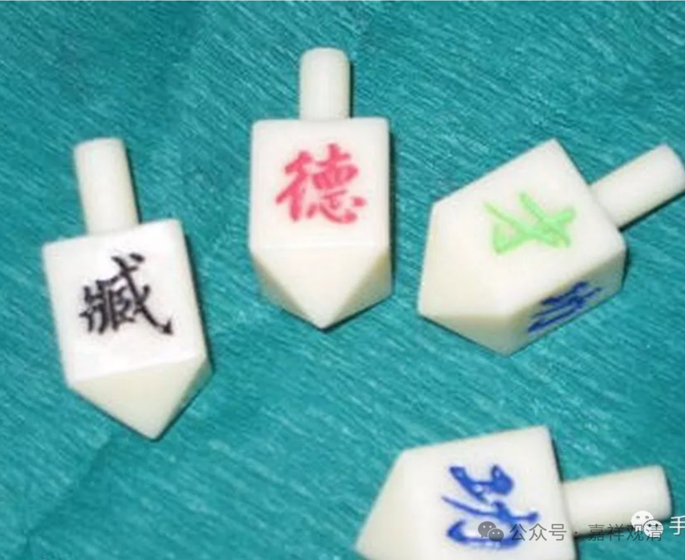
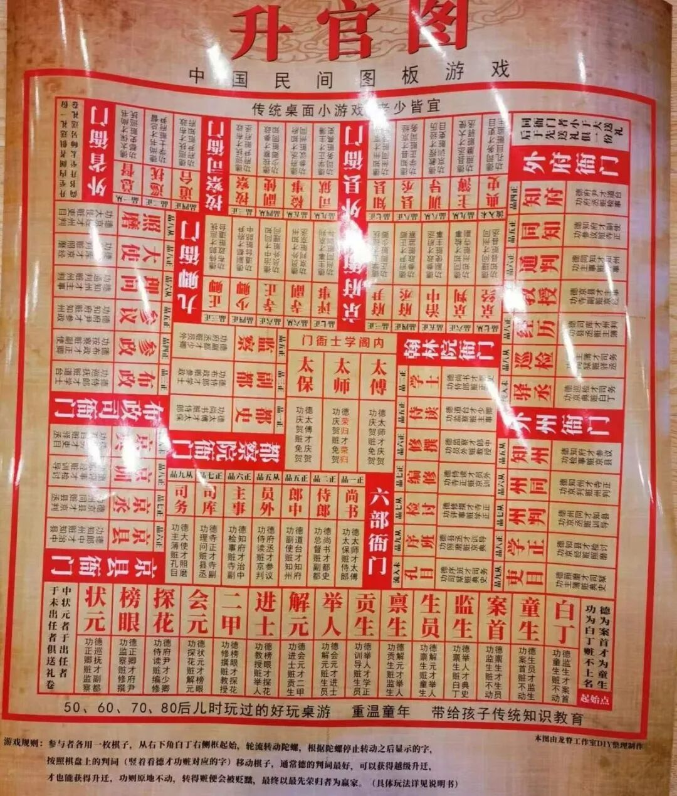
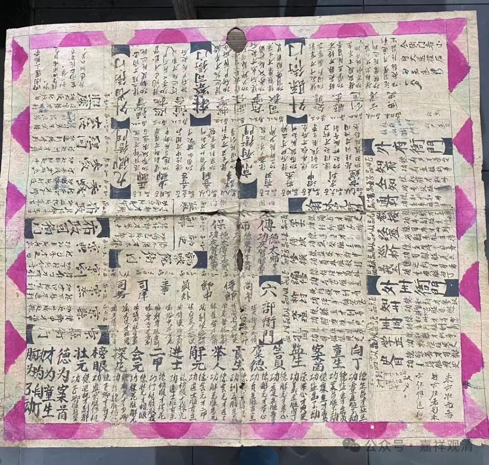

**“选佛图”和“升官图”**

有一次去戒幢律寺访志大师，发现了这个东西——

“选佛图”，便“没收”了。

这张图是现代制作的，玩的时候要搭配两粒骰子，骰子六面分别为“南、无、阿、弥、陀、佛”。

“选佛图”类似一种游戏棋，二人以上就可以玩，靠投掷骰子在图上进退，最终先到“圆教佛果位”者为圆满、胜利。

比如行进到“六妙门禅”的方格，假如丢出两粒骰子为“南南”，则进至“兜率天”；丢出“南无”则进至“大梵天”……若此时丢出“佛佛”，则直接进至“圆教的十信位”。

若“意外”进入“独觉位”，那接下来就“麻烦”了，因为虽然仍旧可以丢骰子，但除了至少丢出一个“佛”的骰子来才可以行动外，否则一概原地不动——禁足了！

这种寓教于乐的“选佛图”，基本是以天台教理为背景的，传说自明代末年由憨山大师创制，藕益大师推广。

《选佛图》也不是孤立出现的，它的来源是明代出现的“升官图”（也有说是唐代就有了），“升官图”也有不同的版本，有明版的，也有清版的，还有民国版的。清版的据说创自纪晓岚——有一次纪晓岚赌博被乾隆抓包，纪晓岚说自己在玩“升官图”，第二天便献上依明版“升官图”创制的清版。

“升官图”的骰子是用四个四面的骰子（也有用六面骰子的），分别是“德”“才”“功”“赃”（臧）。一般来说，“德”最好，能飞速提升，“赃”最差，会降级，但是“赃”在有时候反而可以得到意外的机会，因为可以从“翰林”这种纯文职外派成为“知县”这种实职，而翰林这种位置的升迁上限反而不如知县这种实职有更清晰的上升通道和更高的官职上限。

这是现代复制的清版“升官图”，清版的升官图也有很多版本。

这是我收到的清版的“升官图”，相对比较粗糙。意外地还有“彩绘”（如果这几笔算的话。）

哪天找几个兄弟咱们走走“选佛图”？！

约不约？

