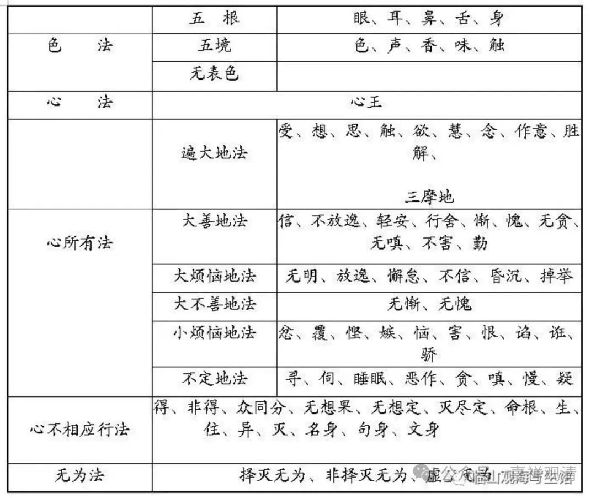

**《宗义略讲》003·019**

“遍大地法”之后是“大善地法”，《俱舍》的“大善地法”对应唯识讲的“善法”，唯识的阿毗达磨里面善法有十一个，它这里是是十个：信、不放逸、轻安、行舍、惭、愧、无贪、无嗔，不害、勤——这里没有“无痴”，所以唯识法相善法是十一个，《俱舍》是十个，这个大善地法就是善法起来的时候，都会相应。这个我们一会儿一起说。

“大烦恼地法”六个：无明、放逸、懈怠、不信、昏沉、掉举。

“大不善地法”两个：无惭、无愧。所有的不善的心，它都相应的。

“小烦恼地法”，个别生起，忿、恨、恼、害、悭、嫉、谄、诳、憍、覆（这是我背的次序，和一般的不一样），这十个各宗的安立都一样没有差别。其实之所以诸宗在这上面没有差别，是因为有佛经里面全讲到了，都列举出来了，那大家也就没有问题、没有各自发挥的余地了。

（其实我真的一直蛮接受经部思路的，经部说“心所即心”“心所无量”，只是佛讲到了这些，阿毗达磨里把这些单独拿出来做了一番整理。因为是各自摘取，所以就有了宗派的差别。）

“不定地法”，唯识的法相说寻、伺、眠、悔，《俱舍》这里还有四个——贪嗔、慢、疑。

“寻、伺”早先也翻译成“觉、观”，“寻”“伺”是什么呢？寻伺就是思慧一分为体，浅深推度为性，就是想得很粗和想得很细，想得粗的就是寻，想得细的就是伺。经部讲什么呢，（我个人的观点真的和经部很接近啊，）其他宗派说说“寻、伺”在二禅以上就没有了，我认为（我一直这么认为的，我怀疑我老里八早是不是经部的），因为你就是定义“思、慧一分为体，浅、深推度为性”，那二禅以上还是有“思慧一分”，有“浅深推度”。二禅以上没有思慧嘛？没有浅深推度吗？肯定有啊，所以我认为三界九地都有寻伺，经部也是这么说的。在《瑜伽师地论》的解释当中，（当然它是批评的）它在解释“有寻有伺”“寻伺”的时候，有一家是认为“寻伺是三界九地都有的”。

通常一般还是按照有部这个说法：初禅（含）以下，有寻有伺；初禅到二禅的中间定，无寻唯伺；二禅（含）以上啊，无寻无伺。我个人认为，假如你的定义确实是“思、慧一分为体，浅、深推度为性”，那二禅以上仍旧应该有寻伺……但是我只是这么说，并不坚持。……我个人认为，三界九地都应该有寻伺。

睡眠，就是睡觉；恶作，就是悔。为什么是不定呢，因为后悔这个事情，想好的也有，想坏的也有，睡眠前面想好的也有，想坏的也有，睡眠本身也是一样，恶作也是一样，中间恶转，厌恶所作，就是后悔，对好的事情后悔就是不好，对不好的事情后悔就是好。

那么《俱舍》在不定里面还有四个“贪、嗔、慢、疑”。“痴”呢，就是无明呢？——已经把他放在大烦恼地法当中去了。“贪、嗔、慢、疑”算在不定里的意思是什么呢？就是这几个烦恼，有可能因此作善业，有可能作不善业——这几个放在这里也有道理。

但是在唯识的阿毗达磨里当中，大家把它独立出来了，就是“贪、嗔、痴、慢、疑、不正见”，它就变成六根本烦恼，或者不正见再分五，成为十根本烦恼——唯识的这个分类是跟这里《俱舍》的分别是不一样的。

那么唯识的“不正见”在《俱舍》里面，这账是算在哪里呢？“不正见”放在哪里呢？它放在“慧”里面了，就是在那遍大地法当中，十个大地法当中，这个“不正见”就是“慧”，“慧”可以是正的也可以是负的，这“不正见”就是负面的“慧”——也有道理啊。都有道理，无所谓，哈哈（中观这种“无所谓”的态度也很……那啥，超脱）

