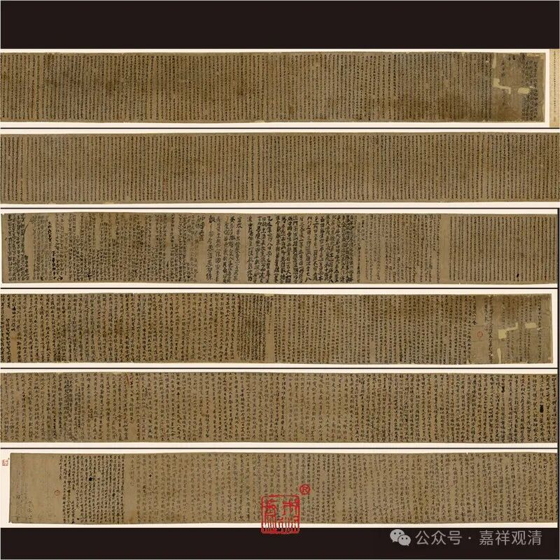

**昙旷的“四种二谛说”**

中国佛教史上，三论师吉藏和唯识师大乘基都提出过“四重二谛说”，而两位大师的二种说法完全不同，实际上，前者的四重二谛说是带着一种判教性质的方便说，后者则是在《瑜伽师地论》“四重世俗谛”和《显扬圣教论》“三重二谛”上的一种拔高和总结。这两种“四重二谛说”都可以看作是一种中国化佛教的成功的尝试，代表了隋唐佛学的最高水准。

此外，敦煌本昙旷的《百法手记》中也有一种“四种俗谛”说，它既不同于吉藏，也不承自基师，是一种“未完成版”的“四重二谛说”，或者精确地说是一种“四种二谛说”，它是一种尚未到宗师级别的“二谛说”，或者说是一种俗讲的“四种二谛说”。

《百法手记》里的第一种俗谛叫“真实俗谛”，指的是“世间内外二种因缘生法”，假如把它放大，这就是一种有为、无为的“真俗观”——无为法是胜义谛，有为法是世俗谛；

第二种俗谛称为“非实俗谛”，说世间之法如幻化而非真实——这实际是一种世间、出世间的二谛说——出世间一切皆真，世间一切皆假。这一层并不一定比第一种二谛更高阶，略同说出世部的说法。

第三种俗谛《百法手记》里叫做“近胜义俗谛”，就是揭示真谛的名句文——这实际略接近清辨的“随顺胜义”。“近胜义俗谛”所对向的是一种“究竟胜义”。这一层二谛并不涵盖“一切法”。

昙旷的第四重俗谛叫“清净俗谛”，指的是诸佛相好功德，这种“俗谛”朝向的“胜义”是指佛的法身——也就是说，佛的福德身是第四种二谛里的“清净俗谛”，而佛的智慧身则是“清净胜义”——这一种二谛仍旧不包括一切法。

昙旷的“四重（种）二谛说”也是言之有物，通俗易懂，也是一种基于佛教思想史判教的“四种二谛说”。

