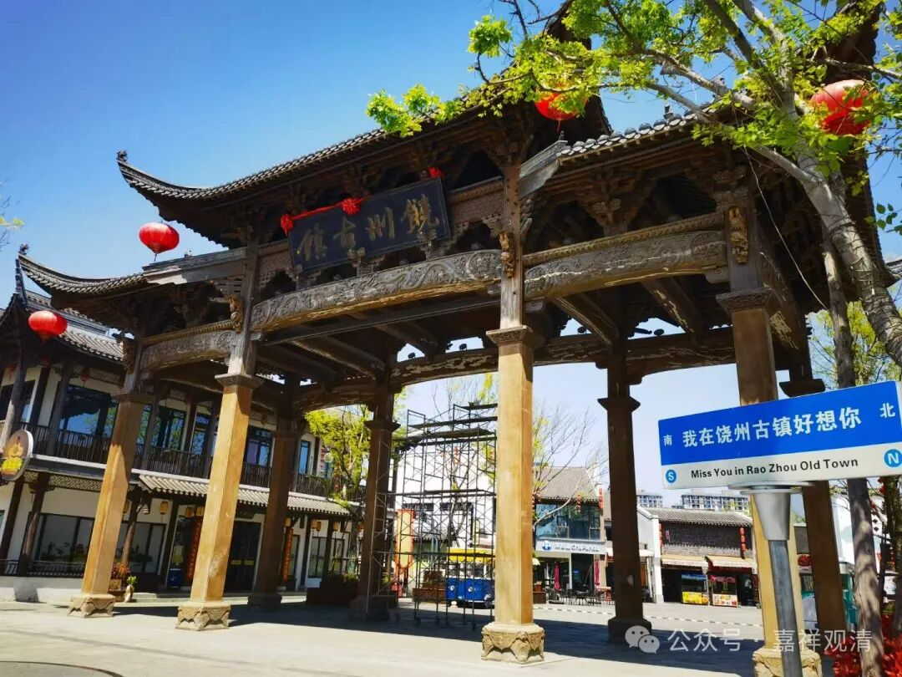
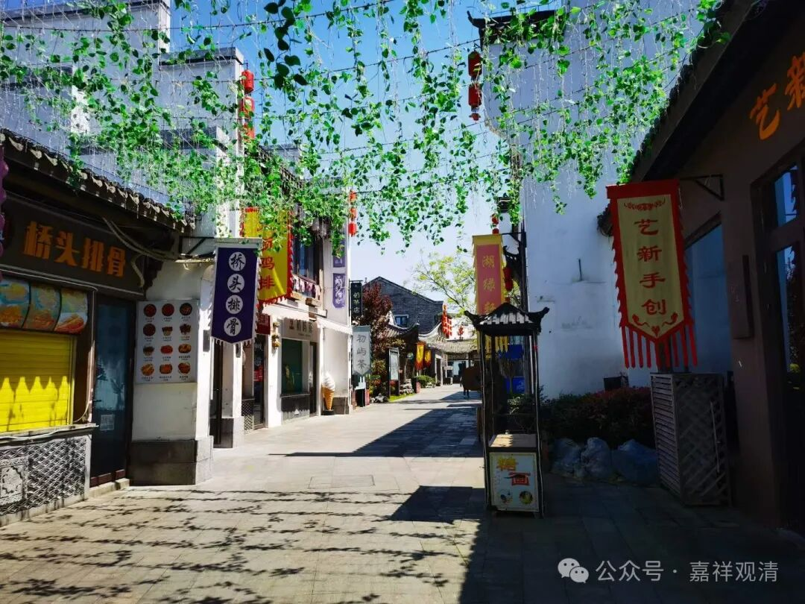
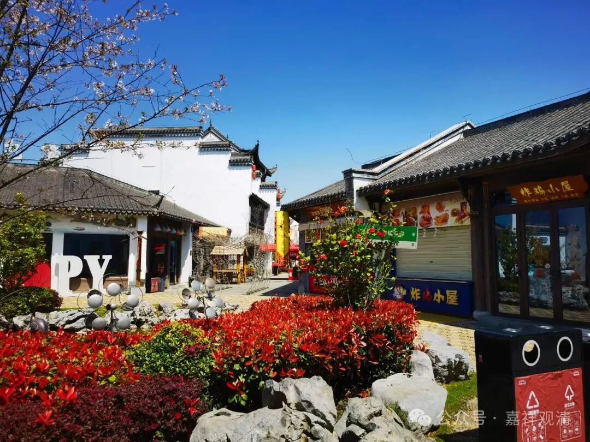
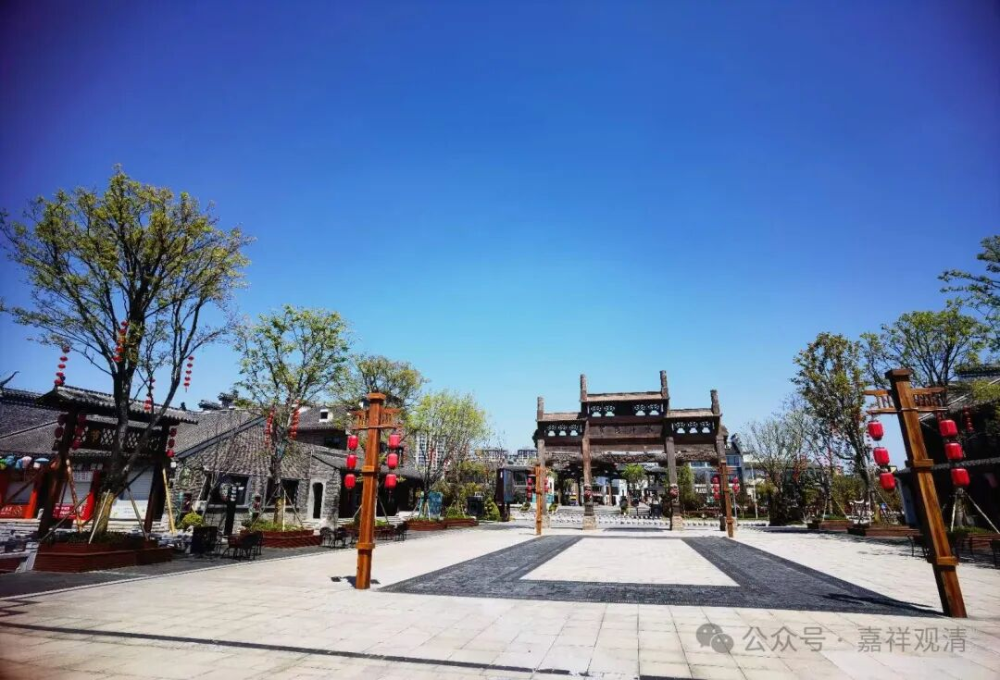
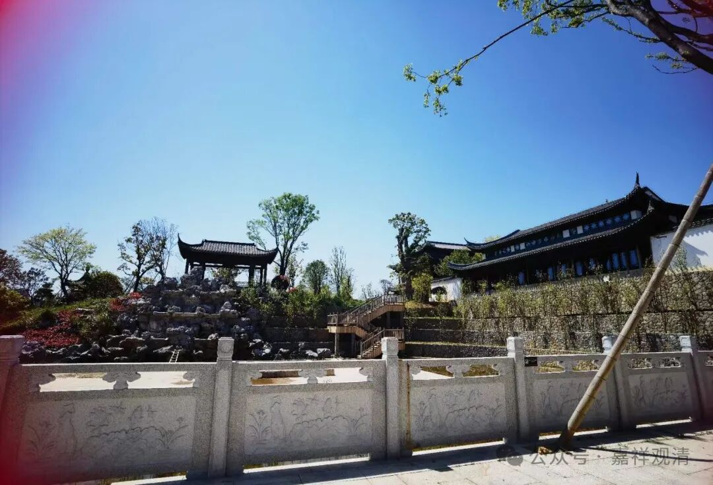
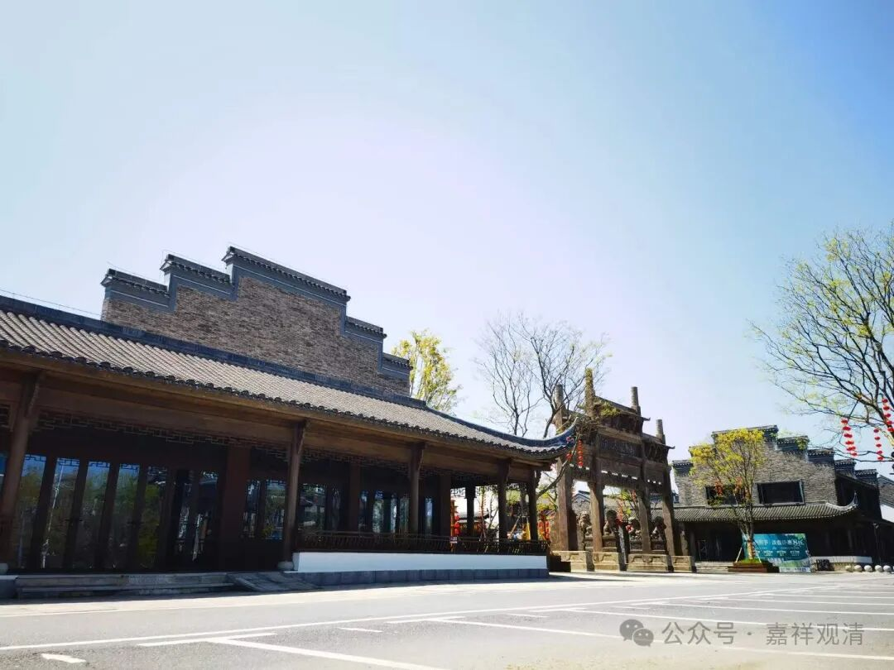
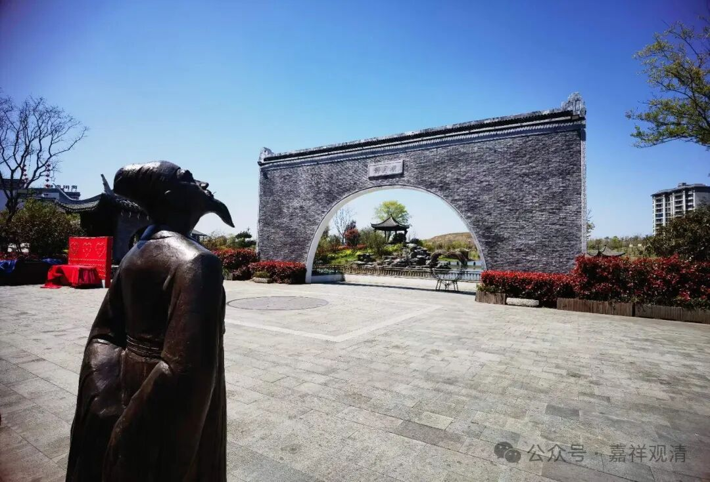
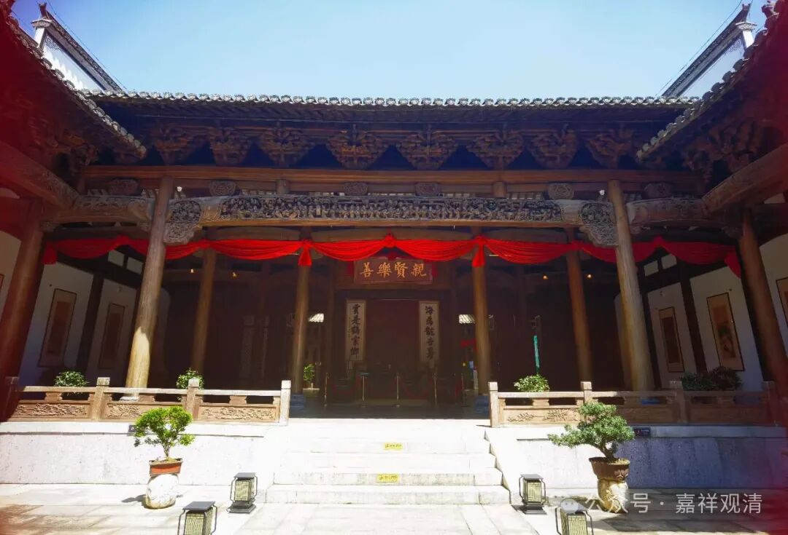

**饶州古镇**

中午去饶州古镇走了走，真清凉……

除了几个零星开着的小店，好像也就我和老胡两个算“游人”了。甚至我想吃个炸土豆、臭豆腐、铁板豆腐（我好像也就只能吃这些了）都没一个出摊的。还好我们在对面炒了俩豆腐、青菜吃过了才来，不然今天的午饭都得抓瞎了。

问一些营业的小铺，说白天基本没人来，一般要到晚上才热闹，呵呵，晚上不是我出来活动的时间。

我和师父去新加坡的时候，住的地方也是晚上非常热闹，白天冷冷清清，师父说，这是“鬼城”啊，大家都是夜晚才出动……我们都笑着说“有道理”！

前几天去义乌，了个打车，滴滴司机师傅原来在老家做老板——他做过旅游，疫情原因亏惨了，后来又在老家经营老街的烧烤店铺……他说“没人，根本没人”，他说，当地人想要吃烧烤都自己买东西自己烤，很少有闲心、闲钱去烧烤店吃——“这点钱，自己买点东西烤烤不香吗？烧烤架才多少钱？”……他做了两年的老街烧烤，终于“顿悟”而“出离”，跑到义乌来开滴滴，准备挣点钱回去把做旅游的窟窿填上，他说“再过两年就还完了”。

我和老胡也是这么说：鄱阳自身的消费观是撑不起一个饶州古镇的，外来的旅游人群又一直不是特别的火，所以这个饶州古镇估计也就“中午会火——因为早晚会凉”，同质化的古镇真不缺、也带不起鄱阳这一个。

老胡说：“不来，后悔，来了，更后悔。”哈哈！（老胡早上来，吃了碗肉丝面，十几块钱，就几个肉丁儿……）

希望国内的内需会被拉动起来吧，那什么，首先多给点我能吃的吧

