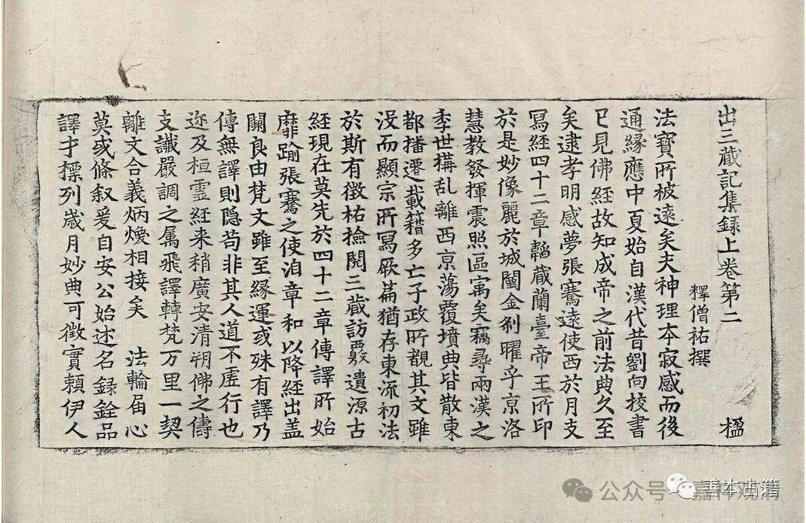

**“综理众经”而成的《目录》**

吕澄先生在《中国佛学源流略讲》里提到道安的《综理众经目录》时说：

** “他的经录通称为《综理众经目录》。这是后人依其说明中提到的‘难卒综理，为之录一卷’的说法而给它取的名字。原来的题名如何，不详。目录原本，也早已佚失。”**

现在学界、教界一般的说法都沿用《综理众经目录》的称呼，此名称最早出自隋·费长房的《历代三宝记》——

** “综理众经目录一卷……沙门释道安撰……”**

此说为《大唐内典录》《开元释教录》《贞元录》所沿袭。

而如吕澄先生所言“综理众经目录”来源于道安法师自己的说明——《出三藏记集》里保存说：

** “此土众经出不一时，自孝灵光和已来，迄今晋康宁二年，近二百载，值残出残，遇全出全。非是一人，难卒综理，为之录一卷”（今有）。**

这是说：自后汉灵帝时至东晋康宁二年（宁康二年，即公元374年）两百多年的佛典翻译，有则必录，数目庞大，难以一下子整理，先整理了一卷……“今有”二字为小字，说明僧佑看到了这本一卷本的目录，但这并非道安《录》的全貌。

所以吕澄先生说“综理众经目录”是后人“取”的名字甚至是“误读”的名字，实际是“综理”“众经”等而成了一些“目录”，并不是原来就叫“综理众经目录”。

中学时学历史，教科书上说陈胜吴广建立了“张楚”政权，但是我读原文，觉得不应该这么解读的——“号为张楚”，不应该读为“号称是张楚政权”，而是该读为“号称是张大楚国”。后来看到一本历史学杂志上也说不应该“张楚”连读为国号。这里的“综理众经目录”的名称和“张楚”就有点像，前者是偏正结构，后者是动宾结构。

