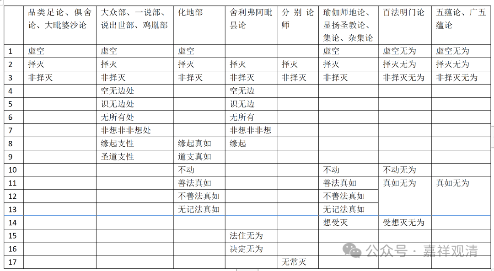

**《宗义略讲》003·025**

接下来说无为法。

无为法在有部，或者说我们说在《俱舍》，《大毗婆沙论》系统当中，它说有三个，择灭无为，非择灭无为和虚空无为，这是三个。但是这个可以有开合的不同。

比如有部后面就认为善法当中，大善地法，他还要加的，比如说“厌”，修行当中什么不要，烦恼我不要，这个厌，厌离世间，佛说了厌离世间，这个厌怎么会没有呢？实有的，而且是一个善法。还有“欣”，喜欢无漏法，喜欢解脱，佛说的，这个“欣”也应该是一个善法。《成实》的“八十四法”固然加了欣厌，其实在俱舍和有部师也都是要加的。所以有更多可以在“七十五法”上加的东西……

看到书上的感觉有部是铁板一块的，但实际有部的人是有开合的不同的，有部开合的不同，都说它是有部背后的背景，即使有再大的差别，即使心所都不承认了（比如法救），但是你只要承认“蕴界处三世实有”，那在有部的大视野看来，“你还是我的人”，比如法救，你还是我婆沙四大论师之一——他这个心还是挺大的。

稍微休息一下……

……下面简单讲一下各部的无为法。说一切有部师和成实师都是三种无为。

据《异部宗轮论》，大众部、一说部、说出世部、鸡胤部许无为法有九种：一、择灭，二、非择灭，三、虚空，四、空无边处，五、识无边处，六、无所有处，七、非想非非想处，八、缘起支性，九、圣道支性。

《异部宗轮论》说化地部许无为法有九种：一、择灭，二、非择灭，三、虚空，四、不动，五、善法真如，六、不善法真如，七、无记法真如，八、道支真如，九、缘起真如。

瑜伽行派，《百法明门论》许六无为，《五蕴论》许四无为，《瑜伽师地论》《集论》等说有八无为。见下表——

读完这个表，无为法基本上可以看个大概了。

