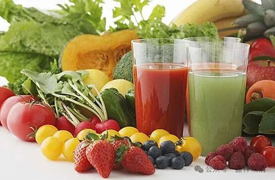

**素食者平时的营养问题**

今天又有人问起吃素的营养问题，作为一个读过营养学的、吃素的和尚，我就冒充专家出来说两句吧。其实我在寺院、佛学院也经常讲这个课的。现在一去吃素食的自助餐，满眼的东西，在我只是：碳水、纤维素、脂肪、蛋白质……

细分的营养就不说了，说大头，其实就是上面几个。营养要均衡搭配，就是基本上每餐都要有这些——碳水、纤维素、脂肪、蛋白质，吃素的主要就是要考虑蛋白质的摄入，那就是要多吃点豆制品，豆腐、腐竹、豆腐皮……这些都行。吃素的人其实要注意碳水的摄入，米面都是碳水，这些吃多了经过三羧酸循环就变成了脂肪，所以很多吃素的人并不瘦，就是碳水的锅。

另外，寺院的厨子一般炒菜会多放油，他们的意思是“要多给点油水”，其实适量就好，一般还真不缺。

吃素的人有的会贫血，除了上述的蛋白质摄入过少以外，主要是两个方面，维生素B12摄入的减少，和缺铁。

维生素B12主要在海产品中比较多，吃素的人接触不到，但是发酵的乳制品，比如腐乳或者一种臭的奶酪里有B12，实在不行就买点B12的药片吃。缺乏维生素B12会有口干甚至恶性贫血，要注意检查。可以在每次体检时加这一个项目。

素食里本身不缺铁，但是叶绿素里是绿色的三价铁，而三价铁人体基本不吸收，所以就算吃八百斤菠菜都没用，我们需要的是红色的、腥味的二价铁——亚铁（血的腥味就是这个），但是又不能真的啃铁锈是吧。虽然没有研究，但我们可以理解，铁锅应该有用。牛奶里很少二价铁，但羊奶里二价铁很丰富，我看到潮州街上就有卖新鲜羊奶的……最近一些中老年奶粉里也加了二价铁，应该有用。实在不行还是买什么补血口服液，其实就是补铁，那里面也就是含有二价铁的溶液而已。

一般的情况也就这些了，具体地还有些要补钾、补钙的那就再说了。补钙的可以吃点钙奶片，那个有生物活性比较容易吸收，贝壳渣渣虽然也是钙，但不容易吸收，好处是便宜……补钾可以平时吃点香蕉、坚果……

这些都是说的平时注意的，有病了就得直接吃药甚至补液了，这就不是这里谈的了。

下课！

