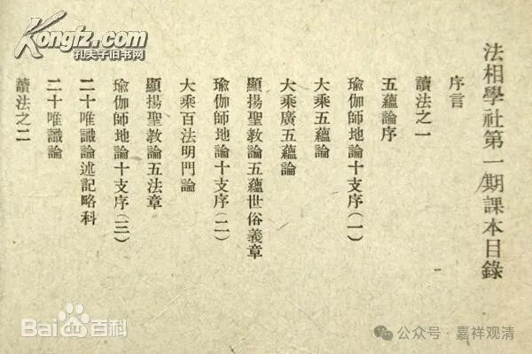
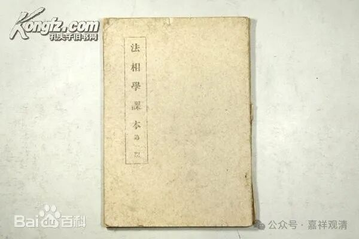
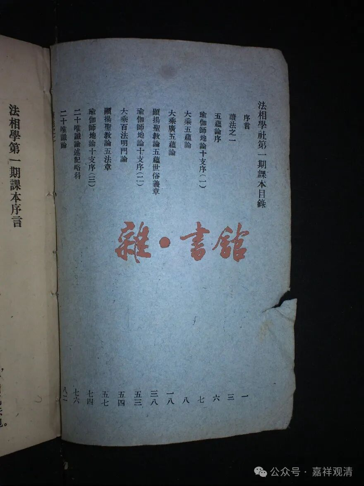

**“法相学社”和“省心莲社”**

讲到民国时代的唯识，一向有东范（范古农，上海，法相学社）、西王（王恩洋，四川，东方文教学院），南欧（欧阳渐，南京，支那内学院），北韩（韩清净，北平，三时学会），中太虚（太虚法师，武汉，武昌佛学院）并称之说。

现在的说法是，上海的法相学社成立于1948年，但据顾老说，其实之前日据时期就在今四川路一带上《俱舍论》的课了，但没说具体时间。法相学社的院址48年以后在陕西北路67弄慈惠北里6号（有些志书上写“慈惠里6号”，不精确，因为威海路南面还有个“慈惠南里”），今天威海路陕西北路附近。

陕西北路慈惠北里6号，原先是江味农居士的道场，叫“省心莲社”，江居士就在那里讲的《金刚经》，后来由范古老等人整理成文，即《金刚经讲义》，当时被称为杰作。

法相学社编有教材和社刊，课程教材分六期：

第一期：《大乘五蕴论》、《广五蕴论》、《显扬圣教论·五蕴章》、《显扬圣教论·五法章》、《百法明门论》、《二十唯识论》。

第二期：《大乘阿毗达磨集论》、《大乘阿毗磨杂集论》、《摄大乘论世亲释》。

第三期：《显扬圣教论》、《辨中边论》。

第四期：《瑜伽师地论·本地分》、《大庄严经论》。

第五期：《瑜伽师地论·摄抉择分》、《瑜伽师地论·摄叙分》等三分。

第六期：《成唯识论》、《成唯识论料简》、《成唯识论述记》。

范古老上完两期去世，后曾请内学院游侠继续讲《辩中边论》。游侠当年是中共地下党员、国民党海军少将，组织参与了江阴要塞起义。内学院欧阳渐大儿子早年居国民党高位，海军中将，抗战中被蒋介石以“军事不利”之由枪毙。后来国民党海军由黄埔桂永清一系掌权，原海军将领失势，游侠是属于原国民党海军系统的。

48年以后，“省心莲社”和“法相学社”算是“合兵一处”，算是两块牌子、一处办公的兄弟单位。游侠会内学院以后，法相学社就停止活动了。省心莲社则在1956年并入上海净业居士林。

