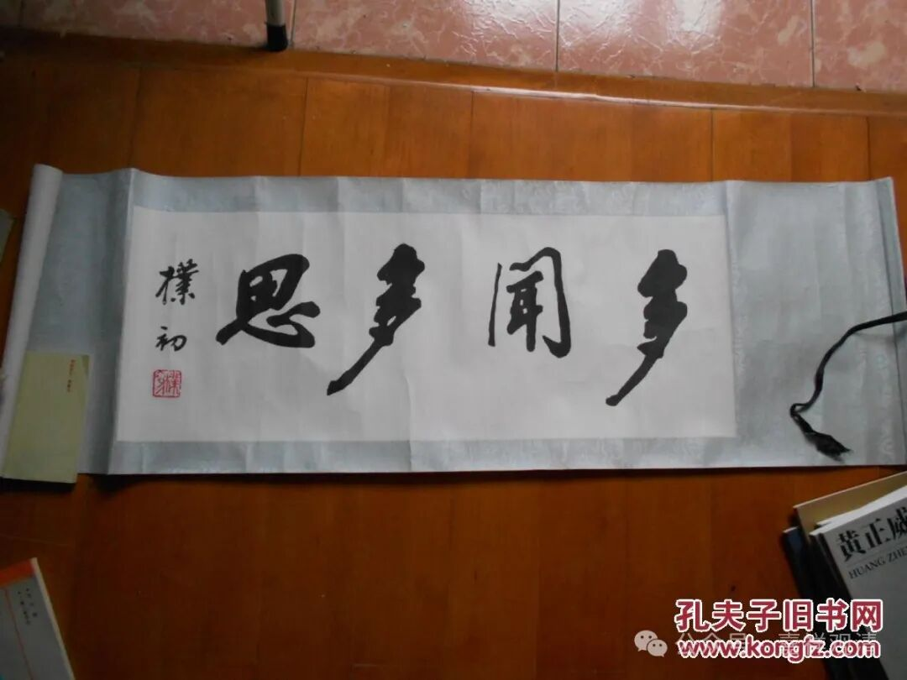

**不要自己骗自己，你没有那么想修行！**

佛教传入中国，给中国文化带来了一个很重要的符号——打坐。

禅修、静虑、打坐、盘腿子这件事情，在原来的中国文化历史背景下是没有的（不要跟我谈“坐忘”），甚至在印度传统以外也都是不存在的，所以佛教传入中国以后，除了表面上在宗教仪轨方面影响到了道教的形式，在“修行”层面的“盘腿打坐”完全让汉文化的宗教、思想界“大开眼界”——噢，原来还可以（还需要）这样？！

这其实给了一正一负两种暗示：正面的，暗示了修行、修心、反省需要引进这种“打坐”的特殊方法；负面的呢，让“修行界”有了一种错误的“知识点”——“只有盘腿的才叫修行！”后者的问题虽然不至于那么严重，但实际上影响到很多内部的人走到另一个误区——“不盘腿、不闭眼就不是修行”，进而走上了反对闻思的行为上去了。

其实对一般人而言，“多闻多思”反而是大家更欠缺的——你都不知道惑、业、苦，也不去（反复）思维轮回或者现实生活的过患（并有所体会），你只在那里闭闭眼睛、盘盘腿有个屁用啊，因为你主要一睁开眼就是现实的“我要”“我要”“我要”，老实说这个时候就是观音菩萨出现在你面前说“来吧，我们走”，大多数人的回答实际应该都是“哦，这个，再等等行吗？我老婆、我孩子，我……”

你连个欲界里面少少的欲望都放不下，却说要证果证道，你能证什么很明确嘛，你能证（挣）的只能是轮回！

不要自己骗自己，你没有那么想修行！不要舍弃闻思（谛理），单单借盘腿说事。

