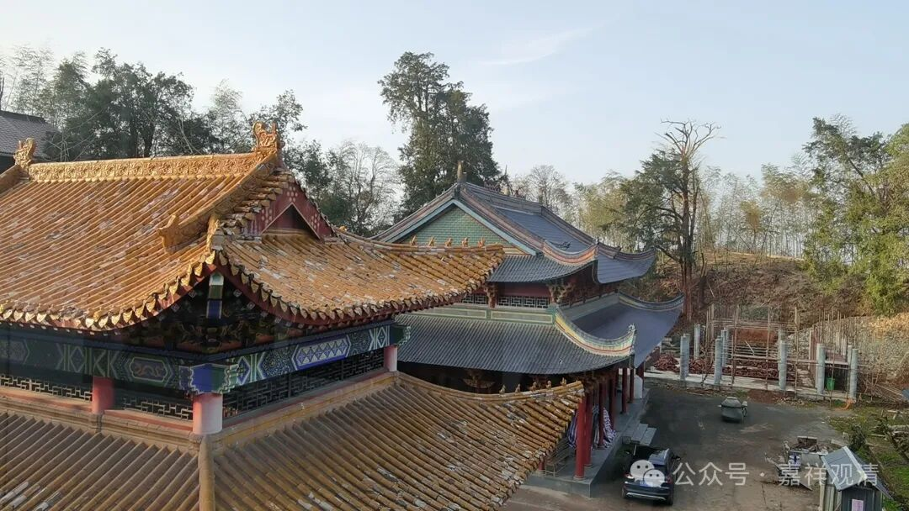

**没有闻思，枯参无义！**

我师兄今天发了一段自己“悟”到的文字给我——

“我对所知障有一个新的看法

请师兄们给评论一下。

能够对万事万物发生反映的意识

是发生在事实真相的后面，

就是说我们在感知上落后于客观事实。

这个是最根本的所知障。

甚至意识不能真正的做主，

我们的所知只是潜意识的冰山一角。

破除所知障，我们才能真正的做主人。

我们追求最高真理的目的，

其实就是为了摆脱这种落后和被动给我们造成的困境和弊端。

困在其中，苦不堪言……”

这是对“所知障是什么”，不愿意去翻字典、学经论，倒愿意泡在禅堂里“参”。

我找了几段经论原文贴给他，告诉他，（其实早就告诉过他）“所知”指的是一切法，在一切法上不能够完全通达的、成佛的障碍叫所知障。

其实以前他也和我犟过（那个找到我非说“金刚不是钻石是合金”的也是他。当时我说，你查字典，看看到底是“金刚”还是“金钢”。他真找出《新华字典》，然后……老实了。），他说“所知障就是知识障”，“知识越多越反动”，知识学多了就是障碍，所以大学生出家不如他这种初中毕业的——这也是普遍的江湖流行的“文盲佛教”的标准答案，问一百个和尚，至少九十九个是这个答案。

这师兄那时候跟我犟，但多少听进去了一些我讲课的内容。有一次他在GM寺打禅七，老和尚开示“何期自性本自具足、何期自性能生万法……”，我这师兄脑子一热，问老和尚：“那人家都说‘无自性’你怎么还说‘有自性’呢？”……第二天就被安排看大殿去了……这是师兄弟们笑着传给我听的。

中国绝大部分和尚这个毛病我看这辈子都是改不了的了——根本不学习！

