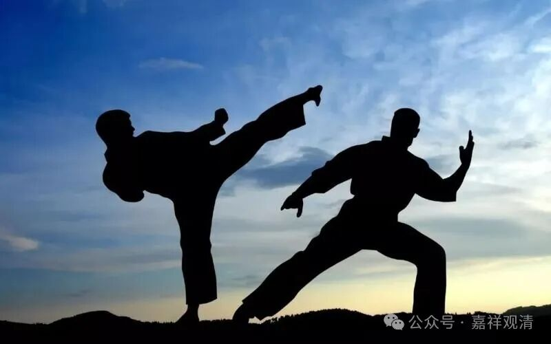

**中观师拔脓**

这两天我们师兄弟们好像有点儿活跃，还有个师兄的徒弟要收剃度弟子了，问我应该排什么辈份。我说，“字，派空字辈；号，排道字辈。”……

我怀疑会不会是那个做过黄晓明替身的徒侄儿要收徒弟了——我这个师兄有很多徒弟都曾经是横漂的武打演员，他自己也是武林高手，文革后第一代山东散手队（那时候还不叫“散打”）的，实战高手，和很多著名影星和武打演员都有结交，他们庙的上山路就是LLW出钱给修的。有空再去跟他学两招去……

在黄山的时候，师父看我偶尔也会动动腿脚，他说，“这都是鬼玩的东西”，一句话真的是让我有“茅塞顿开”之感——确实，武术的来源除了军队和猎户，就数和宗教有关，而且大量的民间武术和民间宗教直接有关，有的门派的武术拳谱一看就有明显的、浓浓的、民间宗教的痕迹（我就不点名了，还是很有名的武术流派），我们常说“毉巫同源”，其实也不妨说存在着“巫武同源”，只是在历史的流变中慢慢地标准化了……

在我师父那次说了“鬼玩的把戏”之后，我有十几年都没碰武术了（我的武术老师知道后说可惜了），直到后来发现自己身体虚了需要锻炼，才又捡一点起来，不过也还是被咱们志大师嘲笑——“一个练过武术的中医，现在竟然主要去跑步和吃西药，丢人啊！”哈哈，他抓得很准哦。

我们中观师，没套路的，能拔脓的就是好膏药，不拘中西，马步蹲得，马拉松也跑得……

