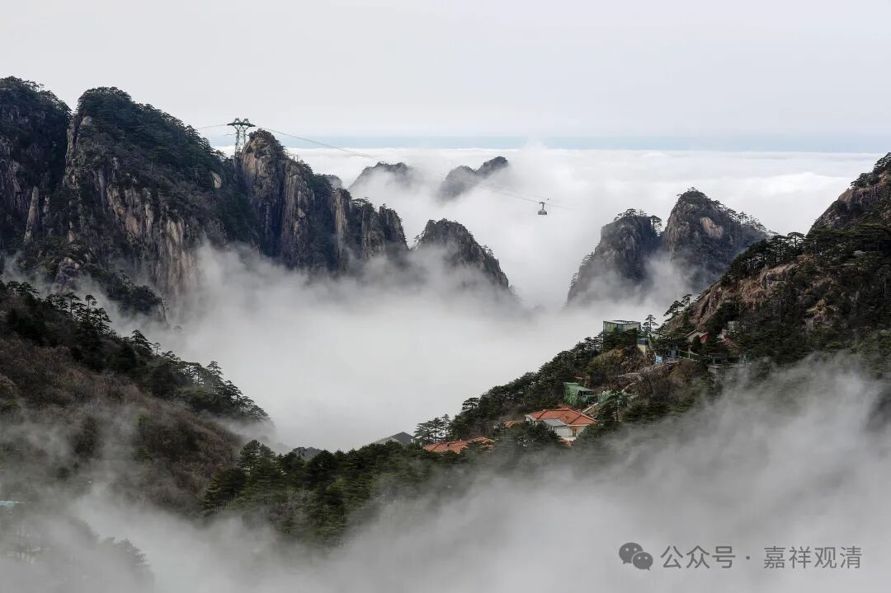
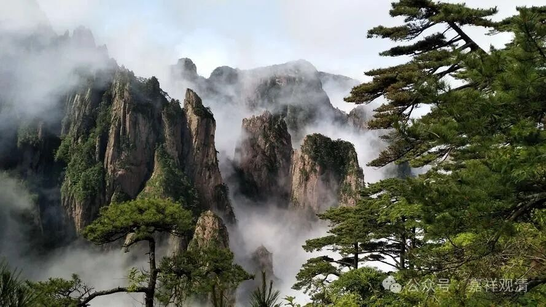
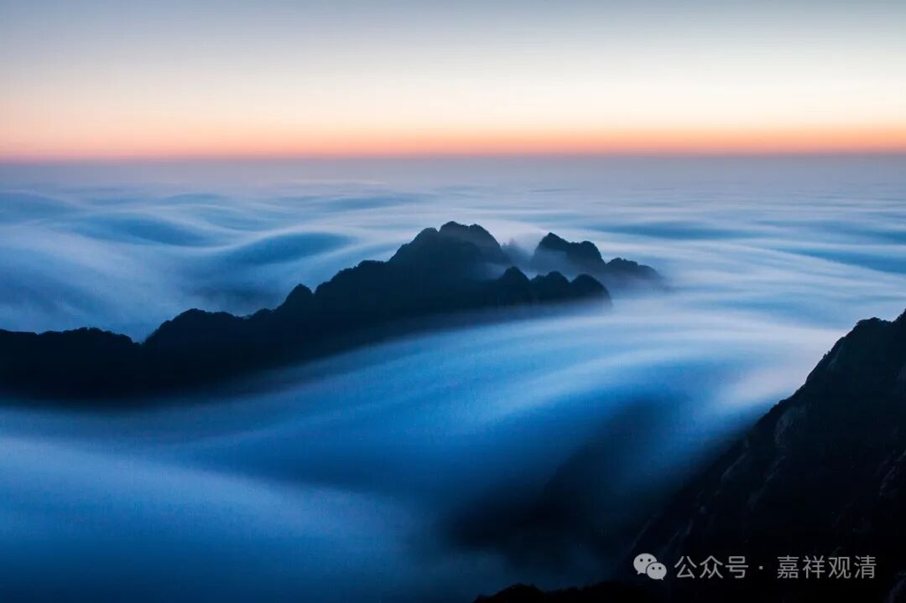
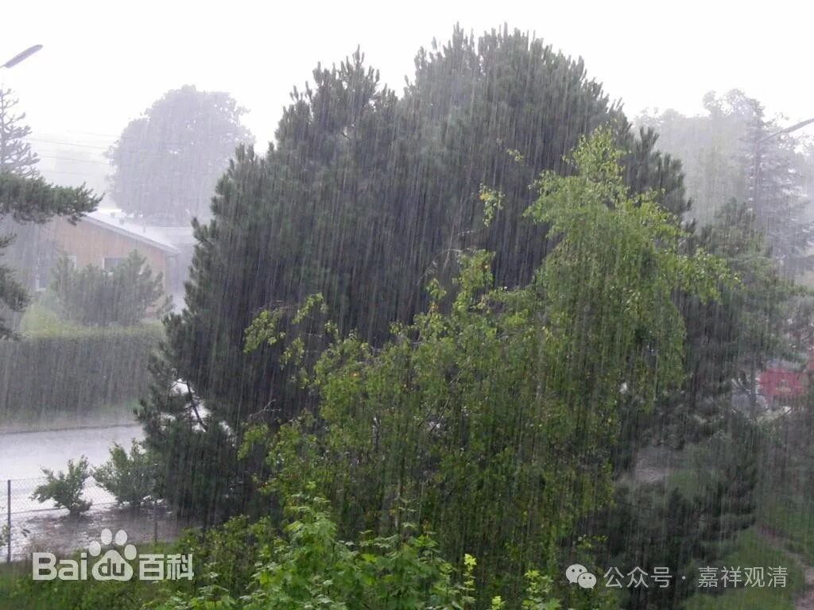
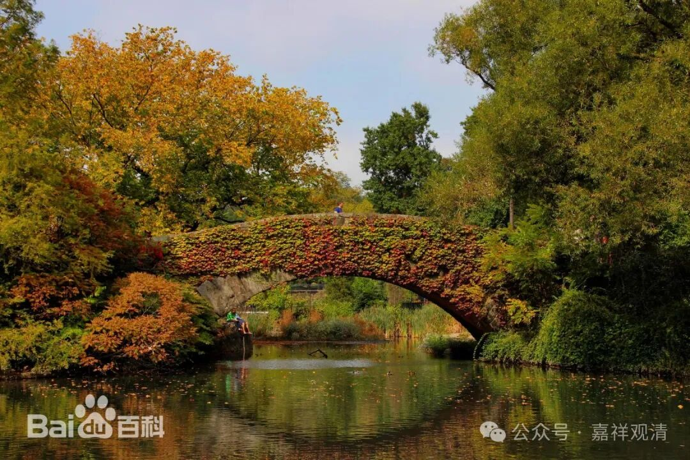
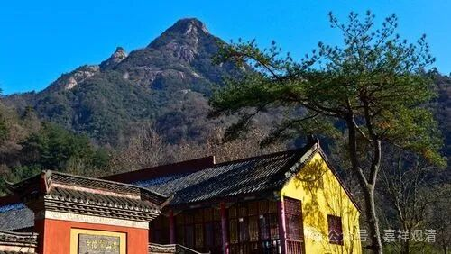

**黄山哪里像印度？**

黄山翠微寺的开山祖师传说是印度人麻衣祖师包西来，他得径山系赤岭和尚传法，西入黄山，见此处非常像印度，所以留了下来，后来弟子渐渐聚集，遂成黄山翠微寺。

师父说起这个传说的时候，我是非常纳闷的——这里到底哪里像印度？

后来我管庙里的图书，翻到一本新的地方志，才略有所“悟”——

黄山地理有点特别，山高谷深，植被茂密。一般而言，山高处更冷，海拔上升一千米要下降6摄氏度，而黄山很多山头要超出1000米，所以山顶比山下要冷很多……但是山高谷深，有时候又会造成山顶有日照而深谷没有，所以有时候又会相反，造成黄山的气候多变。

黄山的气象志里记载，黄山的年平均降雨在183天！当时我看到这个数据就感叹——一年365天，183天下雨，这是一年超过一半的日子都在下雨啊！愁死了啊！

于是突然间就懂了麻衣祖师说的“黄山像印度”的话——

我估计咱这麻衣祖师是印度那啥“雨极”（印度东北部梅加拉亚邦（Meghalaya）的乞拉朋齐（Cherrapunji），坐落在布拉马普特拉河（the Brahmaputra）南侧东西走向的卡西山地（the Khasi Hills）南坡的一袋形山坳中，海拔1313米。——百度）的人，那里天天下雨，山也是一千多米高。

乞拉朋齐

乞拉朋齐

大家来黄山重要就是看云海，而这里老是有云海，说明这里老是下雨啊。常常一开门就是云飘过去了……上面看是云海，我们庙里就是雾啊，雾大的时候，大殿对面人都看不清。很像前段时间广东的回南天，屋里到处都淌水，愁啊……

祖师还觉得好……活该他证果啊！

