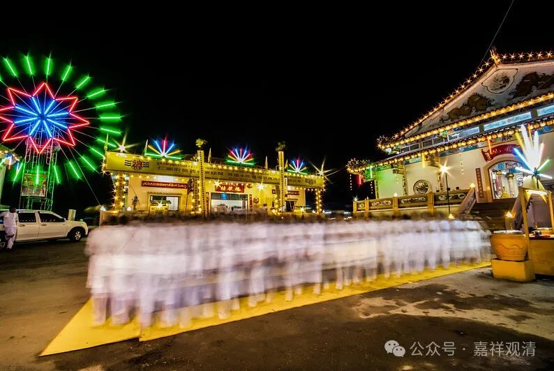

**寺院过节**

今天，汉地寺院的“节日”都是那些某某菩萨生日之类的，其实这些东西出现很晚（我这里就不方便多说了，自己人单聊。哈哈。明天我有个小的讲座专门说说这个。）

俱现存敦煌文献记载，唐代寺院重要的日子有：

** 正月初一：新年。**

** 正月十五：元宵节。**

** 二月初八：释迦菩萨逾城出家纪念日。**

** 二月十五：如来双林入灭纪念日。**

** 三月初三：上巳节（实际是上巳节的民间版）。**

** 四月初八：释迦菩萨降生纪念日。**

** 五月初五：端午节。**

** 七月初七：鹊桥会。（庙里咋还过这个节？很顺俗啊。）**

** 七月十五：盂兰盆会。**

** 九月初九：重阳节。**

** 冬至：这天有过节。**

** 腊八。**

** 腊日：冬至过后的第三个戍日为“腊日”，祭祖。**

** 除夕。**

除此之外，每月的上中下旬的“旬日”寺院也有专门的仪式。还有皇帝“圣诞”也要祝寿——这个基本上隋代以后都有了。

到了元末明初，“旬日”的仪式改为初一、十五的望旦节祀了，据此时禅宗语录文献，这时的寺院节日有：

** 正月初一**

** 元宵**

** 佛涅槃日 二月十五**

** 佛诞 四月初八**

** 五月初五 端午节**

** 结夏**

** 解夏**

** 中秋**

** 重阳（九日）**

** 祖祭：达摩祭 寂照祭 圆悟祭 大慧祭**

** 腊八 佛成道**

** 冬至**

** 除夕**

这个时候由于禅宗的五山十刹寺院制度固定了，所以有了固定的祖师祭祀。此前大部分的寺院宗派属性并不确定。这个时期还有“青苗节”，不是现在百度上少数民族的青苗节。我记得是一个另外的节日，可惜但是看了没记下来，有知道的知会我一下，谢谢。

乃至明末清初，禅宗语录里看到的佛教节日的变化也不大——

** 元旦**

** 春日**

** 解制**

** 四月初八 佛诞**

** 四月十五**

** 端午**

** 秋日**

** 中秋**

** 解夏**

** 重阳**

** 腊八**

** 结冬**

这一时期，禅宗出现了结夏安居之外的冬三月的安居，所以有了“结冬”的说法。清代禅宗语录频繁出现“解制”，看起来是和“解夏”相独立的“解制”，大概类似“今日放假”之类的制度。这一时期的节日反而比之前少了。

清代的中后期，《禅门日诵》在大禅寺里流行，今天的这些佛菩萨生日开始被固定下来了。

那么这些“佛菩萨生日”又是从哪里“泄漏”出来的呢？有缘就听我小小的讲座吧。

哈哈！卖个关子。

