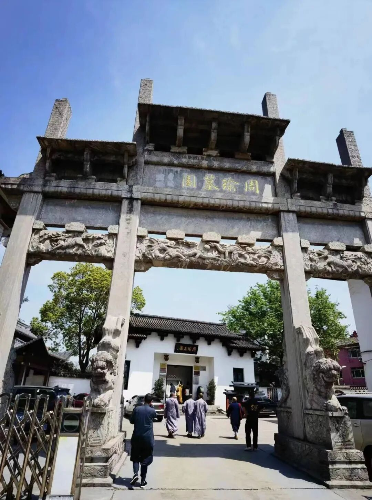
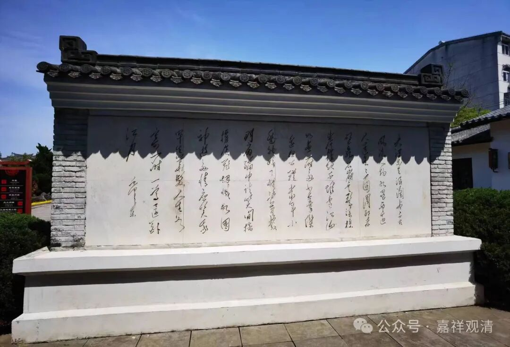
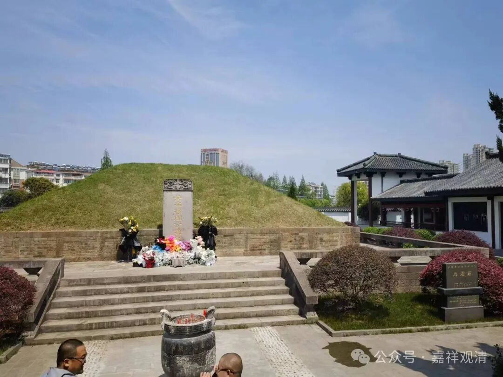
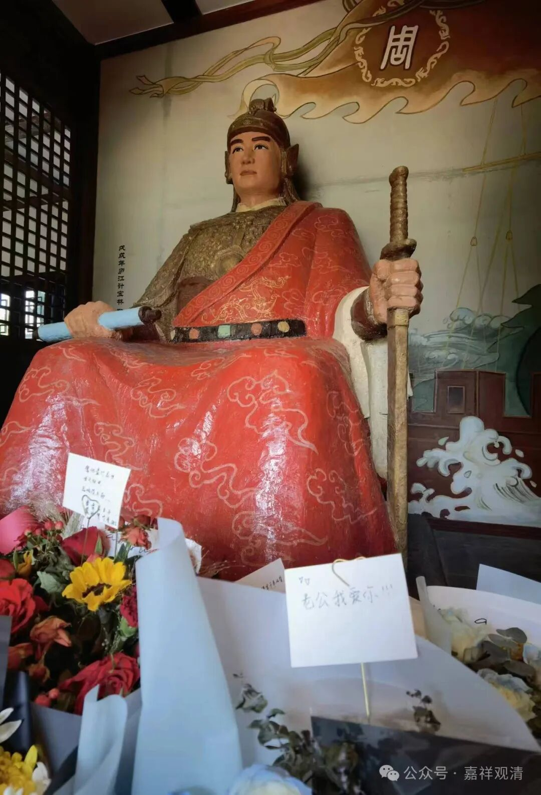
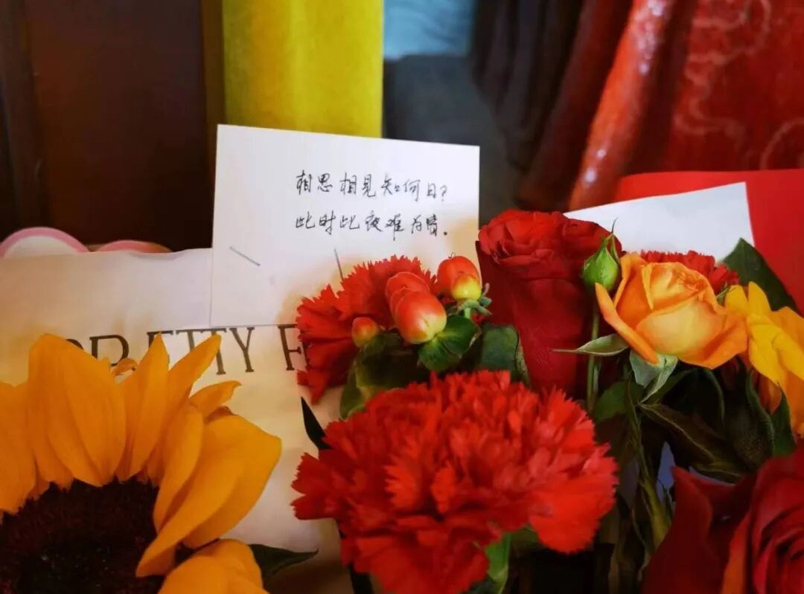
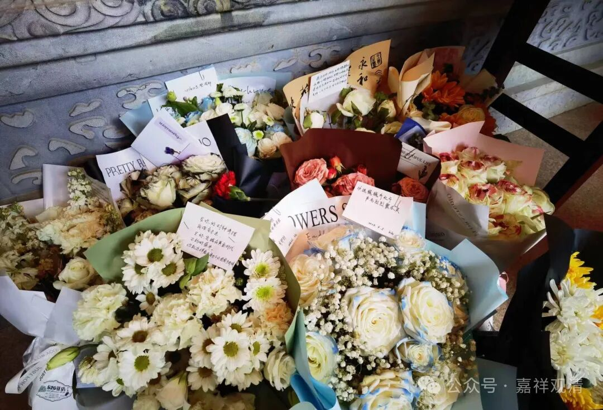
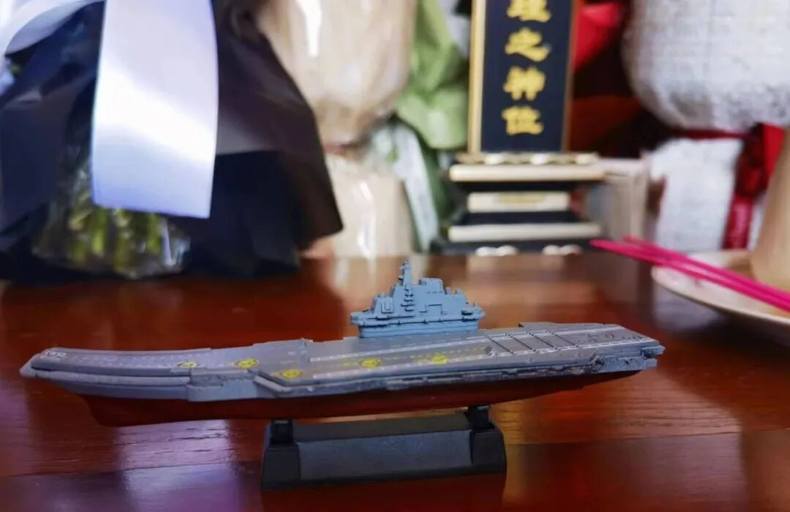
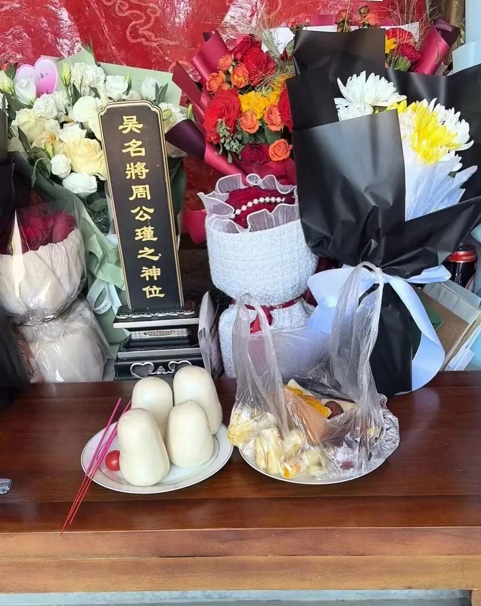
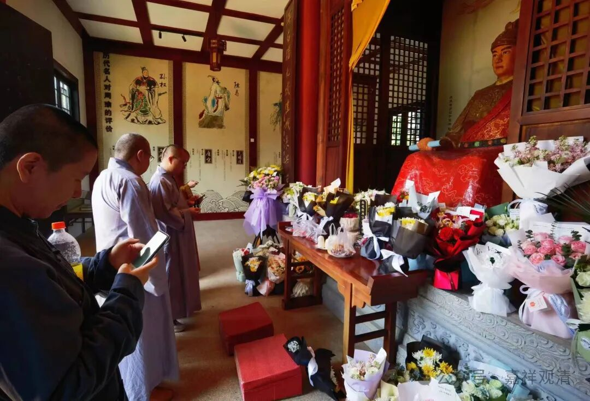

**周瑜墓园前献祭**

到了庐江，一起去了周瑜墓园。周瑜墓园也是爱国主义教育基地。

毛主席书法《大江东去》

一个三国，曾经养活了半个中日游戏产业，若论三国英雄，周郎都必须上榜。前段日子去了义乌，那里说是二乔故里，不过似乎也有说二乔是安徽人的，说起来应该是安徽的可能性更大。周瑜墓园也有小乔像，介绍说当年周瑜过世后她就在此守墓。

完全没料到，周瑜墓前和塑像前都有很多鲜花，仔细看去，花上还夹着“情书”——

“老公我爱你！”

“相思相见知何日，此时此夜难为情”

这絮絮叨叨的，尚不在少数……

甚至真的还有装在信封里的情书哦……还不少呢。不知道这些是不是会每天拿到墓前烧掉……

我想，大概是现代美女们通过给周郎写情书、叫“老公”，认领“小乔”吧。周郎长得帅，这都快两千年了也有人喜欢，可见颜值的重要性！

男生则有男生的浪漫！给水军大都督献了艘航母！这是有心了！当年若是周都督有艘航母，天下更无三分之势也！

和尚们，则只有做老本行了——稍上四个馒头、一提水果，给周郎上个供。

