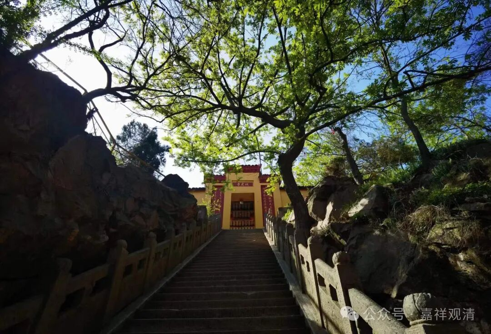
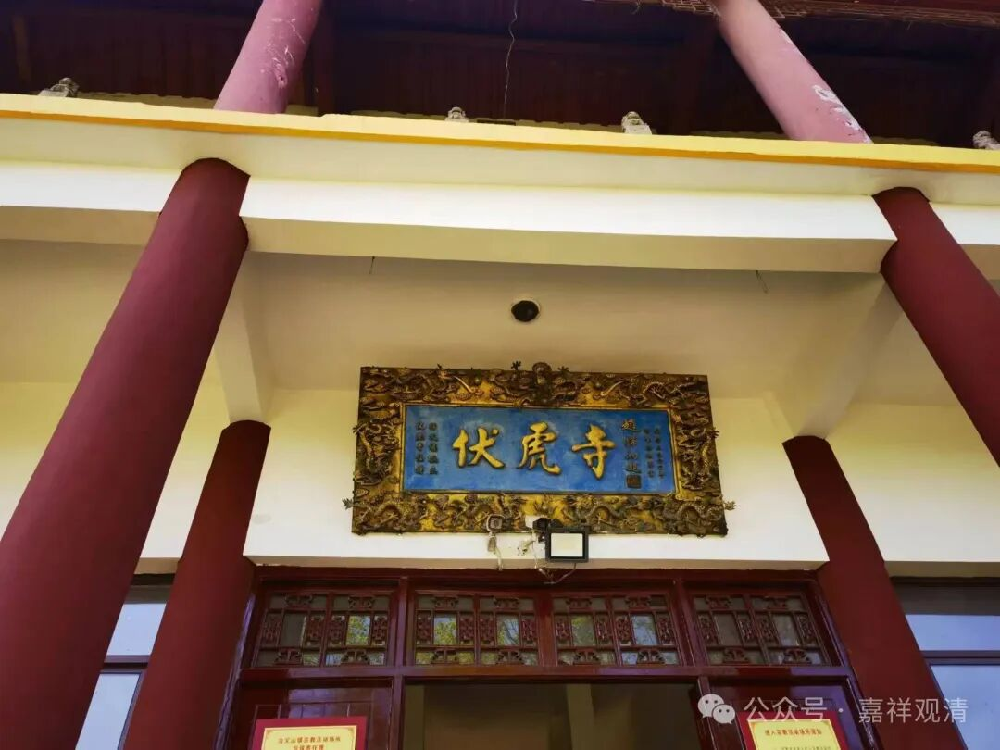
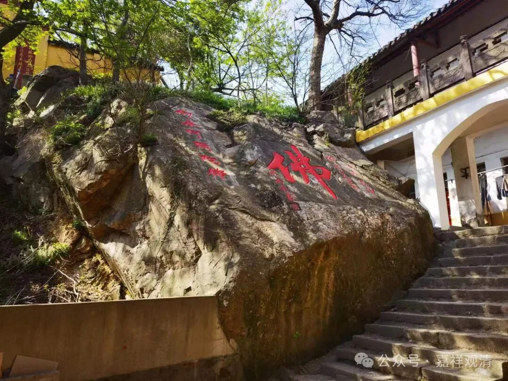
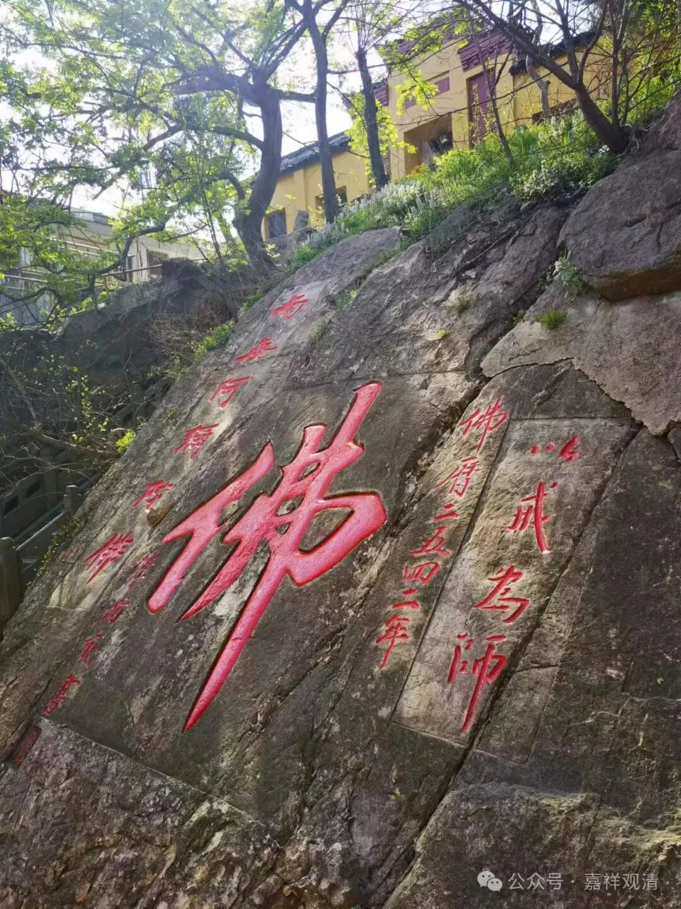
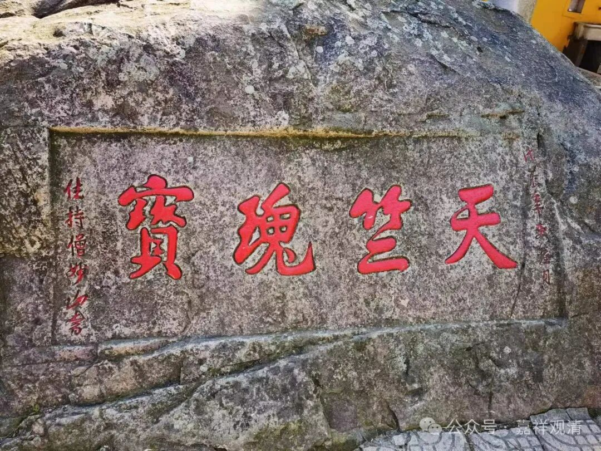
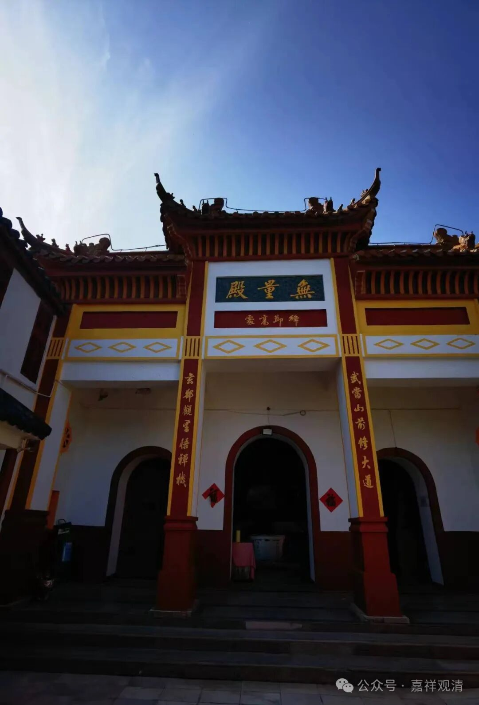

**伏虎寺的真武殿**

安徽省庐江县冶父山，山顶上面有个伏虎寺。

寺院入口处很排场，真正进寺院就发现是哪种最传统的老寺院。我这里用“传统”的意思是，五十年前一百年前的那种地方性的或者的寺院的样子被大量的保留着。

古旧的山顶的寺院一般都不会规模太大，几间顺山势造的小房子就算是寺院了。山顶一般都缺水，也缺人工和建材，所以不太可能建大寺院。我以前在九华山问过一个多面手和尚，他什么都会做，包括但不限于烧砖……我说为什么不在山上搞个窑厂烧点砖造庙？反正有土有木头……他说山上有点土不容易，不能拿来烧砖……也有道理啊。

伏虎寺有点摩崖石刻，但都不算太老。看样子应该有些文物的，但都在某个年代被破坏了。寺院的佛像也是缅甸来的玉佛，我估计和我师父有关。

寺院还有复制的碑文，说明原来有碑后来各种原因不在了。

到了最后一个院子，无量殿。我愣住了，殿前一幅对联——

“武当山中修大道

玄都观里悟禅机”

咦？！怎么变道教了？一看果然，这里供着真武大帝。两位本地出家师父介绍说，这是老早就有的。佛光师很反感……我倒是开解他——佛教在基层其实就是这个样子的。

后面还有一个塔，名字却叫“雷公塔”。底层就是这样佛道不分

