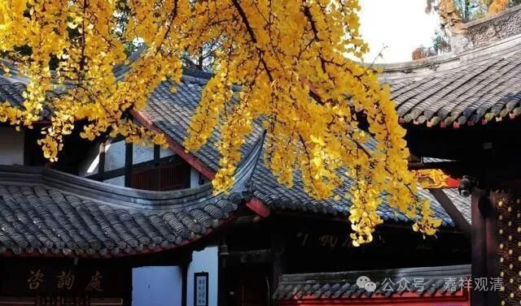
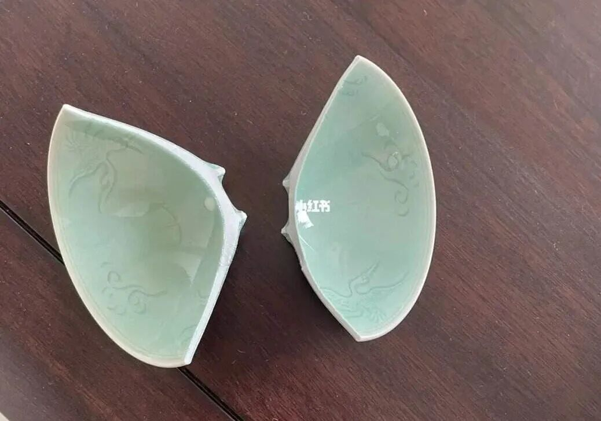
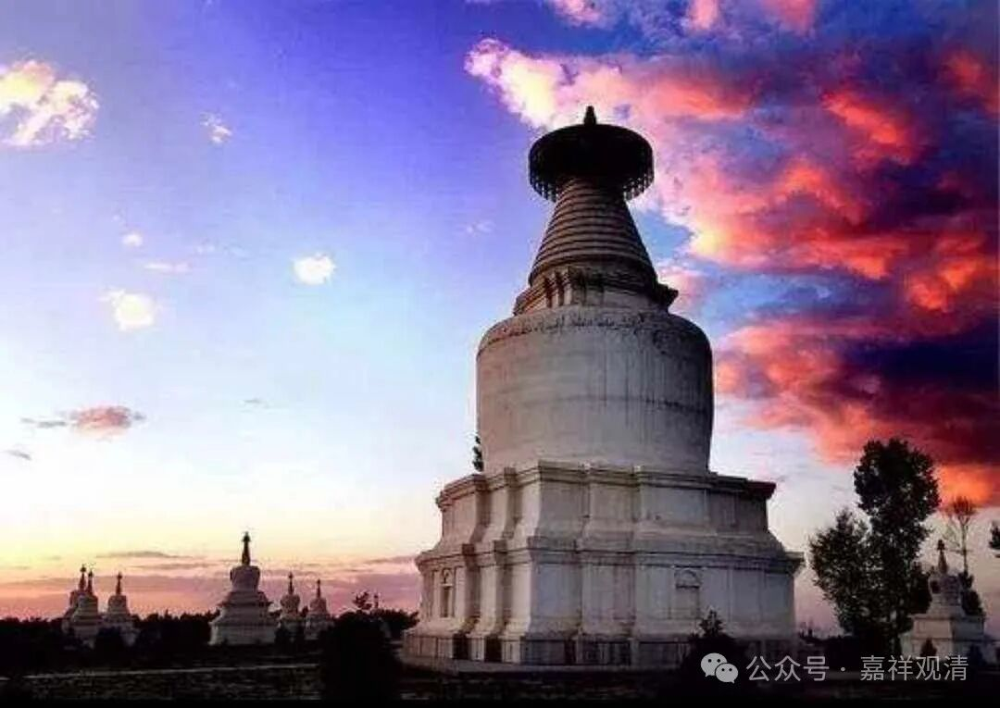
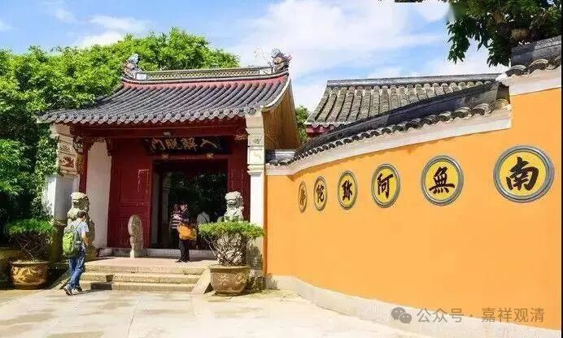
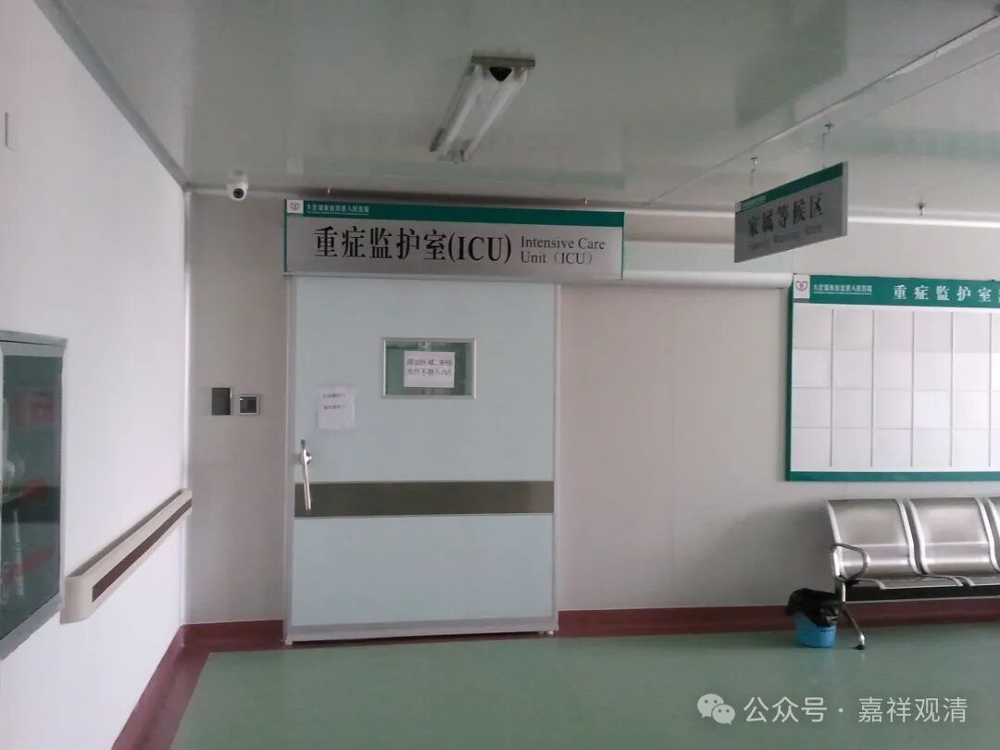

**生灭无常**

这两天赶早赶晚，有点忙，所以没有更新公众号，有的兄弟催了……这不，来了。

话说，小时候看一休小和尚，记得有个场景——

一休打破了一只杯子，师父很喜欢的杯子。师父进来，一休问：

“提问！师父，世间有没有什么东西能够永存呢？”

长老回答：“世间的一切都是无常呀，比如花开花落，比如流水奔逝……”

一休指着瓷片说：“师父，你的杯子无常了……”

“诸法因缘生，诸法因缘灭”，世间来说，无常就是它的真相……

前两天，我又一位师父圆寂了，这是近一年来过世的第四个师父了。

师父们老了、过世了，需要我们“顶上来”了。我们也老了，我们也变成老和尚了。

当年顾老过世，一开始还没觉得什么。有一天，网上有个人问了我一个关于唯识方面的问题，我没有马上回答他，心里想着“一会儿问一下顾老就好”……心里这么一想，当时还没觉得啥。过了一会儿，突然转过念来了——“顾老已经过世了，我没有人问了！”这时候，突然心里就有点落空——没有地方问了，答案得从我嘴里出来了……

上课的时候，我经常跟小和尚们说：“你们要努力啊，你们要接班……我们都老了，早晚得交班的……我也想去闭关，这已经拖很久了。你们接班了，我们就可以去闭关了……”不过也没啥效果。

大概师父看我们，就像我们看他们。

师兄刚动完心脏手术，还没完全康复就回寺院张罗了，比我辛苦。我占“便宜”了。

