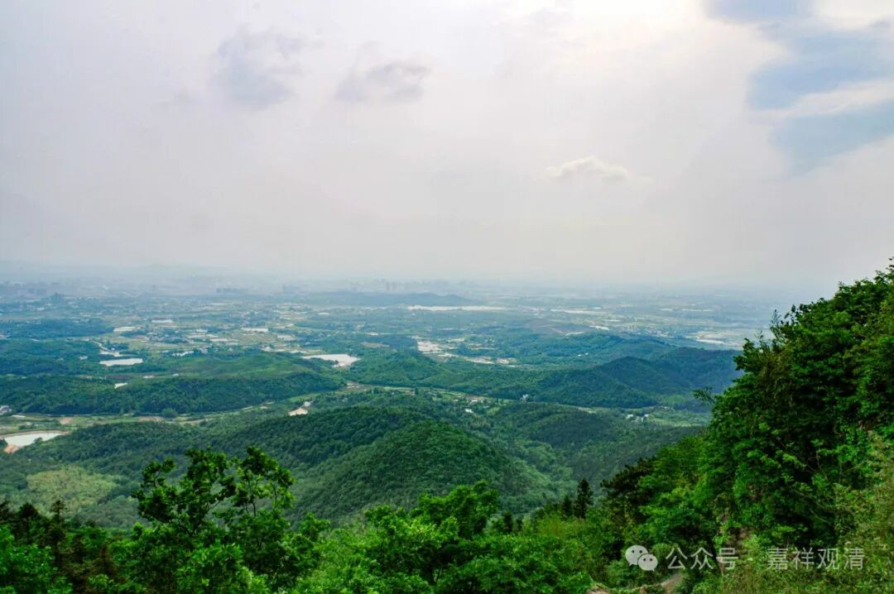

**文盲当道，愧对佛祖**

庐江冶父山的伏虎禅寺，今天是山下实际寺的下院，估计历史上本来就有沿革关系。据说又称“小九华”，我觉得这是跟它供奉十殿阎罗有关——和九华山都在安徽境内，并供奉十殿阎罗，所以叫它“小九华”。前殿十殿阎罗，中间供了几尊玉佛，后面作为主殿的无量殿供奉真武大帝，大塔是雷公塔——妥妥的民间宗教大杂烩。

其实冶父山附近的白云禅寺也一样，白云寺供岳飞、张飞、关羽、观音、佛、罗汉、财神……一不留神，你都会以为进了武庙了。

所以，行走在民间的佛教实在是千奇百怪的，老佛爷本人要是回来看看，一定不会认为这个啥教居然跟他老人家能扯上关系，假如由他们自称大乘佛教被拿出去展示，那被人家骂“大乘非佛说”也实在不冤枉……而实际上这种事情一直在发生着。

前几年泰国有个世界佛教论坛，主题是“佛教和环境”啥的，一个弯弯的老居（wen）士（mang）上去论坛发（diu）言（lian），说“吃素最好，吃肉要还的，那是因果，吃牛肉变牛，用自己的肉还，乃至吃猪肉下辈子做猪，吃鸡会变鸡”……一个南传长老站起来发言：“那还是吃人好，吃人下辈子还能做人！”

哎，派这种民间文盲出来代表大乘佛教，被人骂“非佛说”真是一点都不冤枉啊！文盲们能靠边站站不？！

