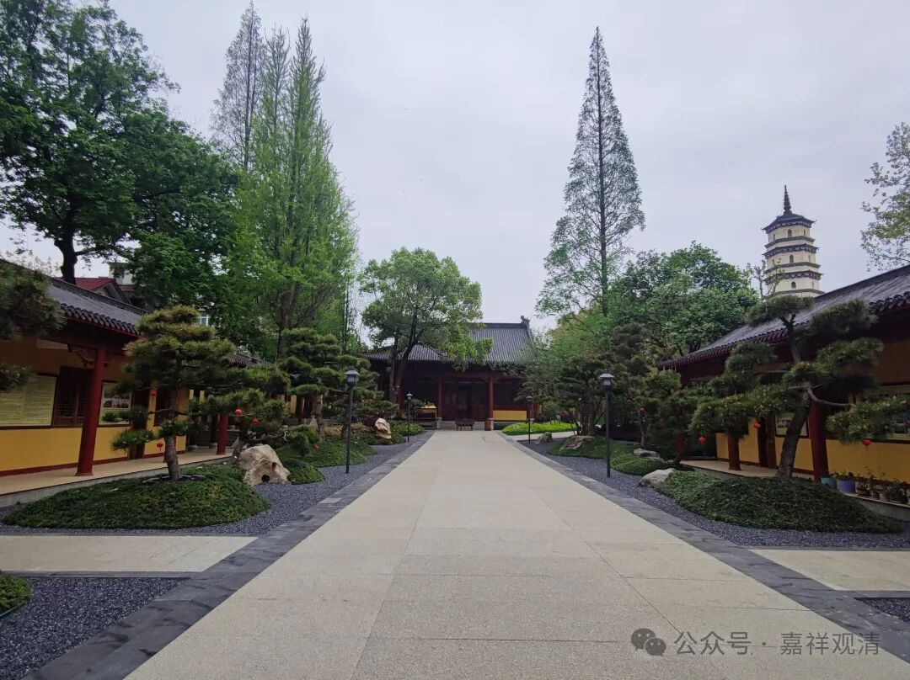
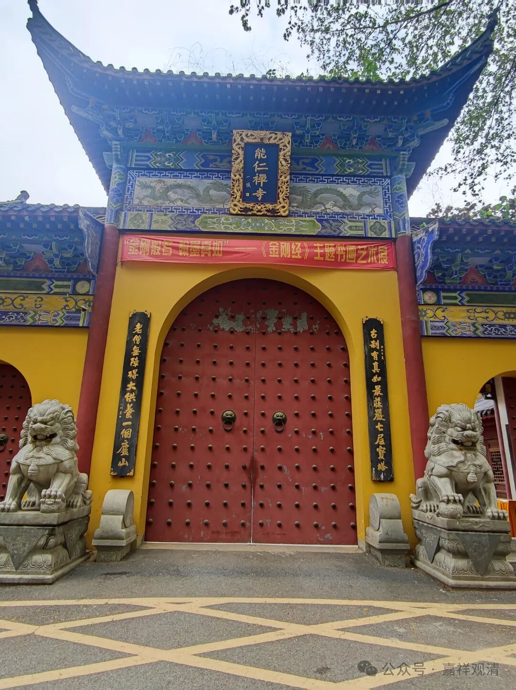
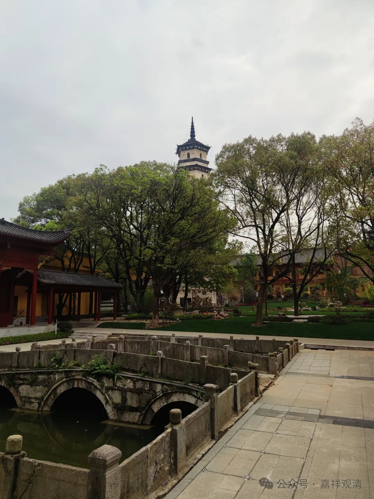
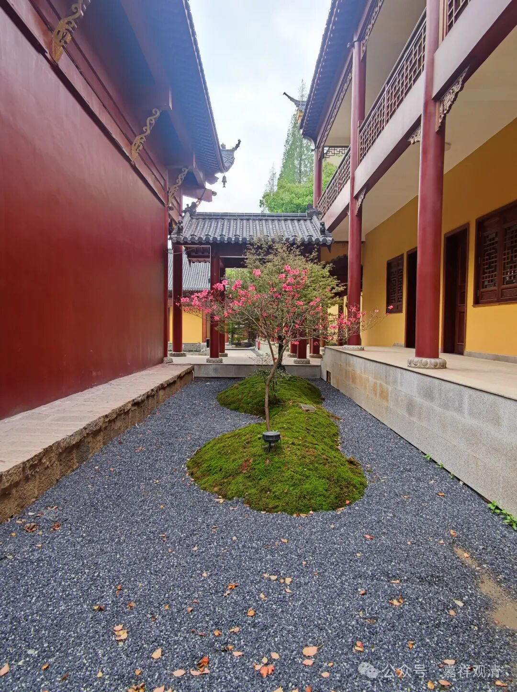
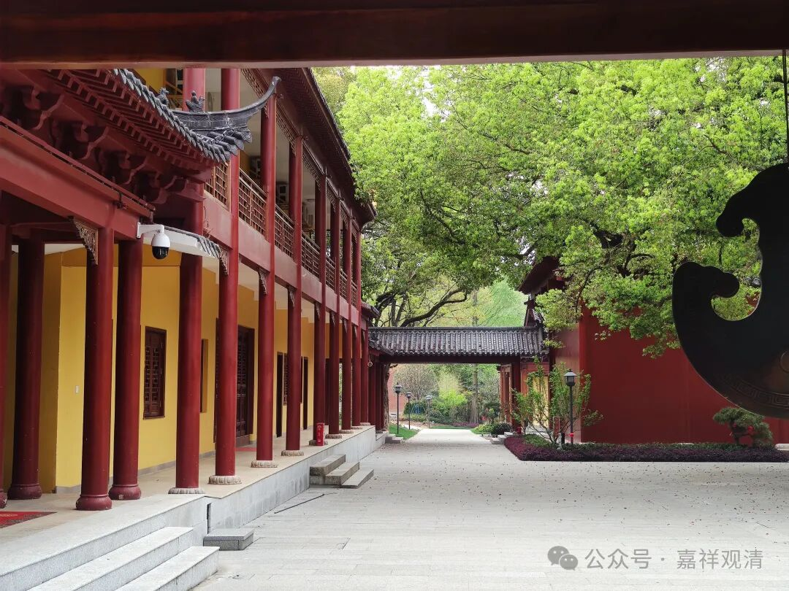
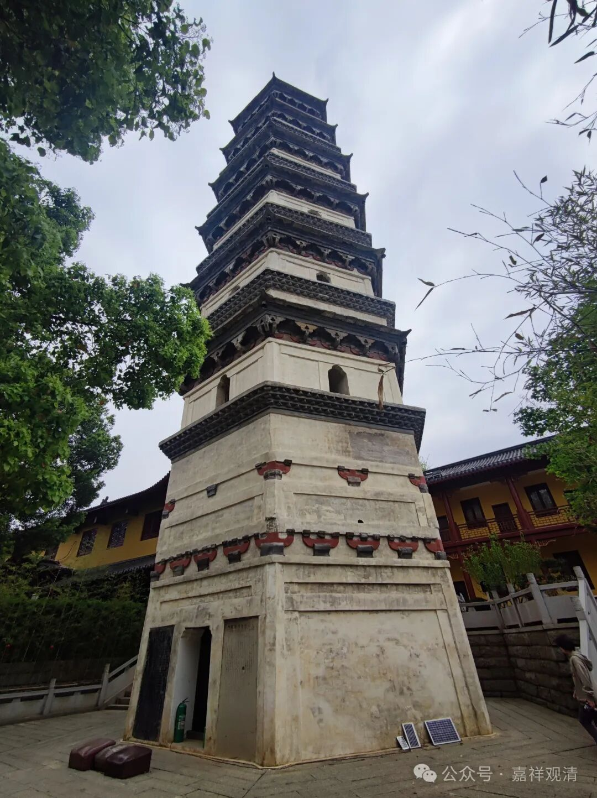

**白云守端禅师和九江能仁寺**

昨天群里何健聊起，“清明节回老家江西九江，发现当地的能仁寺翻修不错，不像五年前那么破败，只是人气很差。”

九江就在我们白云寺边上，兴趣之下，去查了一下，发现这能仁寺还大有来头……

手头正好有一本江西省佛协编纂的《江西佛教重点寺院简介》，这里面，九江能仁寺排第一，是国务院颁布的全国重点开放寺院。

能仁寺历史上叫承天禅院，北宋著名禅僧白云守端最早在就这里出世开法，白云守端禅师是禅宗临济宗杨岐派大师，师承杨岐方会禅师（临济义玄——兴化存奖——南院慧颙——风穴延沼——首山省念——汾阳善昭——石霜楚圆——杨岐方会——白云守端）。

禅宗在江西曾经极盛行，著名的马祖道一禅师也在洪州（今南昌）开法，史称洪州禅。有一种说法说“走江湖”的出处就是禅宗门下在江西、两湖一带行走，所以叫“走江湖”。当年江西水运便利，经济文化都很发达，所以禅宗也很兴盛，今天……不过也是瘦死的骆驼比马大呢，也算是禅寺林立。

白云守端禅师，是我接手白云寺时第一个想到的人物……可惜翻找下来，此“白云”非彼“白云”，白云守端禅师住持的“白云寺”，指的是安徽太湖白云山海会寺，不是咱莲花山白云寺。额，失之交臂。不过安徽那个白云山离我们也不算远。当时我还查到抚州有个白云寺……

看何健给的照片，寺院确实没什么人气，和“全国重点寺院”似乎很不匹配……

