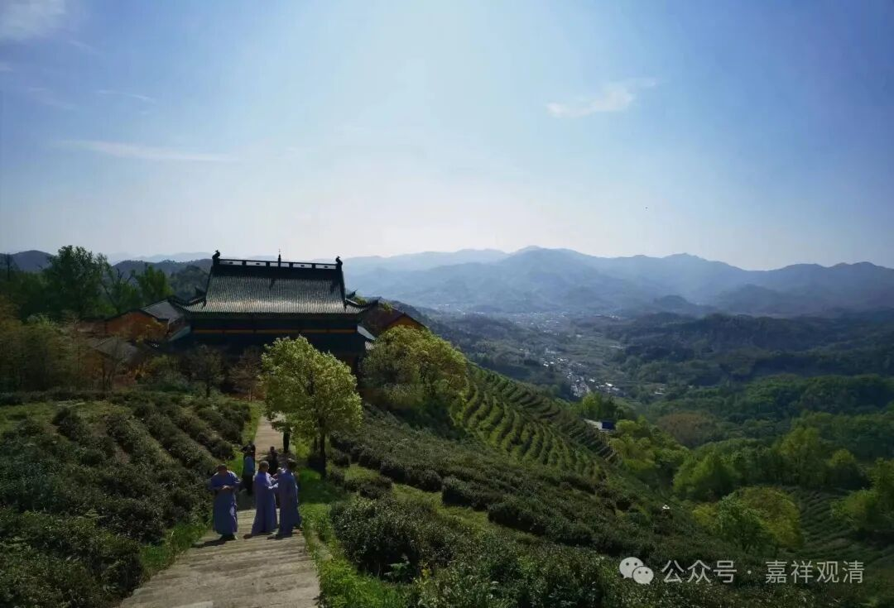
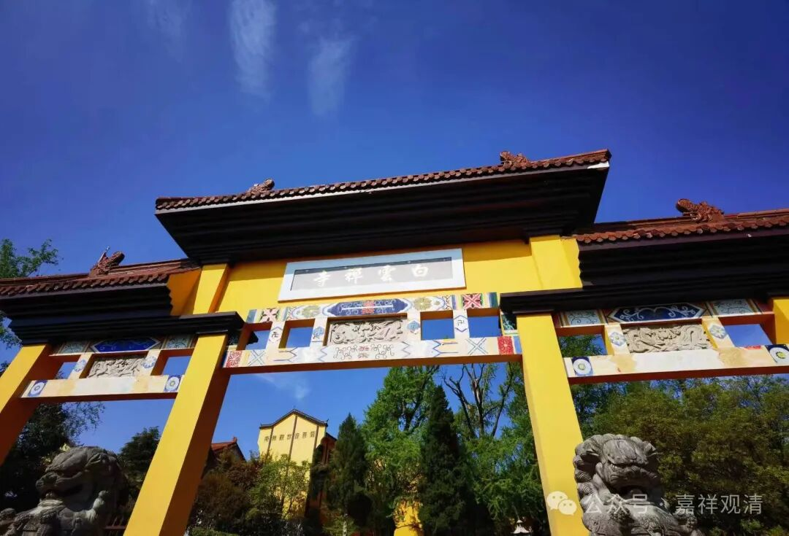
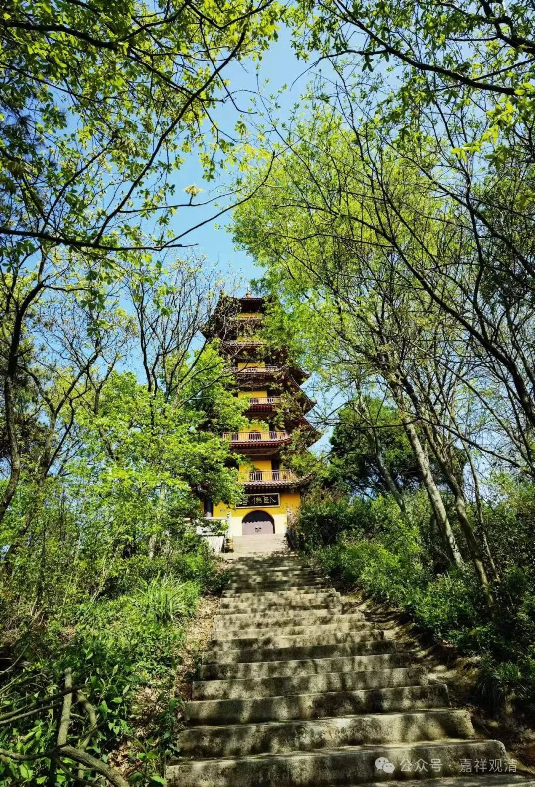
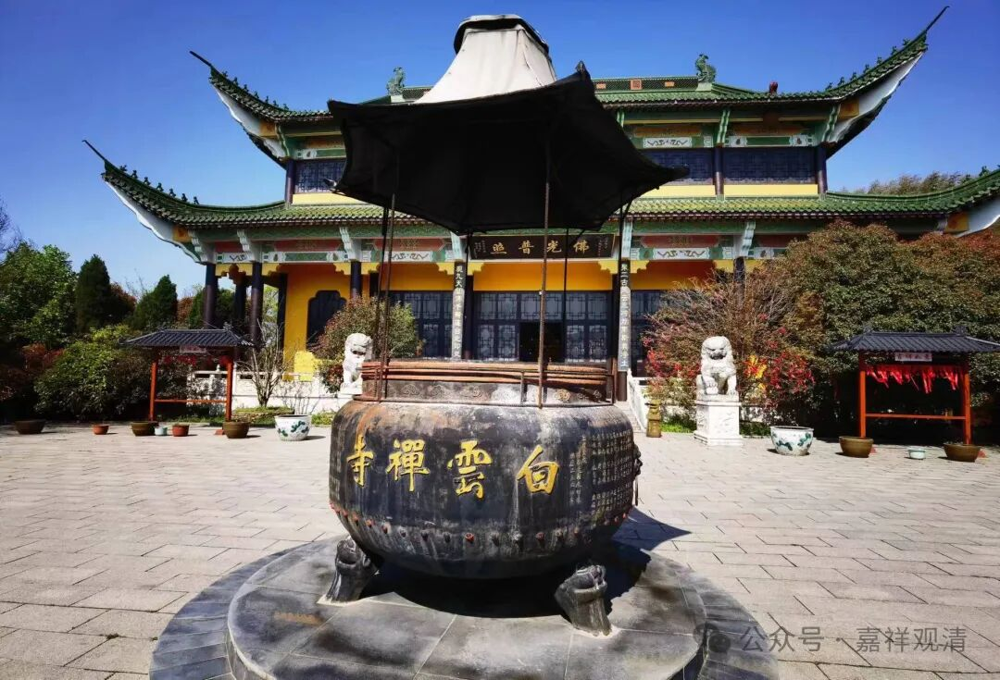

**经驮白马，劫解红羊；囫囵涂鸦，乱点鸳鸯**

上次说到庐江还有个白云寺。

说到白云寺我都会比较兴奋的，毕竟我们的寺院也叫白云寺嘛——莲花山白云寺。其实全国各地叫“白云寺”的很多，我们寺院附近三十公里左右就有一个白云禅寺，昨天说了，抚州历史上也有个白云寺，太姥山也有个白云寺，这里庐江也有个白云寺……

天下寺院重名的很多，庐江有白云寺、伏虎寺、实际寺，智阳师说他们那里（温州）也有白云寺、伏虎寺、实际寺，这么大规模地撞“名”，说明这个“寺院撞名现象”确实太常见了。

前两天说了庐江寺院的民间宗教背景，谈到了伏虎寺的真武大帝和雷公塔（庐江这里好像很突出崇拜雷神，还有十殿阎罗），也谈到了白云寺拜关公、岳飞，此外，白云寺还有其他的民间宗教的符号——

庐江白云寺观音像龛有对联：

“** 仰瞻紫竹慈云，经驮白马；**

** 遍洒绿杨甘露，劫解红羊。**”

“紫竹”说的是观音住的紫竹林（实际应该是紫檀），“经驮白马”，就是白马驮经，其实是在白马寺译经故事——上联虽然全部曲解了，这已经不算很离谱了；

下联里的“劫解红羊”，指的是“红羊劫”，又叫“红阳劫”（还有很多音同字不同的叫法），这个是民间宗教里常见的谶纬元素了，甚至还有弘阳教这类民间宗教（某位去大漂亮国“弘法”的大师就有红阳教背景），倒推上去两百年，哪位要是把这副对联呈上去，最轻的处理也得掉几颗脑袋！

呵呵，现在这副对联就这么“明目张胆”地挂着，观音大士尴不尴尬不知道，反正那啥主事的不尴尬，他可能根本就不知道“红羊劫”不是佛教的。

神州到处都是这种“佛教”，那么，这种“佛教”确实“非佛说”！

