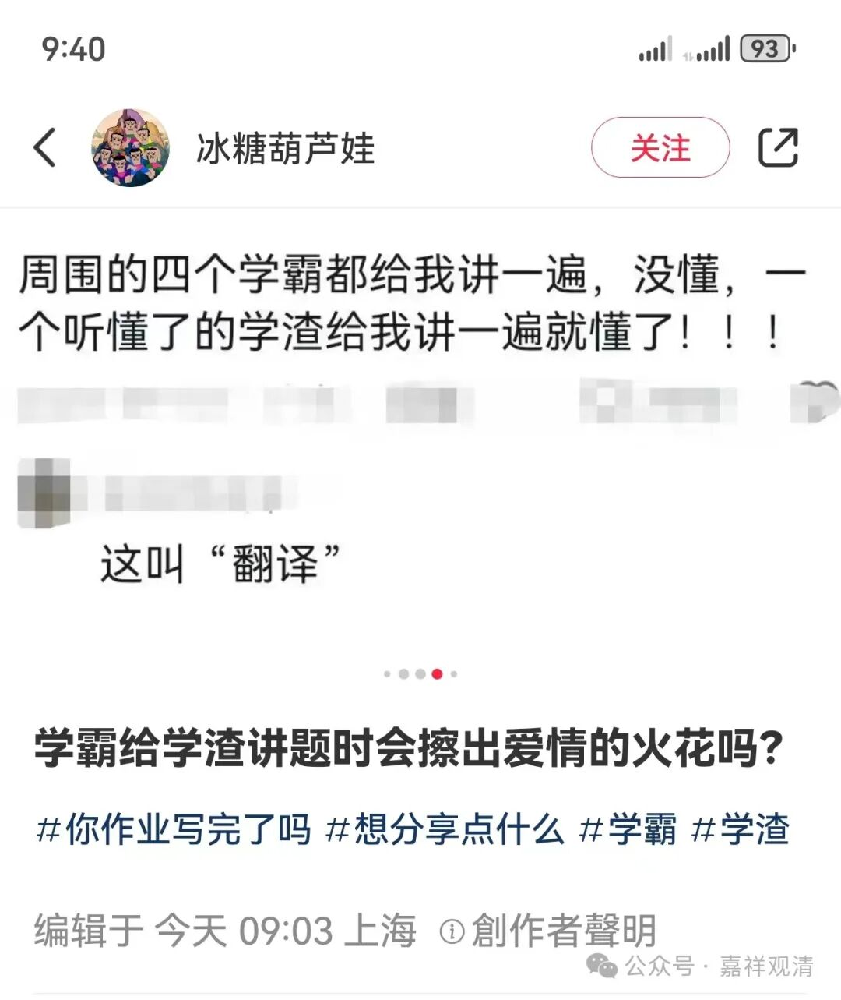
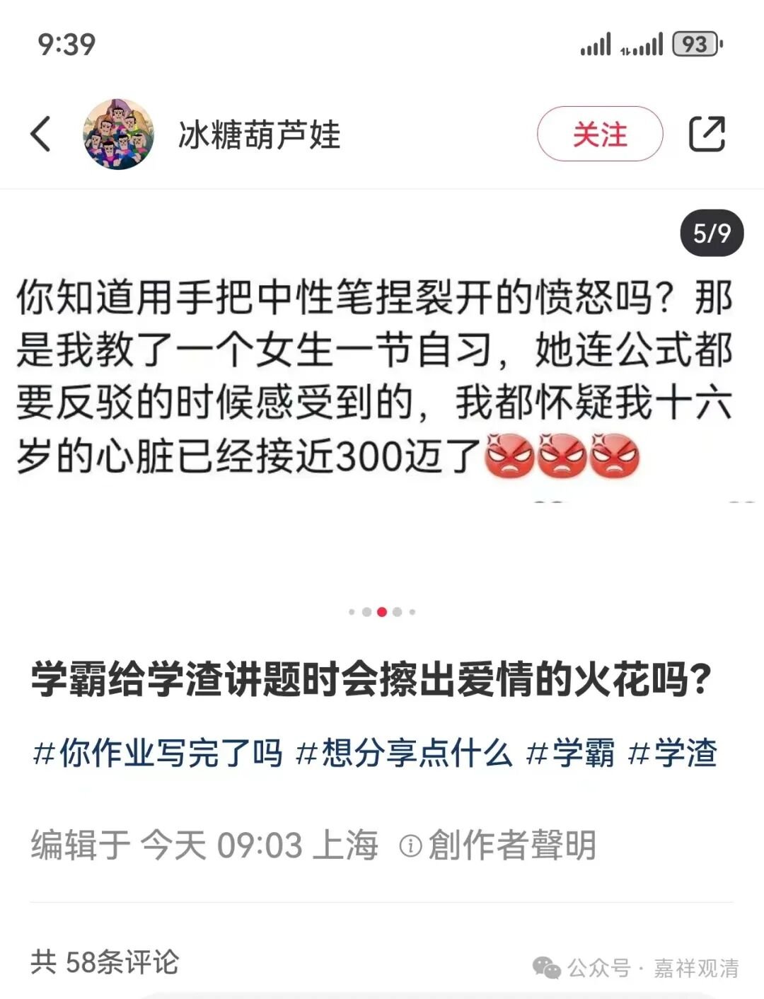

**质疑公式的，不一定是大神，也可能是学渣**

网上有人提一个问题——学渣和学霸会擦出爱情的火花吗？

回复亮了——

最近突然有很多人要找我出家，起初我也觉得有点奇怪……难道是我发的愿灵了？！菩萨这么快就给安排了？！

后来发现，可能是因为这段时间我在公众号发《宗义》的讲义，经常会质疑到教材，给一些人搞兴奋了。其中有些人是真的在学宗义的时候有了一些疑问而不敢说，看到我说了觉得“心有戚戚焉”；但另一种人却是学渣们的“心有戚戚焉”了——学渣普遍爱质疑公式、公理、教材，这不是真的不是超越“公理”“公式”之上的质疑，实际是完全没搞懂的“质疑”，“我看不懂的就是有问题的”是学渣们的普遍心理。看到这种“自信的学渣们”的投怀送抱，真是避之唯恐不及。求放过！

有的学渣当面说几个月就已经把我讲的东西都学完了，我吓得合不拢嘴了——这TM是学神啊！还有的学渣能质疑因明，说“男人”“女人”之外还有“机器人”也属于“人”的分类里面……我只能瞬间结束话题——和学渣多说一句话都是自虐！还是互相放生吧…

