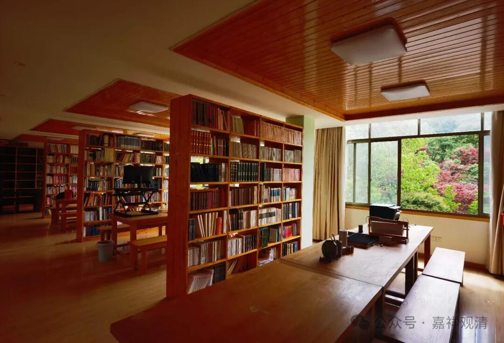
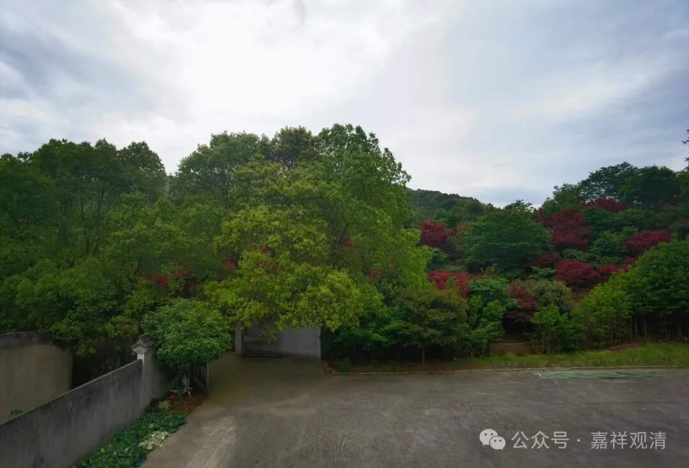
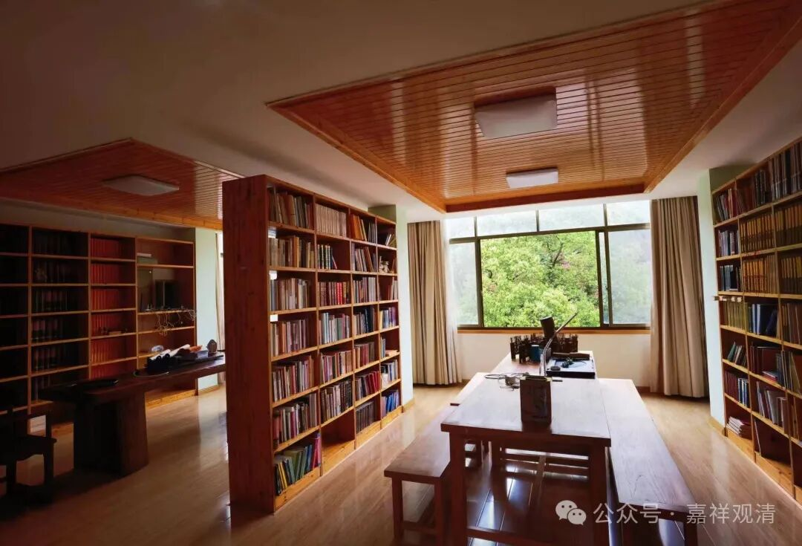
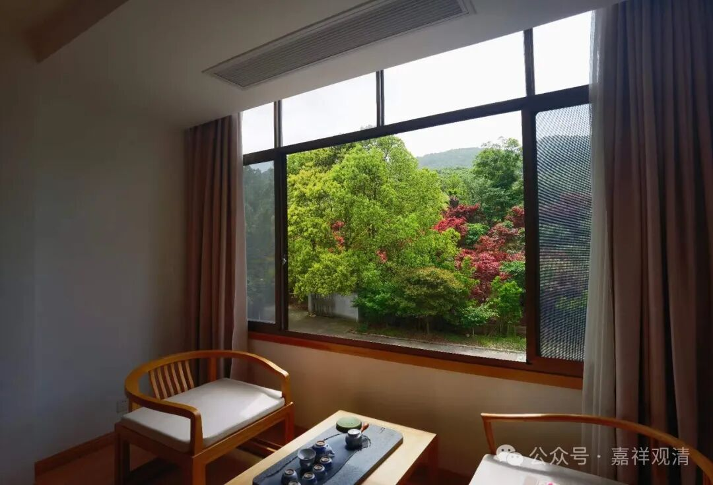
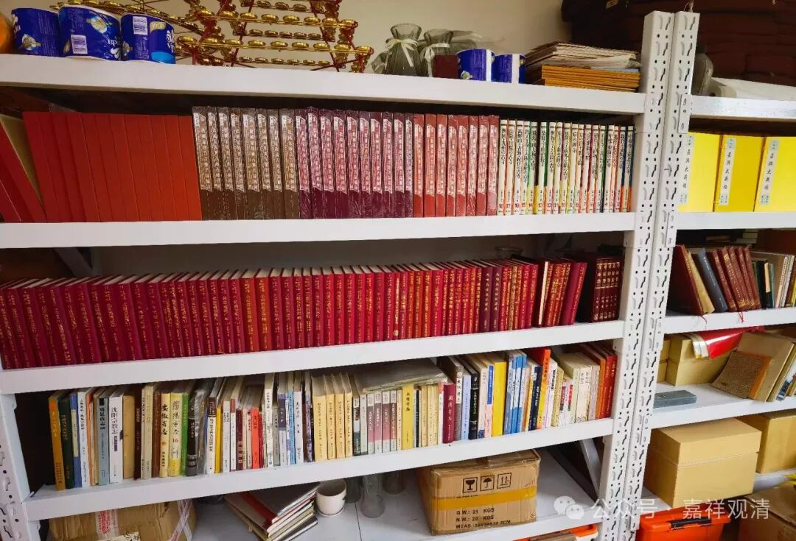
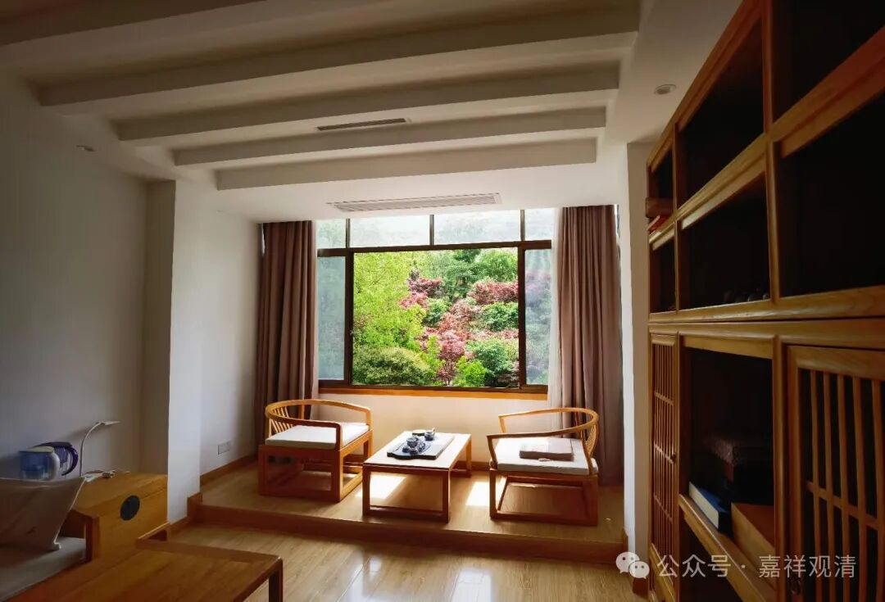

**我们的图书馆**

回到图书馆，真的就舍不得下楼了。

我们在奉化有一个自己的“图书馆”，收集了一些“AI史前”的书，也许AI的明天就要把这些纸质的、“曾经被称作书籍”的东西淘汰掉，不过它仍然是我们这种老菜帮子的实有的执念。

这里有好几套藏经——大陆版的《中华藏》、高丽藏、大正藏、卍字续藏、大藏经补编、乾隆藏、嘉兴藏、房山石经，有时候写完论文就回来查对这些资料，说起来，我们这些老梆子对电子版还是不敢完全相信啊……还是我落后了。

这里还有一套《民间宝卷》的全集，一墙的神话、宝卷、民俗类的书，搞得有段时间我那正直的弟子以为我在不务正业……不过好像也确实有一点，哈哈。学习民间宗教，是为了更好的切割出不是佛教的东西，比如大部分的佛菩萨生日……嘘！

还收集了一墙的八九十年代编纂的地方志，对比一下可以发现，在八十年代末九十年代初，地方经济还没有腾飞的时候，很多地方县市甚至连一家寺院都还没有恢复，说明wg以后的九十年代中后期才是寺院大发展的时期……

还有从拍卖市场上举牌买来的两套日本著名寺院绍介的合集，还没舍得翻呢……想想再不翻读，以后就要被不知道哪个不肖子孙扔出去了，看来得赶快过眼了！

和咱白云寺庙里的图书馆比起来，除了上述几个收藏专题，这里敦煌的书也是相对“富集”的，可能还得增加些……那谁经常说“现在这些都有电子版”，不过我看电子版总感觉收集的信号不够多——以前看书能记住书的第几卷左边第几页的哪一行，电子版就没这个感觉。

哎，有段时间做梦，梦里看的书都是电子版的了……哎，梦都进化了，我还没有进化……

梦里看到的电子版是草绿色的底子、黑色的字，就记住了一行字——

“以无自性为自性！”

        修改于