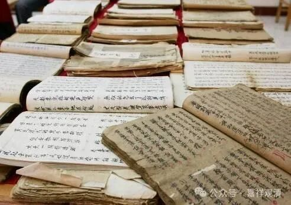

**活的宝卷和禅佛教**

在一些拍卖会上经常可以看到和禅宗有关的“宝卷”，有《达摩宝卷》，还有《三祖宝卷》……民间宗教有他自己版本的“禅宗六祖”系统。

按后世禅宗的说法，禅宗传法前六祖是：达摩——慧可——僧璨——道信——弘忍——慧能。虽然“六祖”在历史上出现过“争排位”的情况，神秀、法如、慧能都曾被追认为六祖，但最终实际传承下来的禅宗是以慧能大师为“六祖”的。这个不提。

《三祖宝卷》中“禅宗六祖”的排序是：达摩——神光——慧可——道信——弘忍——慧能。

其实“神光”是后期禅宗传说中二祖慧可大师的另一个名字，但在“民间禅宗史”中被拆为两个人了，我估计是因为“僧璨”这个名字太不民间了，而且禅宗三祖僧璨的故事在早期史传里是缺失的，民间重建他比较困难。

中国的民间宗教不仅对禅宗的中国祖师感兴趣，乃至把“西天”的历代祖师名录也都“抄”来竖大旗——中观巨匠龙树大师是一贯道“盘转西域，释教接衍”的十四祖，一看就是抄的禅宗灯录，呵呵，他们怎么会知道禅宗灯录另有其出处……

大乘天真圆钝教里还有个“龙殊菩萨”，一看就是“龙树”的讹变，亦或者是“龙树+文殊”——“龙殊菩萨”作为助化诸佛的菩萨，则似乎是来自“文殊菩萨”的形象。

最有趣的是还有一个“钥匙佛”……哈哈哈哈，估计是听和尚唱念“药师佛”，讹变成了“钥匙佛”，再附会上“钥匙”的相关功能——民间宗教的创意是无穷的！

“宝卷”的篇幅是无穷的，因为它还在不断的产生中，甚至还有“有知识没文化”的知识分子也在附体的助力下不断地参与创作、口述新的宝卷……哈哈，听他们脱口而传的宝卷体，真是又好气又好笑，下面给大家看一段（曾经）不入六耳的最新鲜的宝卷——

“……

法眼能为众生开，只因众生未在心

多少轮回寻真相，可叹真相人难寻

……

所言证道道以证，所言证心心以明

所言证法法以在，莫叹今生一凡身

睁眼只在一刹那，醒来何需刹那音

如今末世需净土，汝之法门随汝心

何不口诵佛圣号，无量光佛众接引

我今因缘言至此，汝身得定即见真

南无地藏菩萨摩诃萨”

实在太长，截一段大家看看玩玩。（这是刚刚口述不久的。）

