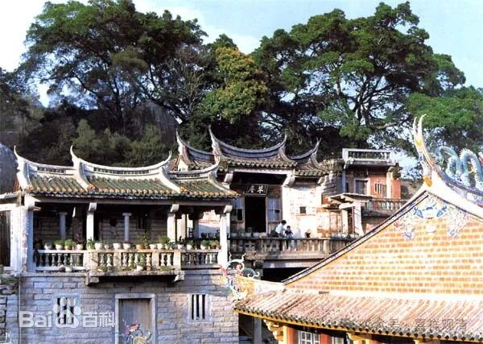
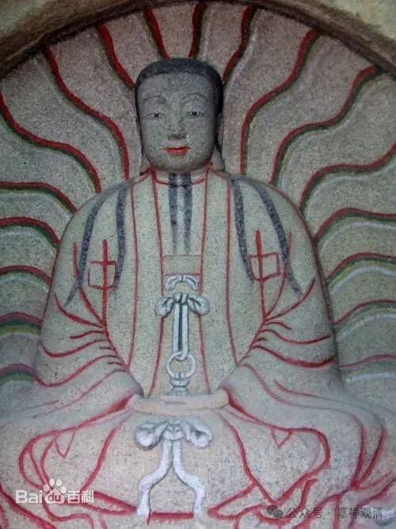

**冒充佛教的外道**

民间宗教，经常是“攀附”佛教；民间佛教，则是“自认为”是佛教；而中国历史上还有其他教派基于传播的原因“冒充”佛教。

《通典》卷四十：

** “开元二十年（732）七月敕：末摩尼法，本是邪见，妄称佛教，诳惑黎元，宜严加禁断。以其西胡等即是乡法，当身自行，不须科罪者。”**

意思是说：摩尼教妄称佛教，在市面上绝对禁止。但因为是胡人的信仰，若限制在他们自身的范围内，则不治罪。

这说明摩尼教在中国土地上传播的过程中有“妄称佛教”的现象。今天敦煌本的摩尼教文献里确实明显都看到有借用佛教名词，比如“三世诸佛”“轮回”“五明”“伽蓝”“三灾”“八难”“生老病死”……

泉州摩尼教草庵

《佛祖统记》卷三十九也记载说：

** “延载元年（694），波斯国人拂多诞持二宗经伪教来朝……”**

也把摩尼教称为“伪教”，基本和《通典》的“妄称佛教”是同一个意思。

泉州摩尼教石刻

我们看元末的底层的白莲教、明教的造反（底层的人对白莲教、摩尼教、民间宗教分不清楚），再看泉州的摩尼教留存，也都可以看到摩尼教（拜火教、祅教、明教）明显的、有意（上层）无意（基层）地借佛教的名义在传播。

“冒充佛教”这事儿，专门的佛教顶层义理高僧或许可以分辨清楚，但在底层的“黎元”大众是分不清的，所以需要自上层向下的“自净机制”，但佛教本身没有这个机制，这就麻烦了。

就像打仗一样，自己解决不了的事情，就需要援军、外力来帮忙了，于是就有了（高僧影响下的）皇帝的敕令。

