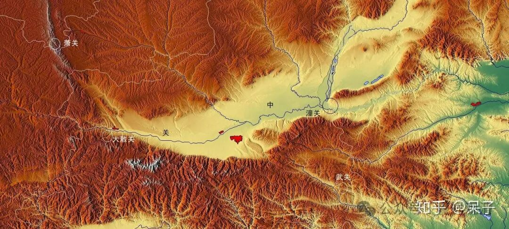
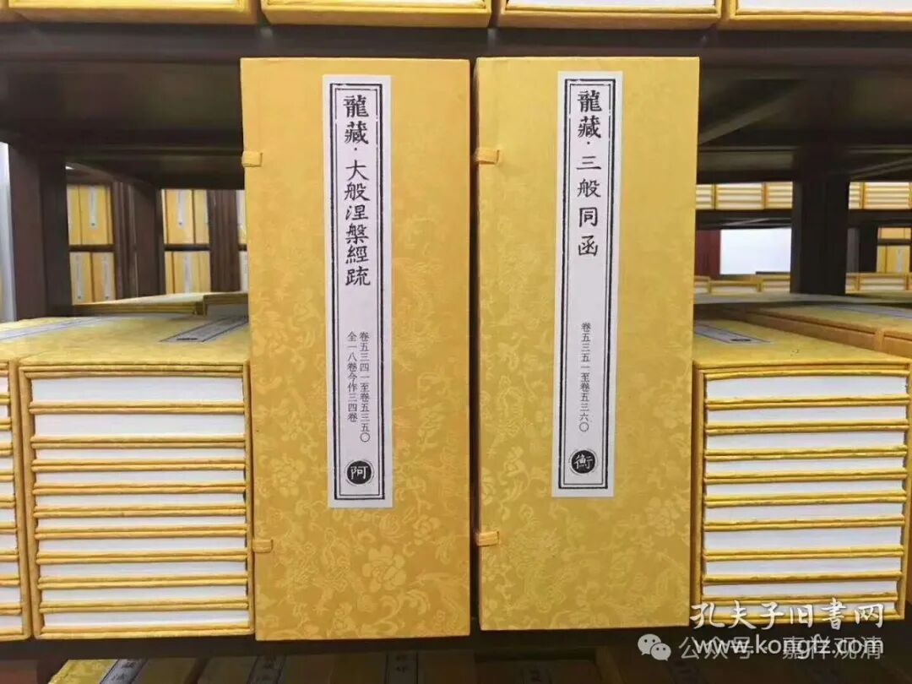

**白云清·《学佛兵法》**

《孙膑兵法》：“有所有余，有所不足，形势是也。”

这是孙膑说的军事地理，我们学习佛教经典，也可以学学孙膑的“兵法”。

军事地理来看，世界不是均值的空间，形势胜劣孕于差异之中。有的城（关）小，兵力弱，但由于形势胜，必须有效持续坚守，以能达到最大的战略战役效果——如斯巴达之与温泉关；有的大片平地，而兵力有限，则不惜让出土地，收缩兵力，后退于内线决战——如徐向前之破川军六路围攻。

我们学习佛教经典也应如此。

有的经典，文字未必很多，但属于战略级的、必须拿下并持续坚守的“要地”，如《百法》《地道》《宗义》，这些必须熟读记诵，绝不可以轻视跳过；有的经典也许非常庞大、精美，但在精力有限的背景下并不建议“分散固守”，如《瑜伽师地论》《大毗婆沙论》。

发现国内为数并不多的“好学”的学僧们由于缺乏明师指导，学习经常缺乏“战略型”眼光，而个别拉虎皮扯大旗的“瞎眼大师”又莫明兴奋地带着初学们硬啃《瑜伽师地论》这类（我就不报名字了）……只能说他们学习的精神可嘉，可是犯了严重的战略错误——你们一共就三五百人的“菜刀门”，居然要去硬啃南京、武汉，那是得多自大、多愚蠢啊！

所以呢，来来来，我们喝个茶，打开学佛地图，谈谈“天下大势”与“雄关形胜”……

