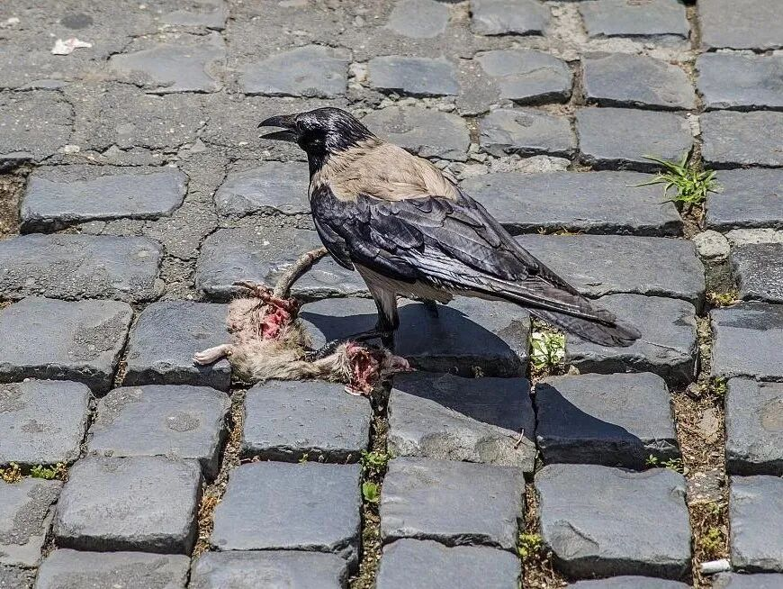

**收到！好大声的“嘎”呦……**

小时候看李法曾演的诸葛亮，特别喜欢，里面有诸葛亮操琴而歌：

“凤翱翔于千仞兮，非梧不栖～非梧～不栖……”

语出《庄子·秋水》。

庄子见惠施，给他讲了一则寓言：凤凰翱翔于天际，非梧桐不栖，非澧泉不饮……。有一只乌鸦在地上正抓着一只臭老鼠，看见天上凤凰飞过，以为它要抢食，于是奋力地“嘎”了一声……

庄子说：你现在在梁国管个事儿了，以为我过来就是要抢你的位置，所以要“嘎”我一声吗？！呵呵……

现实里这样的事情也遇到不少呢。

曾经路过某些地方，正事之外，时间宽裕，遂去看看在附近寺院、道场学佛的老同学们。不料被惠施们“嘎嘎”了几声，真是领会到了乌鸦们的“待（song）客之道”——不迎不送不带领参观、不主动留餐、几百年没洗过的油腻沾尘的碗拿出来由你装饭菜（、背后还嘀嘀咕咕“以后不欢迎”老实得怕你听不到）……

回来跟老弟兄说：就像你去兄弟家串门，家里孩子也不叫人，兄嫂弟媳既不端茶也没笑脸，恨不得你识趣早点走……

说：应该就是怕抢他那只死耗子……你是和尚，他们的庙没和尚……

索嘎……

呵呵，我刚说过啥来着……封闭管理，不学无术，三代以后……

