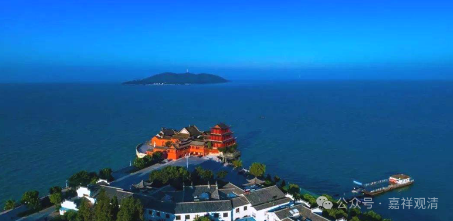

**《宗义略讲》003·045**

再回到原文：

** 第三他示余义：许三时实有，许瓶子瓶之过去时中亦有。

**婆沙师关于“** 过去、现在、未来三世实有”比较著名的有四个人的讲法，最主要的讲法指“位”的不同，主张者是世友论师。

《大毗婆沙论》卷七十七说：

**“说一切有部有四大论师，各别建立三世有异。谓尊者法救说类有异；尊者妙音说相有异；尊者世友说位有异；尊者觉天说待有异。”

婆沙四大论师：妙音，觉天，世友，法救。先把世友论师的说法提上来说，因为有部后来把他这个说法当作正统的三世实有说。

世友论师说，法的三世差别，是基于“位”的不同，他举了一个例子——数字“一”在个位上，就代表一，在十位上就代表十，在百位上就代表百。本身的一没有差别，但位置有差别表现为差别。他说，有为法，未有作用，叫未来世；正有作用，是现在世；作用已灭，就是过去世。

法救论师说三世的差别是“类”上的差别，意思是，三世诸法，本质不变，归类有别，他举了两个例子：一是熔金为器，金体不异，器型有异；而是炼乳而成酪酥，体虽不异，形味有异。

妙音尊者说体不变，而三世之相有别，他举的例子……我来换一下吧。他的意思是，过去世中也有现在未来，现在世中也有过去未来……但是现在世的时候呢，现在世是表现，另两个不是没有，是没有表现出来。我觉得用电筒的例子好了——都是三面的头像，电筒照到哪个，哪个就“显现”。

第四种，觉天论师，说体还是一个，因观待而有三世，如同一女子，观待他的母亲则为女儿，观待她的女儿则是母亲……

有部四大论师有四个说法，但是有部以世友说作为他的核心的说法。那么也可以看出这四个说法，这四个人都各出奇招捍卫“三世实有”，所以称为叫“说一切有部四大论师”。

确实这“三世实有”说很难成立的，实有，比如说过去的，过去的已经过去了，怎么还会存在呢？未来还没到呢，（甚至未来发生不发生还是问题，）它怎么会存在呢？所以多数佛教宗派认为只有现实存在、现在法实有，对“三世实有说”都是持批评态度。

诸法的过去、现在、未来一样都是实有呢，是一个有部很特殊的说法，所以有部自认为只有承认这个才是有部的，为什么呢？其他宗派不承认，其他宗派不承认“三世实有”，很明显的就是，过去的已经过去了，过去当然不存在；未来还没来或者是还没有发生，怎么会存在呢？有部要守住这个，所以自称“三世实有”，所谓“说一切有”，他的“说一切有”的意思，就是过去、现在、未来有，里面就有他有几个原因……

