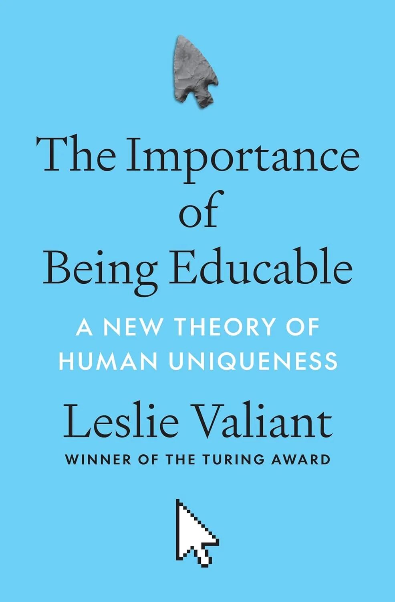
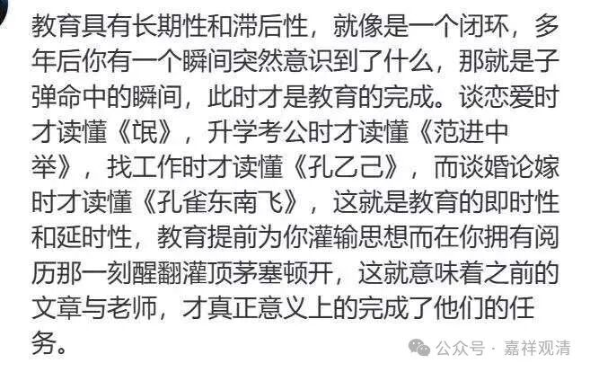

前几天聊到有效知识、冗余知识、惰性知识、无效知识。胡老师问我要定义、界限、差别，亚历山大。

先说冗余知识、冗余量。这是我某次用笔记本电脑的时候“顿悟”的——有些插口，平时看着没用，完全不知道它存在的意义；等到突然需要用到它的时候，才感觉“有他在，真好”！反过来，另一台电脑本来觉得设计恰到好处“没有一丝多余”，等到某次需要接入显示器的时候，才发现缺一个转换接口，临时找已经来不及了。那个多出来的接口，就是冗余量，可以比知冗余知识。

昨天，柯博士给我发来一段文字，出自The Importance of Being Educable: A New Theory of Human Uniqueness by Leslie Valiant《受教育的重要性：人类独特性的新理论》作者：Leslie Valiant，翻译过来是这样的：

**“在我看来，教育的一个关键特征是：他能以当时没有预见到的方式传授知识，这些知识以后会有用。”**

这也可以是对“冗余知识”的一个注解。

今天，智在师也分享了一段——

** “教育具有长期性和滞后性，就像是一个闭环，多年后你有一个瞬间突然意识到了什么，那就是子弹命中的瞬间，此时才是教育的完成。谈恋爱时才读懂《氓》，升学考公时才读懂《范进中举》，找工作时才读懂《孔乙己》，而谈婚论嫁时才读懂《孔雀东南飞》，这就是教育的即时性和延时性，教育提前为你灌输思想而在你拥有阅历那一刻醒翻灌顶茅塞顿开，这就意味着之前的文章与老师，才真正意义上的完成了他们的任务。”**

我马上回复：

这就是冗余知识的例子——现在不知道有什么用，不知道哪一天恰好用着。

好像，谈的都是“教育”。

