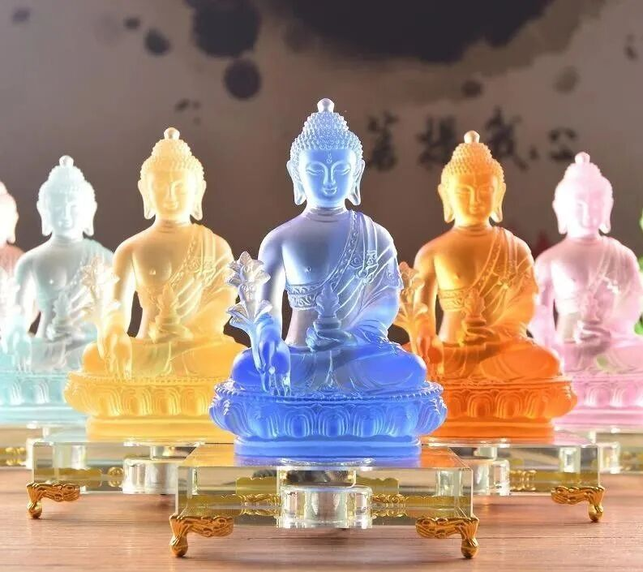

**七佛药师经……**

这两天在庙里简单传讲《药师琉璃光七佛如来本愿功德经》……

此经先后有三译，1、達摩笈多本；2、玄奘本；3、义净本。前两译单纯只介绍单尊“药师佛”的“本愿功德”，而义净本是足本的介绍药师七佛。原先还没注意到達摩笈多也有过一个译本，这次我也是补上了这块知识拼图。

其实这三本外，市面上还有一个流通本，流通本是在玄奘本基础上加了义净本的药师咒等少许段落，某种角度上也是一个汇集本，但基本没人喷……

《药师经》里提到持诵、信仰者有清净戒律的功德，所以在部分持律师中间有念诵的习惯。以前我也是天天念的，后来玉树地震的时候因为来回跑，事儿太多，就把它给停了，这一停，十几年了都……

很多药师佛念诵仪轨都是以《药师琉璃光七佛如来本愿功德经》为背景创作的，大藏经有一个那谁写的仪轨，大家常用的是班钦写的仪轨，现在这有好几个译本。

武汉的FC兄弟问过他师父，说好像汉人更喜欢念经而那啥人更喜欢念仪轨……别说，还真是的。这个在我们看来倒是有点奇怪啊——“彼时尚有周天子，何是纷纷说魏齐？”美人明明就在眼前，为什么却盯着照片看呢？记得FC说他师父说这是一个习惯……也可能和传承有关。

庙里本来在建药师殿和文殊殿，现在歇着呢……

