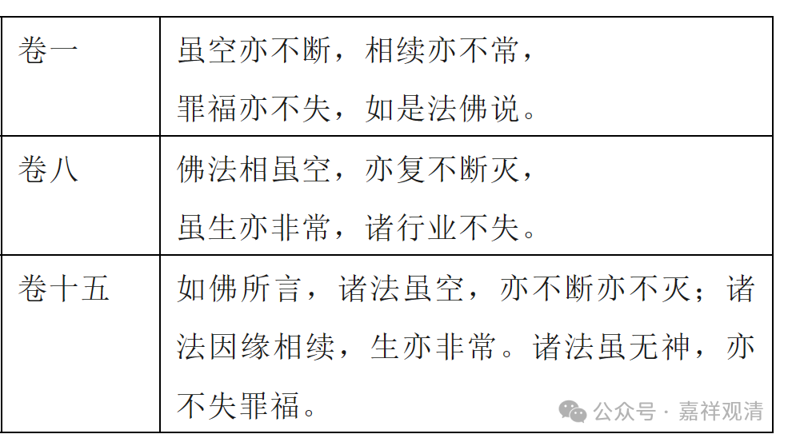

**简谈《中论》“虽空亦不断”一颂的宗义归属**

昨天谈到《中论·观业品第十七》第二十颂：

** “虽空亦不断，虽有亦不常，**

** 业果报不失，是名佛所说。”**

我估计到会有人是按照月称的观点，以为这一颂是他宗的观点——这也是今天中观学者中的主流观点。

不过我对此颂专门写过一篇论文，提醒大家，在罗什系中观的传说中，这一颂明显是属于中观自宗的观点。也就是说，据现有的文献来看，最初的中观师对这一颂的理解和清辨、月称等人不同——

《中论·青目释》大家都知道了，《青目释》说：

** “虽空亦不断，虽有亦不常，**

** 业果报不失，是名佛所说。**

** 此论所说义，离於断常！何以故？业毕竟空，寂灭相，自性离，有何法可断？何法可失？颠倒因缘故往来生死，亦不常！何以故？若法从颠倒起，则是虚妄无实；无实故，非常。复次，贪著颠倒不知实相故，言业‘不失’——此是佛所说。”**

这一段青目说的很清楚，这一颂是“此论所说义”，这就是中观自宗的观点。（不多展开了。）

另外，在《大智度论》里，也有三处引用到“虽空亦不断”一颂，分别在卷一、卷八和卷十五，但文字都不一致，前两处呈颂文，后一处为散文——

1、《大智度论》卷一：

** “虽空亦不断，相续亦不常，**

** 罪福亦不失，如是法佛说。”**

这是在引用《中论》此颂证明诸法胜义无而不碍世俗有，引证用来证成自己的观点，自然是认为“虽空亦不断”这一颂是自宗了。

2、《大智度论》卷八：

** “复次，生死人有生死，不生死人无生死。何以故？不生死人以大智慧能破生相。如说偈言：**

** 佛法相虽空，亦复不断灭，**

** 虽生亦非常，诸行业不失。”**

这也是引“虽空亦不断”一颂证成中观自宗空理。

3、《大智度论》卷十五：

** “如佛所言，‘诸法虽空，亦不断亦不灭；诸法因缘相续，生亦非常。诸法虽无神，亦不失罪福’一心念顷，身诸法、诸根、诸慧转灭不停，不至后念，新新生灭，亦不失无量世中因缘业，诸众界入中皆空无神，而众生轮转五道中受生死。**

** 如是等种种甚深微妙法，虽未得佛道，能信、能受、不疑、不悔，是为法忍。”**

这是用散文的形式引用“虽空亦不断”一颂，解释中观宗的“谛察法忍”。

《中论·青目释》和《大智度论》都是早期中观师的作品（我们暂不讨论《大智度论》的作者，但至少可以确定是早期中观师的作品），在对“虽空亦不断”的解释上都明确以为是中观自宗所许。

另外，对印度中观师的分期上，基本上都这样分：早期中观师（公元二、三世纪）包括龙树、提婆、罗睺罗、青目；中期（六世纪）则有佛护、清辨、月称、寂天，后期（七、八世纪以后）则有寂护、莲花戒。（目前还没有把佛护单独提上去作为早期中观师的情况。）

有兴趣的话可以参考一下下面这篇垃圾文

《中论》“虽空亦不断”一颂的异读——早期中观师对《中论·17·20》的解读 (qq.com)

