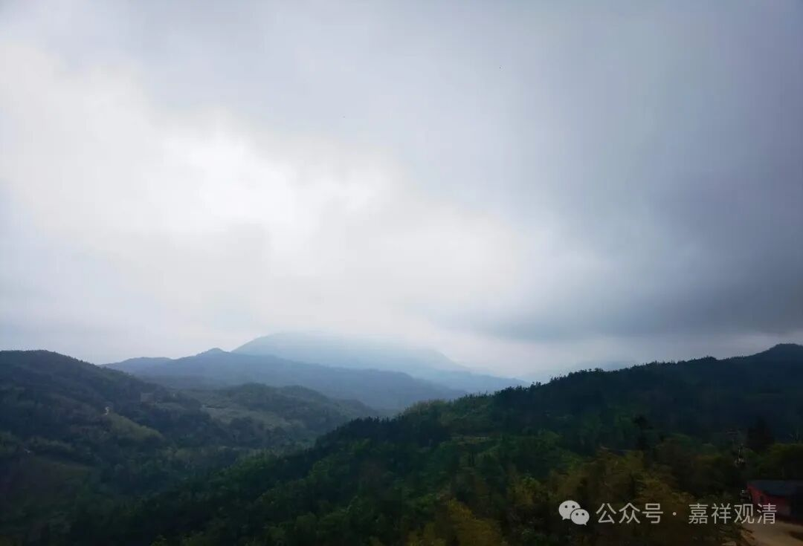

**头疼的水电**

今天庙里全体“出坡”，就是干活。

上午地藏殿安奉琉璃地藏像，下午去综合楼。在综合楼，又一如既往地因为水电崩溃了，哈哈……

冷水桶又没水了，三楼洗衣池龙头也没水，wifi没信号，一个房间没电……，三天前来大扫除的时候还都说是能用的。

专门跟我们上来“交接”的桂师父辩证历史地、一针见血地指出；你们这里的水电“自古以来”（排得）就太乱了。

我想想，真是啊，动过这栋楼水电的，有且不限于，造楼的、装修的、宁波的、景德镇的、鄱阳的、卖水泵的、本地的三波水电工……一堆人不断地在做加法，现在我们有无数个开关，十几个水泵。哎，下半年得专门找个能人把我们的水电线全部重排一下了，不然实在头疼，反正我的脑子里是没办法画出我们综合楼的大致电路图和水系图的，一团浆糊！

想想学佛也应该是一下，要有个简明的顺序、走向，不能千丝万缕地一堆线索，还是那几个关键点：因明、道次第、阿毗达磨……

打电话还是把老胡抓下来……最后排查发现：1、深水井的水泵电闸在路边，没打开；2、三楼一个以前废弃的电闸，现在是冷水泵的电闸，要打开；3、接线板和路由器同时坏了（应该是雷劈的），要换；4、空气能热水桶的水阀坏了，要换……

还有几天才五一，“一切都还来得及”！

