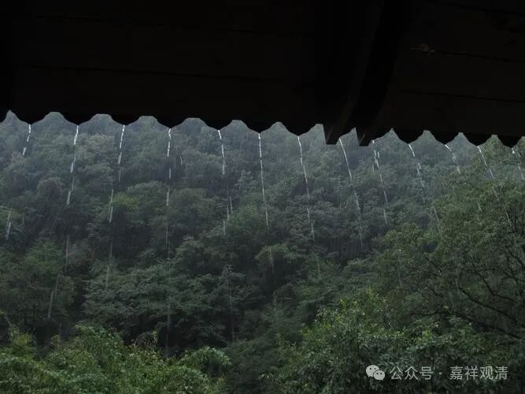

**电路老化，损失惨重**

下午总算把综合楼水、电、wifi的问题都搞定了，水电工和电信的都叫来维修，这穷乡僻壤的，召集他们都不是件容易的事儿啊。总算在来人之前都修好了——电有了，冷热水都有了，网络也有了！圆满！

下午来人，我这儿也“迁都”去了综合楼。

降温了，外面下着雨……

这边正和来人聊天呢，走廊里电灯乱闪，不知道出了啥事儿。很快，前前后后不停传来乒乒乓乓的爆炸声，电闸、电灯炸了一堆，完！马上打电话，找人！

天都擦黑了，还是得把电工们请来……排查下来，是电路老化，总闸那里三个接点都松动继而短路、零线变成火线，很多用电器都炸了……吓我一跳！我的电脑、冰箱、空调！！！

一圈查下来，三楼走廊里同一种型号的电灯几乎全炸了（就剩一盏了），路由器又（为什么是“又”）坏了，电脑、冰箱、空调都还好，刚搞好的空气能热水器好像也有哪个零件炸了……

哎，山上的寺院就这样，水电方面和平地的寺院相比，需要付出大量的成本——时间成本、人力成本、资金成本，免不了的。

天都黑了，已经很晚，能修得先修，剩下的只能明天再说了，至于上网，只有先用手机热点咯。

