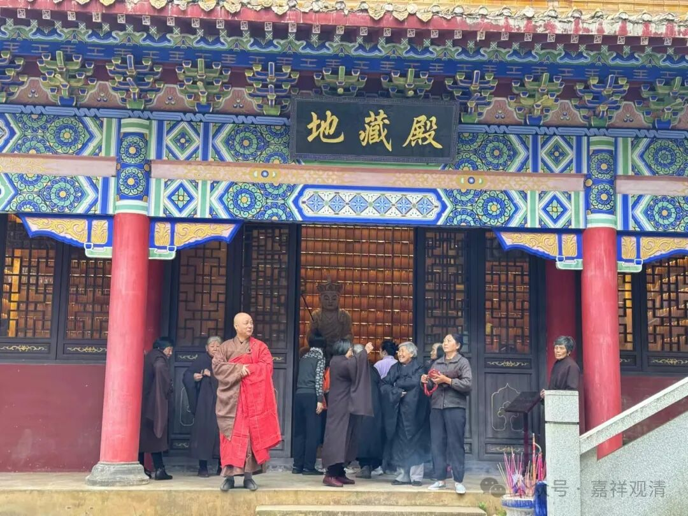
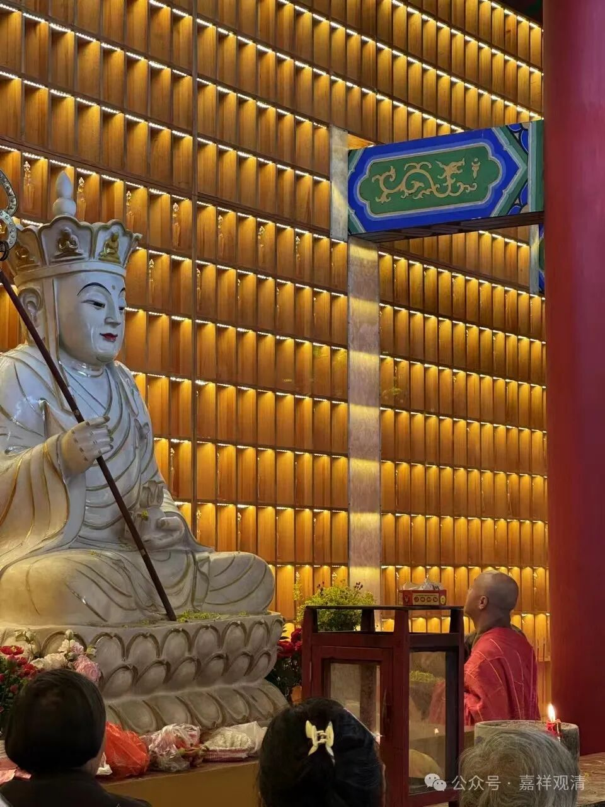
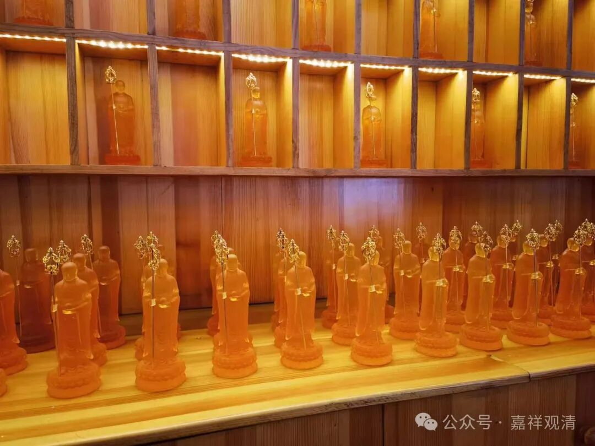
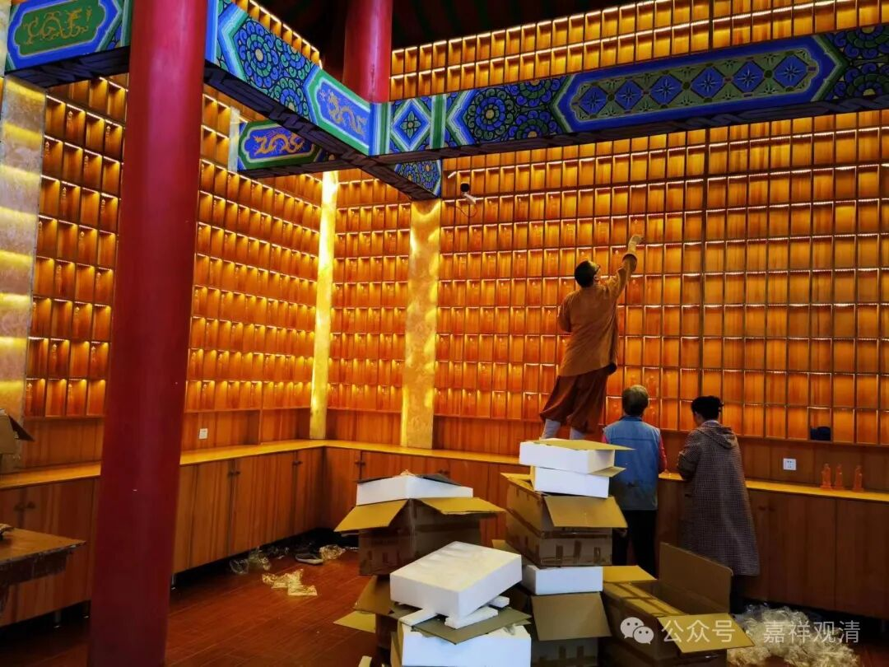
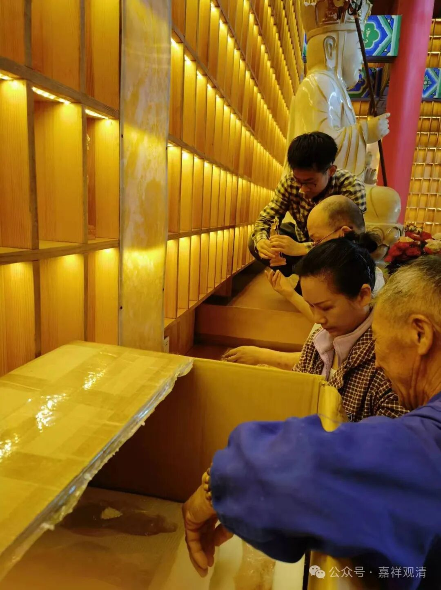
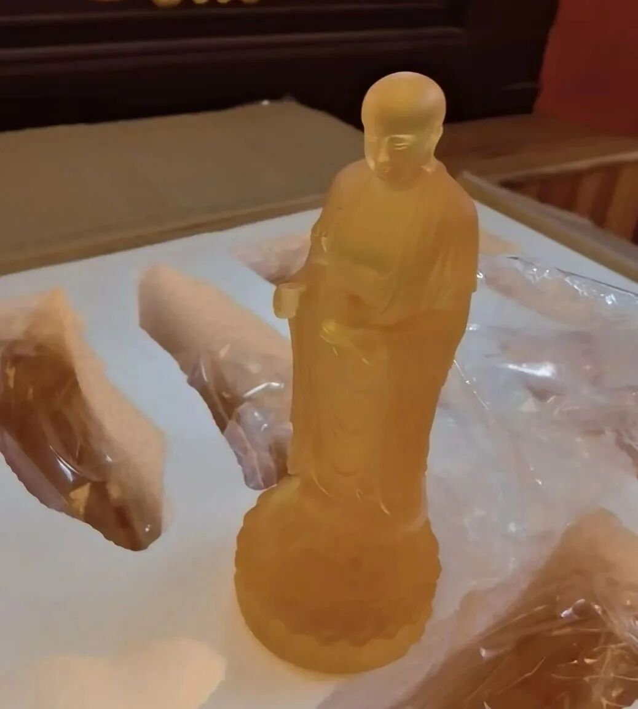
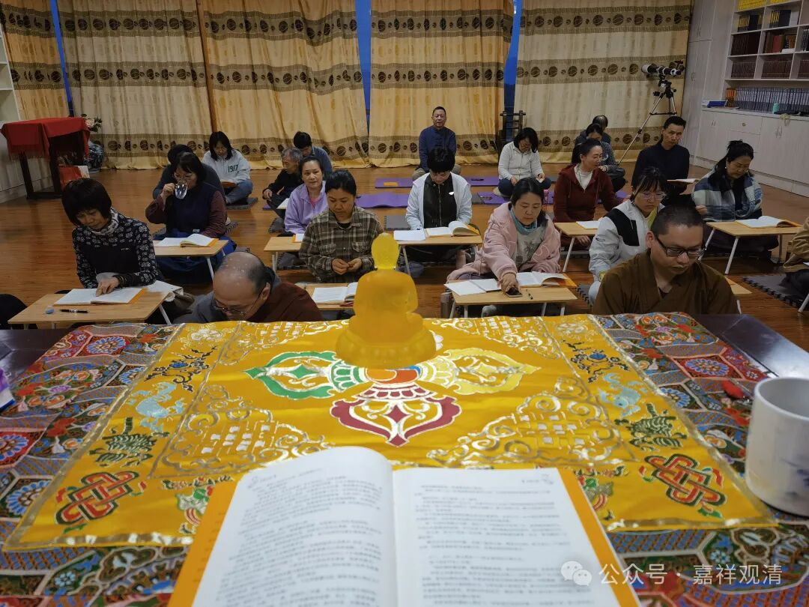
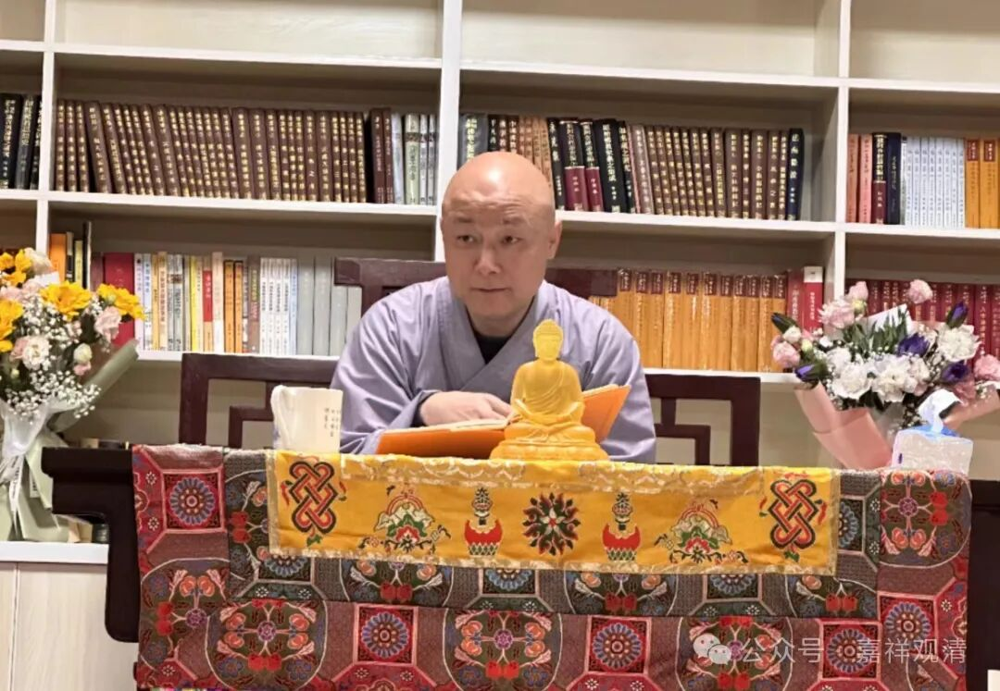

**地藏殿今天开光**

上午居士们上来，地藏殿挤得满满的，地藏殿今天开光！

莲花山白云寺始建于武德、贞观年间，目前查到的县志都说始建于贞观九年，但我也见过说是武德年间始建的说法，不过现在找不到了。

寺院在徽饶古道上，明代做了认真规划，大约是两进院子、两层楼的格局。看留下来的地基，当时寺院是南北向的。

Wg中全毁，八十年代老郑（龙善师）来先建了木板房的地藏殿，后来觉超师接手寺院，改了大雄宝殿和斋堂。老郑和觉超师的自由发挥，让现在寺院的朝向变成了偏东，景德镇的香客说，现在的寺院“旺景德镇”，呵呵。

前几年改造地藏殿，还是老周他们干的，不到两个小时，一个木构建筑就被夷平了……然后有了现在的地藏殿。

地藏殿里预留了木格子，供奉琉璃地藏，去琉璃厂定了。最初由于琉璃厂活儿多忙不过来稍有延迟，后来因为疫情就把这事儿撂下了。最近有时间，就请琉璃厂把琉璃地藏像都运过来了。前几天上架，今天开光。

我们的地藏殿，龙瑜居士是一直忙前忙后地费心修建，疫情的缘故，她不在了。现在最后的琉璃地藏像已经安奉好了，也算克毕全功，她的功劳是很大的。

下午讲传——道次第文殊口授。

时间紧，念的多，讲的少。

